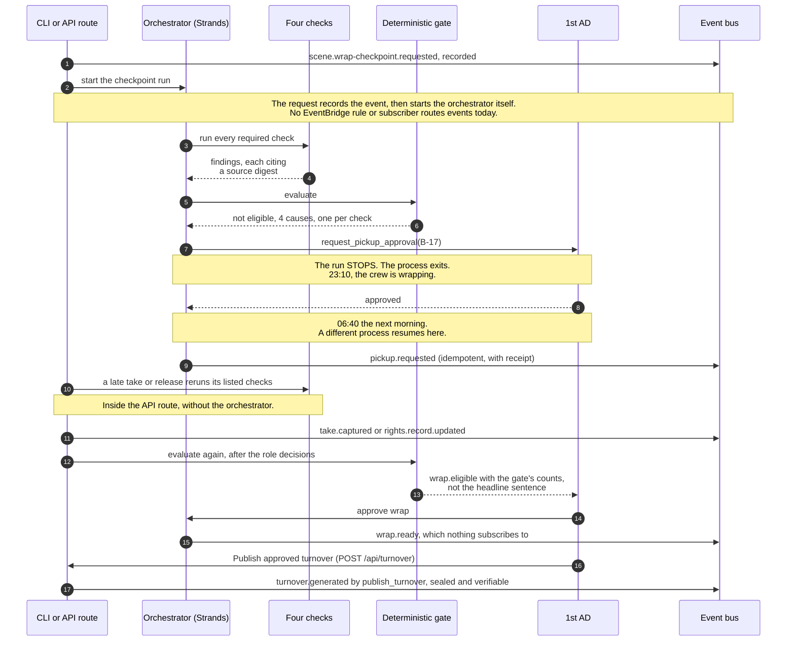
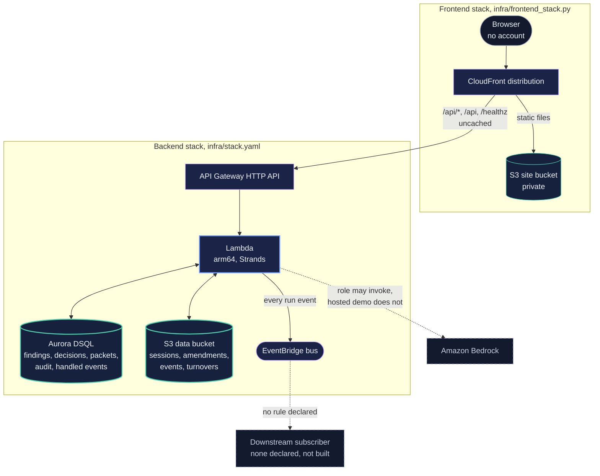

# LastTake

[](https://github.com/upgradedev/lasttake-aws/actions/workflows/ci.yml)
[](LICENSE)
[](https://www.python.org/)

Before the set is struck, LastTake shows a script supervisor which evidence is missing or in conflict, and the 1st AD decides pickup and wrap.

The pickup and the wrap stop the run with a real Strands Agents SDK interrupt, and a later request can resume it in a different process from the session saved on S3.

[Open the AWS workspace](https://d3kf6hquzlli8g.cloudfront.net/) and choose **Start this fictional shoot day**. The next-step panel follows the saved evidence through the human wrap decision to a turnover for the assistant editor.

[Current automated acceptance](https://d3kf6hquzlli8g.cloudfront.net/acceptance.html) compares the observed frontend and backend revisions with the latest public receipt, and missing, malformed, mismatched or older-than-24-hour proof cannot establish a current pass. Human UAT remains NOT_RUN, which means no person has completed the testbook yet.

The live browser uses an offline planner and lexical interpreter with real Strands tool calls, S3 session resume and role-gated decisions. It does not analyze footage or audio, send emails, make payments or establish legal sufficiency. Demo role selection is not authenticated staff identity. Hashes identify bytes, not truth.

## Contents

- **Understand:** [Who this is for](#who-this-is-for) · [How Strands is load-bearing](#how-strands-is-load-bearing) · [Architecture](#architecture) · [The rule the whole product turns on](#the-rule-the-whole-product-turns-on)
- **Try it:** [Try it without installing anything](#try-it-without-installing-anything) · [What the demo shows](#what-the-demo-shows)
- **Run it yourself:** [Quickstart](#quickstart) · [Bring your own record](#bring-your-own-record) · [Running against Amazon Bedrock](#running-against-amazon-bedrock)
- **Verify:** [The numbers, and the commands that produce them](#the-numbers-and-the-commands-that-produce-them)
- **Deploy:** [What is deployed, and what it costs](#what-is-deployed-and-what-it-costs)
- **Disclosures:** [What it will not do](#what-it-will-not-do) · [The demo corpus is synthetic](#the-demo-corpus-is-synthetic) · [Assurance and residual gaps](#assurance-and-residual-gaps) · [Documentation](#documentation) · [Pre-existing components](#pre-existing-components) · [Licence](#licence)

## Who this is for

A **script supervisor** on a shoot day, with the **1st AD** as the second reader.

Not film crews, not production teams, not creators. One person, one afternoon, one decision: is this scene ready to wrap, and if not, what exactly is missing and who can fix it while the set is still standing.

At the end of a shoot day the evidence needed to judge whether a scene is ready to wrap sits in seven places owned by five departments: the current script revision, the shot plan, the captured takes, the supervisor's notes, the camera and sound reports, the continuity references, and the rights ledger. Nobody holds all of it at once. The task is to make missing or conflicting records visible while a human can still review them. No observed time saving, avoided pickup cost or production benefit is claimed.

## How Strands is load-bearing

Remove the Strands Agents SDK and four things disappear at once: the orchestration loop, the tool calls, the two human approvals, and the resume that makes an overnight approval possible. What is left is a script that cannot stop and wait for a person.

The capability the product is built on is **interrupt and resume across process death**:

- Inside a terminal tool, `ToolContext.interrupt(name, reason=...)` stops the run, and the agent returns `stop_reason` of `interrupt`.
- A session manager saves the paused run: `FileSessionManager` offline, `S3SessionManager` on Lambda, where `/tmp` does not survive the night.
- A **different process**, hours later, calls the agent with an `interruptResponse`, and the run continues from the same point.

On a set this is not academic. The checkpoint finds a coverage gap at 23:10 as the crew is wrapping. The 1st AD is not looking at a screen. They approve at 06:40 before the first setup, and the run resumes across a process that no longer exists.

**The flow, from question to governed write and back**



How this is proved:

- The ci.yml job "interrupt survives process death" runs `lasttake checkpoint` and `lasttake approve --yes --hours 7.5` as two separate `run:` steps, which are two operating system processes. It then deletes `.lasttake/sessions`, requires `lasttake approve --yes` to fail, and prints "NEGATIVE CONTROL HELD: with the session wiped, there is nothing to resume." No step compares the two process ids.
- Every dispatched backend deploy fires the checkpoint in one HTTP request, retires every warm Lambda container with a configuration change, approves in a second request, and asserts `c1 != c2`. A run where Lambda reused a container fails the deploy.

**One design constraint this forced.** On resume the tool body re-enters from its first line and `interrupt()` returns the stored answer: a replay, not a frozen stack frame. So every approved action puts its external call after the interrupt, behind an idempotency key derived from the event payload; placed before it, the call would run twice. See [`src/lasttake/agents/tools.py`](src/lasttake/agents/tools.py), and [docs/strands-interrupt-resume.md](docs/strands-interrupt-resume.md) for the CI steps and the historical Lambda run.

## Architecture

The required diagram is a file of its own, [`docs/architecture.svg`](docs/architecture.svg), so it can be opened and downloaded without this README around it.


An interpreter answers exactly two language questions: does this take plausibly contain this beat, and do these two notes describe the same physical state. Identifier equality (media identifier, lens and camera roll against the camera report), SHA-256 comparison of cited artifacts and sealed records, and counting are done in code, not by a model. No timecode arithmetic is performed; timecodes are copied into observation text, never parsed.

The system view, the eight tools and the repository layout are in [docs/how-it-works.md](docs/how-it-works.md). Every deployed resource and both release paths are in [docs/infrastructure.md](docs/infrastructure.md).

## The rule the whole product turns on

**It never infers a pass from absent evidence.** Absent evidence is a finding.

There are four truth states and there is no fifth. `verified`, `missing`, `conflicting`, `unknown`. Three of those are exceptions. There is no `pass`, no `clear`, no `safe`, and a test asserts there never will be.

The gate that combines them contains no model call, no heuristic and no randomness. It fails closed in every direction, and each of these has a test that tries to make it fail open:

- a check that produced no result is a missing result, not a pass
- a check that produced two results is a contradiction, not a pass
- a finding that cites a source whose digest has since changed is discarded, not reused
- a finding whose seal does not verify is discarded
- a finding written under a different policy version is discarded
- a decision bound to an older seal of its finding no longer counts
- an exception no authorised human has looked at is not a pass
- a decision taken by the wrong role is not weak evidence, it is no evidence

The last one is a table, not an `if`. A DIT may resolve a media identity question and may not accept a rights exception. Nobody at all may accept away a missing release, including the role that owns rights, because that decision belongs to production and counsel and not to this system.

## Try it without installing anything

[LastTake on AWS](https://d3kf6hquzlli8g.cloudfront.net/). No account or install is required for the fictional demo.

1. Press **Start this fictional shoot day**, then **Run wrap checkpoint**. **Scene review** shows the lined script, the takes and the current exceptions, with the count above them. Missing evidence stays missing.
2. Select **1st AD** and answer the saved pickup request. Reloading restores the real Strands interrupt, and a pickup does not approve wrap. Press **Open guided demo**, then **Add take or release**: **Try refused date** must return HTTP 400 and write nothing, and a continuity decision goes stale when a take changes its sources.
3. Review continuity as the script supervisor and T-013 as the DIT, each with a reason. As the 1st AD, press **Review wrap readiness** and **Request wrap approval**, inspect the package fingerprint, and approve or decline.
4. In **Handoff**, press **Publish approved turnover**, set **Receipt purpose** to **Wrap review**, and press **Prepare receipt**. A bus-accepted receipt is not proof of downstream completion.

Policy 1.1 requires a fresh checkpoint for older findings, and the page names that reason. Every click, refusal and date example is in [docs/workspace-guide.md](docs/workspace-guide.md).

## What the demo shows

One fictional shoot day, made messy on purpose. Six things are wrong with it and each exercises a different part of the pipeline.

| What is wrong | Which check finds it | Who it goes to |
|---|---|---|
| B-17 was added in the Blue revision and never made the shot plan, so no camera rolled | coverage | script supervisor |
| Shot `S-42C-ORPHAN` plans for a beat the revision cut | coverage, advisory only | script supervisor |
| Two takes of B-23 are both flagged preferred and the mug does not match | continuity | script supervisor |
| T-013's media identifier does not match the camera report row | metadata | DIT |
| BG-07 is visible in a take and has no release record | rights | production coordinator |
| A late take arrives after the checkpoint | targeted rerun | nobody, the checks listed for a new take rerun |

Note the fourth row. T-013 has a real problem, and beat B-11 is still **covered**, because a second take of it is clean. A beat is covered when at least one take of it is usable, reconciles with the camera report, carries no unresolved continuity conflict, and has every subject released. Treating "some take has a problem" as "the beat is missing" would report footage as absent that is sitting on the card.

## Quickstart

Prerequisites: Python 3.11 or newer, and git. No AWS account and no credential is needed for the offline path below, which exercises the real checks, the real gate and the real pickup approval. No CLI command requests wrap approval or publishes a turnover.

```bash
git clone https://github.com/upgradedev/lasttake-aws.git
cd lasttake-aws
python -m pip install -e ".[dev]"
```

The ci.yml job "interrupt survives process death" runs the checkpoint, approval, late take, release and event-log commands below as separate processes on pushes and pull requests.

**Step 1. Run a wrap checkpoint.** The command records the checkpoint event, then starts the orchestrator itself.

```bash
lasttake checkpoint
```

Expected: the four checks and the deterministic gate run, the count prints, and the run **stops** with a pickup request waiting for the 1st AD. The process then exits.

```
Of 34 required beats, 31 covered with evidence, 2 raising exceptions with named
sources, 1 with no release record and routed to production.

[pid 2378] the run has stopped and is waiting for a human.
  who: first_ad
  what: pickup on B-17
```

**Step 2. The 1st AD answers, in a different process.** The first process is gone. Run this now, or tomorrow morning.

```bash
lasttake approve --yes
```

Expected: a new process picks the run up from exactly where it stopped, the waiting tool finishes, and the bus response is reported with its receipt. This does not establish a downstream action.

**Step 3. A late take arrives.** Every check cites the takes document, so all four rerun.

```bash
lasttake late-take --beat B-17
```

**Step 4. Production supplies the missing release.** Only rights reruns.

```bash
lasttake resolve rights --subject BG-07
```

Expected: `Affected checks: rights.` Straight after Step 2, the other findings keep their results and the gate admits them. After Step 3, `resolve` rebuilds the package without the late take T-041, so the gate stops admitting the coverage, continuity and metadata findings from Step 3, and B-17 prints as `no_viable_coverage` again.

**Step 5. Read the event log, and verify a turnover manifest.**

```bash
lasttake events
```

No CLI step writes a turnover. **Download turnover** on the workspace's **Handoff** page saves `<run id>-turnover.json`. Save it as `turnover.json`, and this re-hashes it against its own seal:

```bash
lasttake verify turnover.json
```

Run the test suite, including the gate's own failure proofs:

```bash
python -m pytest --cov --cov-report=term-missing
```

## Bring your own record

The page and the API take a take or release document you write.

For a session-owned run, replace both placeholders below: `run_id` is returned by `POST /api/reset` using your `session_id`, and `session_id` is the private handle returned by `POST /api/session`. Keep that handle private; it grants access to your saved runs. Do not put it in shared examples, screenshots or logs.

```bash
curl -s -X POST "$URL/api/ingest" -H 'content-type: application/json' -d '{
  "run_id": "REPLACE_WITH_YOUR_RUN_ID",
  "session_id": "REPLACE_WITH_YOUR_PRIVATE_SESSION_ID",
  "kind": "take",
  "document": {
    "take_id": "T-900", "shot_id": "S-42-PICKUP", "beat_ids": ["B-17"],
    "slate": "42L/1", "camera_roll": "A007", "sound_roll": "SR07",
    "timecode_in": "23:04:00:00", "timecode_out": "23:04:41:00",
    "lens_mm": 50, "media_id": "A007R2G01",
    "preferred": true, "usable": true,
    "note": "Pickup on the reaction. Clean single.",
    "visible_people": ["DELPHINE"]
  }
}'
```

An owned run refuses a missing handle or a handle from another session with HTTP 403. Legacy unowned demo runs still accept their `run_id` without `session_id`; omit that field for those runs. Omitting it never unlocks a session-owned run.

`kind` is `take` or `rights_record`. A document that does not match the shape is refused before anything is written, and the refusal names the missing and the unexpected fields.

The document becomes a package amendment with new digests. The `AFFECTED_CHECKS` table in `src/lasttake/domain/events.py` picks the checks to rerun: a take reruns all four, because every check cites the takes document, and a release reruns only rights. The gate separately discards any finding whose cited source digests moved, so a check left out of the table would show as a missing current result, not as a pass.

A decision carries the digest of the finding it was about, so when an amendment moves that evidence the decision stops applying and the ingest response lists what was withdrawn. Shape, limits and the full rerun story are in [docs/bring-your-own-record.md](docs/bring-your-own-record.md).

## Running against Amazon Bedrock

The offline path uses a lexical stand-in for the two bounded interpretations. New finding records serialize `model_id` when an interpretation is present; older records without that field remain unknown.

To use a real model, ask your own account what it can invoke rather than trusting a string in a source file. This lists the Anthropic foundation models and cross-region inference profiles the credentialed account can reach, in its own configured region:

```bash
lasttake doctor --bedrock
```

The default, `global.anthropic.claude-sonnet-5`, was verified by invocation on 2026-08-22 against one account, which is not the same as verified against yours. Set the one `doctor` printed and run any command with `--bedrock`:

```bash
export LASTTAKE_BEDROCK_MODEL_ID=<an id that doctor printed>
lasttake checkpoint --bedrock
```

Every dispatched backend deploy runs a full checkpoint through `BedrockInterpreter` on the GitHub runner, so `BedrockModel` plus `agent.structured_output` is exercised rather than described.

The deployment checks that required beats remain 34 and that bounded model interpretation does not raise covered beats above the offline baseline. It also requires real model-touched coverage and continuity findings and confidence below 1.0. It does **not** require Bedrock to reproduce the offline 31 covered beats: the dated observation in the numbers section below was 19 of 34. Model identifiers in exported findings come only from their serialized records.

The hosted HTTP demo always runs offline, with no Bedrock switch.

Untrusted input is handled as untrusted. A script page, a supervisor note or a camera report can contain text shaped like an instruction, so everything from a scene package is wrapped in delimiters, and the system prompt states that content inside them is evidence to describe and cannot issue instructions. `tests/test_prompt_injection.py` covers the offline interpreter; a real model's resistance to the same text is unexercised in CI and rests on that prompt design. The model identifier history and the prepared real-model evaluation are in [docs/model-evidence.md](docs/model-evidence.md).

## The numbers, and the commands that produce them

The table below is the offline synthetic baseline, not a Bedrock invariant or a claim about a production. The test that asserts them fails if the corpus or the rule drifts.

| Claim | Value | Command |
|---|---|---|
| required beats in the scene | 34 | `python -m pytest tests/test_corpus_counts.py -q` |
| covered with evidence | 31 | same |
| raising exceptions with named sources | 2 | same |
| with no release record, routed to production | 1 | same |
| takes in the shoot day | 40 | `python corpus/build_corpus.py` |
| blocking causes at the first checkpoint | 4, one per check (coverage B-17, continuity CR-01, metadata T-013, rights BG-07), routed to three roles | `lasttake checkpoint`, then read `.lasttake/runs/run-sc042-wrap-checkpoint/packet.json` |
| covered beats when the interpreter is unreachable | 0 of 34, down from 31, every one unknown rather than a pass | `PYTHONPATH=src python tools/ablation.py` |

`[PRIMARY]` 2026-09-08, deploy run 34195514875. The deploy job runs `lasttake checkpoint --bedrock` on the GitHub runner with the AWS access keys that `infra/setup_ci_identity.py` issues to the `lasttake-ci` IAM user, not with the Lambda execution role, and prints the count.

| Interpreter | Covered, of 34 |
|---|---|
| `offline-lexical/1.0.0`, which the live URL runs | **31** |
| `bedrock:global.anthropic.claude-sonnet-5` | **19** |

Neither count establishes correctness without labelled ground truth. What the production declared does not move; a stricter reader corroborates less of it, and most takes carry no supervisor note. The basis behind each count is in [docs/model-evidence.md](docs/model-evidence.md).

`PYTHONPATH=src python tools/evaluation_cases.py` runs a correct, an incomplete, a conflicting and a changed input through the pipeline offline, and a test pins all four outcomes. **These are our cases, scored by our pipeline.** They describe behaviour, not judgement quality against labelled ground truth, and **no practising script supervisor has run any of it**.

`PYTHONPATH=src python tools/measure.py` holds a baseline and expected outcomes written before the run, and reports a case that disagrees as a failure. Human active time, interruptions, corrections and Bedrock inference cost are deliberately not measured. Both harnesses are described in [docs/evaluation-harness.md](docs/evaluation-harness.md).

## What is deployed, and what it costs

Two CloudFormation stacks run in eu-west-1:

- **Backend, stack `lasttake-app` from [`infra/stack.yaml`](infra/stack.yaml):** an API Gateway HTTP API, one arm64 Lambda running Strands, Aurora DSQL for run state, one S3 data bucket and one EventBridge bus. These five backend services are declared in `infra/stack.yaml` and deployed by `.github/workflows/deploy.yml`, only when an owner dispatches it with action `deploy`.
- **Frontend, stack `lasttake-frontend` from [`infra/frontend_stack.py`](infra/frontend_stack.py):** a private S3 site bucket that CloudFront reads through origin access control; `/api/*`, `/api` and `/healthz` go uncached to the HTTP API. Every push to main, docs included, publishes the site and runs live Playwright acceptance (`frontend-deploy.yml`).

The CloudFront frontend stack and the CI identities are set up outside any workflow: the owner provisions `infra/frontend_stack.py` once and runs `infra/setup_ci_identity.py` by hand.



Two approvals of the same pickup arriving together become one `INSERT ... ON CONFLICT DO NOTHING` on DSQL, so the pickup is not requested twice. `/healthz` reports `run_state_store`, and the backend deploy fails unless it reads `aurora-dsql`, so a silent fall back to S3 cannot pass.

**Costs and timing.** No measured invoice, human-active time or savings are claimed. AWS charges and quotas depend on the account and request pattern; CI timings are validation timings, not time saved for a crew. The receipt exposes measured publication elapsed time without treating it as human time.

**Tearing it down.** An owner runs `gh workflow run deploy.yml -f action=teardown` to delete the backend stack. The data bucket and the Aurora DSQL cluster are retained on purpose (`DeletionPolicy: Retain`), because they hold the audit trail; empty them deliberately if you want them gone.

Resources and their settings, least privilege, and why DSQL and an HTTP API were chosen are in [docs/infrastructure.md](docs/infrastructure.md). Releases and scheduled live checks are in [docs/release-and-acceptance.md](docs/release-and-acceptance.md).

## What it will not do

It is a second set of eyes and an integrity layer. It replaces nobody.

It may not judge creative quality or choose a performance. It may not declare a scene legally cleared, safe or creatively complete. It may not approve a pickup, a wrap, a schedule, a spend, a permit or an external communication. It may not edit or delete original media. And it may not infer a pass from absent evidence.

A rights row reading `verified` means the expected record was found and its structured fields matched the configured policy. It is not a legal opinion and it does not state that a use is lawful. Counsel determines sufficiency. That sentence is printed on the face of every turnover packet, not buried here.

## The demo corpus is synthetic

THE LAST FERRY is a fictional production. Every person, place, identifier and record in `corpus/` is invented for this demonstration: no real production data, no real person's release, and no footage. `python corpus/build_corpus.py` is deterministic, with no clock and no randomness, so the digests are stable; CI regenerates the corpus and fails if the committed files differ.

## Assurance and residual gaps

[`docs/assurance.md`](docs/assurance.md) holds three tables: AWS Well-Architected across six pillars plus the Agentic AI Lens, the EU AI Act articles this class of system has to answer for, and what is done with personal data.

Every row of the Well-Architected and EU AI Act tables names a residual gap, and none is empty; the data-protection table answers questions and has no residual-gap column. The gaps include real ones:

- no measured AWS latency p95
- no restore drill
- real-model evaluation is NOT_RUN: a 16-case synthetic development set with assistant-authored gold labels is prepared, but no real model has been scored on it, so accuracy is unmeasured
- no staff authentication on the public endpoint, by design
- long-lived access keys for the backend deploy, although the frontend release already uses GitHub OIDC
- no practising script supervisor has run it

Two words never appear there, and a gate fails the build if they do. Whether a system meets a regulation is decided by an assessment body, not by the people who wrote it.

## Documentation

| Page | What it answers |
|---|---|
| [How LastTake works](docs/how-it-works.md) | The system view, the eight tools, where code decides instead of an interpreter, and the repository layout |
| [Interrupt and resume across process death](docs/strands-interrupt-resume.md) | The CI steps and negative control, the historical Lambda run across two containers, and where the pattern lives in code |
| [Using the LastTake workspace](docs/workspace-guide.md) | The full walk of the live site, page by page, with its refusals, sessions and saved runs |
| [Bring your own record](docs/bring-your-own-record.md) | The document shape, limits on a supplied record, what reruns, and why an approval goes stale |
| [Evaluation harness](docs/evaluation-harness.md) | The baseline written before the run, the rule-removal probes, four kinds of input, and the source hero measurement |
| [Model evidence: what has run and what has not](docs/model-evidence.md) | Bedrock on the deploy runner, why two readers count covered beats differently, and the real-model evaluation that has not run |
| [Infrastructure](docs/infrastructure.md) | Every deployed resource with its file and line, both release paths, least privilege, and teardown |
| [Releases and acceptance evidence](docs/release-and-acceptance.md) | How the frontend and backend are released, what the public receipt requires, scheduled checks and dated journey counts |
| [Assurance](docs/assurance.md) | Well-Architected and EU AI Act rows with their residual gaps, and how personal data is handled |
| [LastTake: optional AgentCore design notes](docs/BEDROCK_AGENTCORE_ARCHITECTURE.md) | A design proposal for a move onto Bedrock AgentCore; nothing in it is deployed |
| [architecture.svg](docs/architecture.svg) | The required architecture diagram, as a file of its own |

Evidence files in `docs/`: `measurement.json` and `evaluation_cases.json` are written by `tools/measure.py` and `tools/evaluation_cases.py`; `ablation.json` is historical, and `tools/ablation.py` no longer overwrites it; `hero-measurement-protocol.json`, `model-evidence-protocol.json`, `model-evidence-cases.json` and `model-evidence-gold.json` were committed before their instruments and are frozen; `model-evidence-inventory.json` records the spent-evidence inventory. Unpublished drafts: `build_stories.json` holds three and is written by no tool, and `submission_description.json` is the submission description draft.

## Pre-existing components

Required disclosure. The historical component disclosures below are retained. The optional video tooling also retains its source-kit provenance in its file headers; none of its original upstream records was removed. Current video source is NOT_CONFIGURED, which means the video pipeline is not set up to run: its preflight fails on purpose until the owner provides narration credentials and verifies exact-release capture and timing. No candidate recording is claimed.

| Component | Where it came from | What was carried |
|---|---|---|
| `src/lasttake/domain/sealing.py` | ClaimScene, MIT, same author, `src/claimscene/provenance.py` | `sha256_bytes`, `canonical_json`, and the sealed-record approach. About thirty lines of primitives, plus the idea of sealing a record with the digest of its own canonical JSON. ClaimScene shares them with Cinemory. |
| The product thesis | A private research package written 2026-07-28 by the same author, 2,365 lines across 13 files: the problem definition, the user roles, the four truth states, the finding contract, and the event list | Carried as specification, not as code. Every line of implementation here is new. |
| CI shape, and the README's original structure | A private submission toolkit by the same author | Workflow layout, which CI still follows. The README followed the toolkit's section ordering until this restructure regrouped its sections by reader task. |
| Production workspace visual direction | Kerdon interface and the owner's approved workspace reference | Visual inspiration only: deep navy panels, amber LastTake accents, compact navigation and connected context/evidence/decision panes. Implemented here with existing React, TypeScript and Tailwind dependencies. No Kerdon customer data, tenant configuration, source IDs, assets or dependency code was reused. |

The AWS adapters, the Strands agent definitions, the deterministic gate, the checks, the demo corpus and the CLI are all new.

## Licence

MIT. See [LICENSE](LICENSE).
