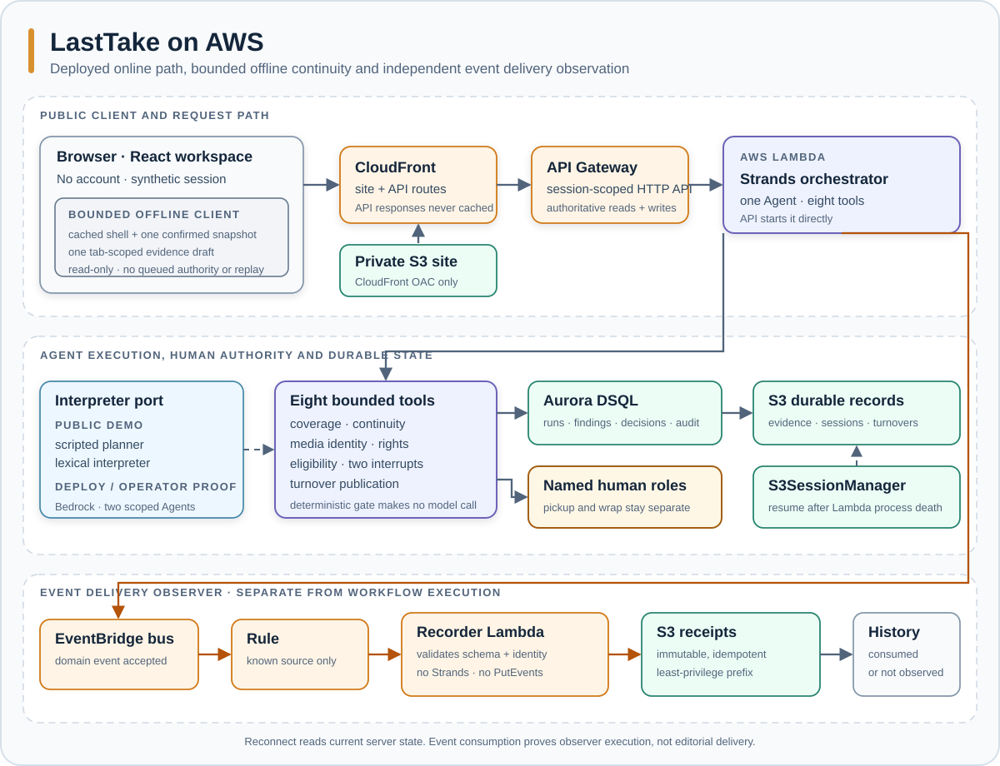
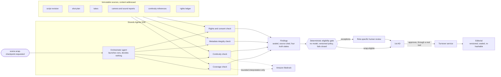
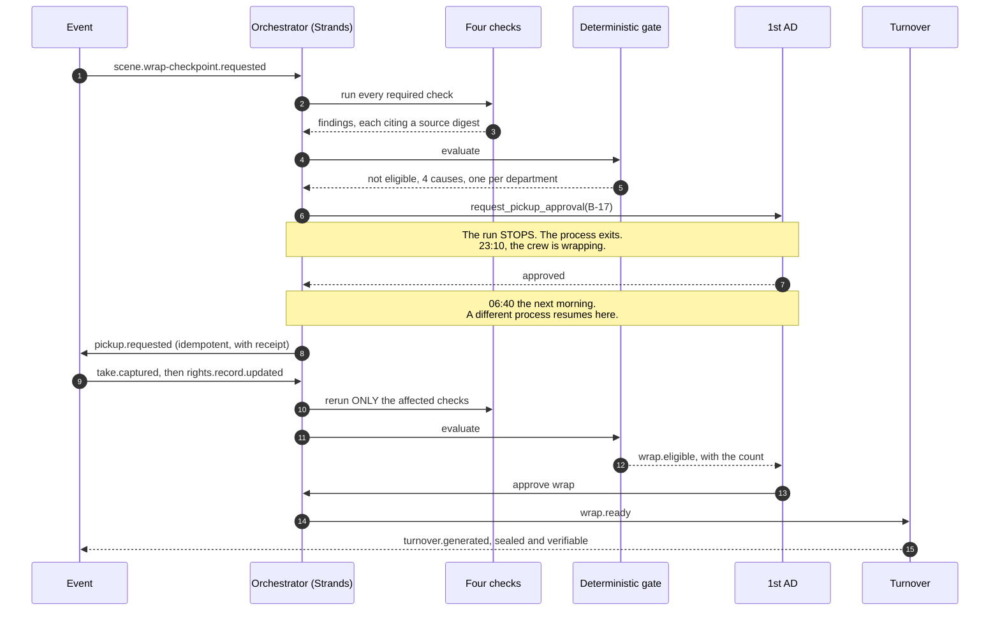

# LastTake

[](https://github.com/upgradedev/lasttake-aws/actions/workflows/ci.yml)
[](LICENSE)
[](https://www.python.org/)

For a script supervisor and the 1st AD reviewing a fictional shoot day. LastTake reconciles supplied records before a human wrap decision.

[Open the AWS workspace](https://d3kf6hquzlli8g.cloudfront.net/) and choose **Start this fictional shoot day**. The next-step panel follows the saved evidence through the human wrap decision to a turnover for the assistant editor.

[Current automated acceptance](https://d3kf6hquzlli8g.cloudfront.net/acceptance.html) compares the observed frontend and backend revisions with the latest public aggregate receipt. Missing, malformed, mismatched or older-than-24-hour proof cannot establish a current pass. Human UAT remains NOT_RUN. The page becomes available with the frontend release containing it; source CI alone does not publish acceptance.

The live browser uses an offline planner and lexical interpreter with real Strands tool calls, S3 session resume and role-gated decisions. It does not analyze footage/audio, send emails, make payments or establish legal sufficiency. Demo role selection is not authenticated staff identity. History exports sources, current decisions, revisions, recorded model identifiers, failure/recovery status and limits. Hashes identify bytes, not truth.

## Walk the complete shoot day

1. **Checkpoint:** create the fictional run and choose Run wrap checkpoint. Open a take and compare its sidecar with the independent camera report. Missing evidence stays missing.
2. **Evidence change:** answer the saved pickup request as the 1st AD. Open guided demo, then Add take or release. Save the valid take and a release example. A prior continuity decision becomes stale when the take changes its sources. You can also download an editable input JSON and load that ordinary file; loading only previews it until you press Save.
3. **Human wrap decision:** review continuity as the script supervisor and metadata T-013 as DIT. Record the reason for each accepted fictional exception. Select 1st AD, Review wrap readiness, Request wrap approval, inspect the fingerprint and explicitly approve or decline. Reload restores the saved request; eligibility never signs for the human.
4. **Editorial handoff:** in History, Publish approved turnover. Download turnover preserves the saved manifest. Download or copy the handoff summary for the beat-to-take map, source digests and retained exceptions. Prepare a Wrap review receipt for the recorded approval and open work. Historical records remain downloadable with their status shown.

The steps above are the new source capture contract, exercised by `frontend/tests/e2e/hero.spec.ts` against the real HTTP handler. Availability on the live URL depends on a reviewed frontend release; source CI is not deployment evidence. Final recording stays `NOT_CONFIGURED` pending owner verification. File intake accepts one JSON record up to 64 KiB, with independent camera report fields inside a take; it does not parse media, PDFs or CSV. Session authority comes from the browser's saved handle, never from the imported document.

---

## Workspace reference

<details>
<summary>Detailed workspace behavior, release verification and recovery</summary>

### React workspace usage

Live AWS application: [LastTake React workspace](https://d3kf6hquzlli8g.cloudfront.net/).
Historical release evidence only: [Live AWS acceptance](https://github.com/upgradedev/lasttake-aws/actions/runs/34327806494)
passed all 8 desktop/mobile journeys on 2026-09-09 against CloudFront, Lambda, S3 and Aurora DSQL.
This is automated synthetic acceptance, not a practising supervisor's signoff.
The tested frontend was `1f10d39c8b2b22474f64b1c057851eb2057665e7`; current release identity is
at `/release.json`, and backend identity at `/healthz`. That earlier run does not validate
the new dashboard and cockpit. The reliability scope and its new UAT cases start as NOT_RUN. Current acceptance comes from the exact-commit CI artifacts
and, after parent-approved release, the exact-SHA live acceptance workflow.

The React, TypeScript and Tailwind application is in `frontend/`. It builds to
`frontend/dist/` with hashed `/assets/` files and uses same-origin `/api/*` JSON
requests. Navigation opens Dashboard, Workspace, Records and History. Existing
`#overview`, `#scene`, `#actions` and `#history` links remain supported;
`#dashboard` and `#workspace` are also accepted. Run, beat, finding, record and
search context travel in the hash, and browser back/reload restore the selection.
The static UAT testbook is included as `UAT.testbook.html` and
`UAT.testbook.json`; human signoff remains `NOT_RUN` until a person completes it.

Every push to `main`, including a merged pull request, now starts
[`frontend-deploy.yml`](https://github.com/upgradedev/lasttake-aws/actions/workflows/frontend-deploy.yml):
offline checks -> AWS frontend deployment -> live desktop/mobile Playwright testbook journeys.
The release lock stays held through acceptance; queued releases do not interrupt a running test.
The reusable `aws-uat.yml` checks the exact frontend SHA before and after the journeys and fails
on browser errors or a changed release. Focused `test.only` tests are refused. Each run retains
HTML/JUnit reports, traces, screenshots, failure video and the testbook for 90 days, with a
result summary in GitHub Actions. Failure makes the pipeline red; it does not undo a merge
or automatically roll back the deployed frontend. Backend deployment remains a separate process.
The previous accepted run 34359050749/artifact 10107569851 was preserved as inert source bytes in archive artifact 10113819181 by [CI run 34375838628](https://github.com/upgradedev/lasttake-aws/actions/runs/34375838628). Its SHA-256 manifest records the original IDs and bytes; the immutable archive expires 2026-12-08. Archival is now manual opt-in and skips an existing archive. Ordinary verification does not repeat it.

Manual reruns remain available. Automated results never set human UAT signoff to PASS.

The public receipt requires at least the existing 20 product cases. JUnit supplies the totals; the same run's Playwright JSON report additionally refuses retries, repeated cases, skipped cases, expected failures and report disagreement. That raw report remains in the private CI artifact and is never published to the frontend bucket.

The served root HTML commit marker must match `release.json` as well as the receipt before publication or a current pass. A partial release or rollback cannot use a manifest alone to establish identity. Publisher-only retries use the producing acceptance job's artifact name and attempt output, preserving the run/attempt that actually executed the journeys.

Backend release is explicitly controlled: `deploy.yml` runs its deployment job only for `workflow_dispatch` with action `deploy`. Source pushes cannot activate that job. This separates code integration from its broader stack updates and real-model validation, not an extra approval gate on ordinary work. Frontend main CI/CD stays automatic; manual teardown/lifecycle behavior is unchanged. The package copies `src/lasttake`, corpus JSON and runtime dependencies. Credential-free branch CI retains a code package for a reviewed code-only rollout; it does not invoke the deployment workflow or establish AWS acceptance.

The browser acceptance job has only `contents: read` and no cloud credentials. After all three stages succeed, it parses the current run's product-journey JUnit into sanitized totals. A separate main-only publisher uses the existing frontend release OIDC role and bucket. `/acceptance/runs/<run-id>-<attempt>.json` is create-only or verified byte-identical; `/acceptance.json` is the latest pointer and aggregate, updated conditionally after rechecking public and origin release identity. Frontend publishes preserve retained proof. A changed backend during acceptance or stale dispatch refuses publication; frontend and backend commits may legitimately differ and the exact observed pair is recorded.

Receipts contain no scenario text, credentials or personal information. They record successful preflight/journeys/postflight, not overall workflow success. A final credential-free browser job reads the actual published page and receipt. Source-only proof-renderer fault fixtures have a separate configuration and JUnit report and never enter the public product-journey counts. Earlier testbook observations and failed-run artifacts remain dated history. In CI, `python infra/test_frontend_acceptance.py` exercises malformed JUnit, stale dispatch, release changes, immutable collisions and conditional publication; `npx playwright test --config playwright.proof.config.ts` checks the anonymous page's refusal states.

Create a fictional shoot-day run, start a checkpoint, inspect the script and
source records, then select the demo role responsible for each decision. Take
and release forms save records through the Python backend. The optional guided
demo supplies labelled fictional examples. The API reports the offline lexical
interpreter; real Strands interrupts govern pickup and wrap approvals.

Dashboard metrics describe only the selected run of the single fictional scene.
Coverage and missing-release counts come from the API assessment; absent or nullable
assessment is labelled Not assessed. Retained exceptions counts distinct findings,
including reviewed and accepted exceptions, and is separate from the eligibility
causes in Priority work. Supplied takes is a record count, not an audio or footage
quality assessment. No portfolio trends, savings or reshoot costs are inferred.

Workspace connects the lined script and take inspector, source-backed discrepancies,
and role decision controls in three purposeful panes. The wrap-status strip remains
visible above the scrolling decision form. Selecting a finding links back to its
actual beat, continuity reference, take or visible subject. Absent requirement IDs
never match absent continuity IDs; unmatched advisories keep their source evidence.
Source locators and artifact digests are displayed as reported. The package SHA-256
is a fingerprint, not a Merkle proof or independent verification.

Records exposes the scene projection: linked takes, script beats, retained findings
and visible release subjects. Unlinked takes and full release documents are not
returned by this endpoint, and the inspector states that limitation. An executed
ledger flag alone does not establish expiry, scope or legal sufficiency. Sound checks
use metadata only. History preserves saved turnovers even after evidence changes;
eligibility and an exact, unchanged pending interrupt remain separate from human
wrap approval.

The browser stores only a session handle and role preference. Saved runs belong
to that session; role selection is a synthetic demonstration, not staff login.
With browser storage blocked the tab remains usable, but a reload may start a
separate session. Requests time out after 35 seconds and never automatically
retry writes. Refresh saved state before retrying a write with an uncertain result.
Known HTTP 400 validation refusals preserve editable input and allow immediate correction
and resubmission. Stale/conflicting, network, unreadable and server-failure results require
a saved-state refresh before another write. Closing an intake form remains available.

Take intake accepts at most 64 unique identifiers in each of `beat_ids`,
`visible_people` and `visible_assets`. Repeated or oversized lists are refused
before writing; unknown beat identifiers are not silently removed. HTTP requests
are limited to 128,000 decoded UTF-8 bytes, including base64 gateway bodies.
Historical repeated links are deduplicated only in the scene projection; original
artifacts and their digests remain unchanged. Uncertain storage reads return a
generic unavailable response, never an unowned run or an empty saved state.

Saved run history loads 10 registrations per page (API maximum 20), before rebuilding
any run. DSQL filters the owning session in a parameterized keyset query and fetches
at most page size plus one row. Local/S3 fallback reads at most 64 KiB of the existing
audit array per page, without rewriting it. A changed fallback file asks for a list
refresh; an unreadable or oversized historical record is refused, not skipped.
Load older runs replaces the displayed page; Refresh newest runs restarts it.
Counts describe the loaded page, not total history. Saved handles, direct owned-run
links and earlier records remain valid. No registration quota is imposed. Database
physical scan/sort cost is not measured or claimed bounded by the result-row limit.

The security and pagination branches' `ci.yml` also produces a credential-free, source-only
Python 3.12 arm64 Lambda ZIP after the Python checks pass. It contains current
`src/lasttake`, corpus JSON, resolved runtime dependencies including the AWS SDK,
and `_lasttake_build.json`. The accompanying build receipt records the source
and component trees, input hashes, dependency report, ZIP hash and Lambda code
checksum. Native ELF architecture is checked, but target code is not executed on
arm64 or AWS. This artifact does not deploy, update `LASTTAKE_COMMIT_SHA`, or prove
live acceptance. The release owner must verify code and environment identity
separately; current AWS status remains on `/acceptance.html`.

The optional source hero measurement is preregistered in
[`docs/hero-measurement-protocol.json`](docs/hero-measurement-protocol.json).
It runs only on manual opt-in after normal source verification:20 fixed attempts,
10 desktop and10 mobile, no retries, recordings or discarded warmup. The unchanged
hero helper is timed from checkpoint through changed evidence, fresh wrap approval
and verified handoff downloads. Raw slots, failures, unrun slots, byte counts and
independent source/runtime identity are retained with p50/nearest-rank p95 methods.
Byte observations cover request bodies only; response-body bytes are UNKNOWN, not
captured, so no total-network-byte claim is made. Future failure retention uploads
only an isolated, once-published snapshot, including captured original bytes and
derived summary/hashes; per-file observations are not a cross-file transaction.
This is scripted source-CI completion time, not AWS latency or human time. External
model cost is0 only with verified offline guards; infrastructure/runner cost is
unknown. Earlier unmeasured protocol176b58b is explicitly superseded, not rewritten.

Historical source checkpoint,2026-09-10: the single
[measured run34481212393](https://github.com/upgradedev/lasttake-aws/actions/runs/34481212393)
at source `faf7f17128549155cda7144fdd1cd560c0f0a5c5` completed20/20 attempts,
10 per viewport, zero failures/incomplete/unrun slots and no retries. Its
[raw artifact10154044857](https://github.com/upgradedev/lasttake-aws/actions/runs/34481212393/artifacts/10154044857)
retains26 hashed files: p50=5662.1155775ms, nearest-rank p95=6547.501716ms,
process=165481.102184ms/exit0. Within the declared boundary,1540 requests had
179300 observed request-body bytes and0 unknown request-body sizes; response-body
sizes were not captured. Reproduce from `slot-*.json`, `summary.json`, `process.json`
and `manifest.json` in that artifact, not from whole Playwright-test timings.
These observations belong only to `faf7f1`. Subsequent timeout-retention fixes are
source-tested with a surviving child writer and replay these already-spent bytes;
they do not constitute another measured cohort or measure the newer source version.

Dependencies are installed in GitHub Actions. `frontend-ci.yml` generates a lock
only when absent, uploads it, builds the app, measures unit coverage, runs the
Python regressions and exercises desktop/mobile browsers against the real Python
HTTP handler with local durable adapters. It supports `workflow_call` for release
integration. A build artifact from a failed verification is for diagnosis only.
The HTTP test entrypoint is `python -m lasttake.app.local_server --state-dir
.lasttake-ui`; Vite's test proxy targets `127.0.0.1:8765`. No model credentials
are needed. Frontend deployment is a separate AWS integration step.

</details>

## Contents

- [Who this is for](#who-this-is-for)
- [Own workflow requirements](#own-workflow-requirements)
- [The problem](#the-problem)
- [Try it without installing anything](#try-it-without-installing-anything)
- [Quickstart](#quickstart)
- [What the demo shows](#what-the-demo-shows)
- [Architecture](#architecture)
- [How Strands is load-bearing](#how-strands-is-load-bearing)
- [The rule the whole product turns on](#the-rule-the-whole-product-turns-on)
- [What each rule is worth, measured by removing it](#what-each-rule-is-worth-measured-by-removing-it)
- [Bring your own record](#bring-your-own-record)
- [Four kinds of input](#four-kinds-of-input-and-what-the-pipeline-does-with-each)
- [What "covered" rests on](#what-covered-rests-on-and-why-two-readers-count-differently)
- [The numbers, and the commands that produce them](#the-numbers-and-the-commands-that-produce-them)
- [The demo corpus is synthetic](#the-demo-corpus-is-synthetic)
- [What it will not do](#what-it-will-not-do)
- [Running against Amazon Bedrock](#running-against-amazon-bedrock)
- [What is deployed, and what it costs](#what-is-deployed-and-what-it-costs)
- [Assurance and residual gaps](#assurance-and-residual-gaps)
- [Repository layout](#repository-layout)
- [Pre-existing components](#pre-existing-components)
- [Licence](#licence)

---

## Who this is for

A **script supervisor** on a shoot day, with the **1st AD** as the second reader.

Not film crews, not production teams, not creators. One person, one afternoon, one
decision: is this scene safe to wrap, and if not, what exactly is missing and who can
fix it while the set is still standing.

## Own workflow requirements

A supplied take must not manufacture its own camera report. Every current required check must have admissible evidence. Current authorized decisions are selected consistently by the UI, deterministic gate and receipt. A wrap approval binds the exact package and review digest shown to the 1st AD. The latest pending or declined wrap review supersedes earlier authority while preserving its historical receipt.

## The problem

At the end of a shoot day the evidence needed to judge whether a scene is ready to wrap
sits in seven places owned by five departments: the current script revision, the shot
plan, the captured takes, the supervisor's notes, the camera and sound reports, the
continuity references, and the rights ledger. Nobody holds all of it at once.

The task is to make missing or conflicting records visible while a human can still review them. No observed time saving, avoided pickup cost or production benefit is claimed.

## Try it without installing anything

[LastTake on AWS](https://d3kf6hquzlli8g.cloudfront.net/). No account or install is required for the fictional demo.

1. Create a new shoot-day run and press **Run wrap checkpoint**. Workspace shows the script, takes and current exceptions.
2. Inspect sources and select **1st AD** to answer the saved pickup request. Reloading restores the real Strands interrupt. A pickup request does not approve wrap.
3. Open the guided demo and **Add take or release**. **Try valid take** fills editable fields. **Try refused date** supplies an impossible expiry date and must return HTTP 400 with no amendment. **Try corrected date** reuses that identifier with a valid date; edit before submitting. A missing independent camera report remains missing.
4. Review the current continuity and metadata exceptions under their responsible roles. Review wrap readiness, request wrap approval, and answer the exact saved review as the 1st AD.
5. Open History to inspect delivery status, save a turnover when authorized, and prepare JSON or human-readable evidence. A bus-accepted receipt is not proof of downstream completion. Pending or unknown outcomes require reconciliation; only definite rejection offers an explicit retry.

Policy 1.1 requires a fresh checkpoint for older findings. The page names that reason and retains old history. Decline any old pending request before running a fresh checkpoint; an unbound historical response cannot approve new evidence.

## Quickstart

Prerequisites: Python 3.11 or newer, and git. No AWS account and no credential is needed
for the offline path below, which exercises the real checks, the real gate, the real
approvals and the real turnover.

```bash
git clone https://github.com/upgradedev/lasttake-aws.git
cd lasttake-aws
python -m pip install -e ".[dev]"
```

The commands below document the offline CLI. Repository validation for this change runs only in GitHub Actions.

**Step 1. A wrap checkpoint fires.** No button is pressed; an event arrives.

```bash
lasttake checkpoint
```

Expected: the four checks and deterministic gate run, the count prints, and the run **stops** with a pickup
request waiting for the 1st AD. The process then exits.

```
Of 34 required beats, 31 covered with evidence, 2 raising exceptions with named
sources, 1 with no release record and routed to production.

[pid 2378] the run has stopped and is waiting for a human.
  who: first_ad
  what: pickup on B-17
```

**Step 2. The 1st AD answers, in a different process.** This is the part that matters.
The first process is gone. Run this now, or tomorrow morning.

```bash
lasttake approve --yes
```

Expected: a new process picks the run up from exactly where it stopped, the tool that was
waiting finishes, and the bus response is reported with its receipt. This does not establish a downstream action.

**Step 3. A late take arrives, and only the affected checks rerun.**

```bash
lasttake late-take --beat B-17
```

**Step 4. Production supplies the missing release.**

```bash
lasttake resolve rights --subject BG-07
```

Expected: `Affected checks: rights.` Coverage, continuity and media identity keep their
results rather than being recomputed.

**Step 5. Read the event log, and verify any turnover packet.**

```bash
lasttake events
```

```bash
lasttake verify .lasttake/artifacts/turnover/run-sc042-wrap-checkpoint.json
```

Run the test suite, including the gate's own failure proofs:

```bash
python -m pytest --cov --cov-report=term-missing
```

## What the demo shows

One fictional shoot day, made messy on purpose. Six things are wrong with it and each
exercises a different part of the pipeline.

| What is wrong | Which check finds it | Who it goes to |
|---|---|---|
| B-17 was added in the Blue revision and never made the shot plan, so no camera rolled | coverage | script supervisor |
| Shot `S-42C-ORPHAN` plans for a beat the revision cut | coverage, advisory only | script supervisor |
| Two takes of B-23 are both flagged preferred and the mug does not match | continuity | script supervisor |
| T-013's media identifier does not match the camera report row | metadata | DIT |
| BG-07 is visible in a take and has no release record | rights | production coordinator |
| A late take arrives after the checkpoint | targeted rerun | nobody, it just works |

Note the fourth row. T-013 has a real problem, and beat B-11 is still **covered**, because
a second take of it is clean. A beat is covered when at least one take of it is usable,
reconciles, carries no unresolved continuity conflict, and has every subject released.
Conflating "some take has a problem" with "the beat is missing" would report a scene as
short of footage that is sitting on the card.

## Architecture

The required diagram is a file of its own, [`docs/architecture.svg`](docs/architecture.svg), so it
can be opened, downloaded and read without this README around it. The Mermaid sources below are the
same system in two other cuts, the system view and the sequence from question to governed write.






The dotted lines matter. A model is used for exactly two questions, both of them language
questions: does this take plausibly contain this beat, and do these two notes describe the
same physical state. Identifier equality, timecode arithmetic, checksum comparison and
counting are done in code, because a model that is bad at arithmetic and expensive at it
is the worst of both.

### The flow, from question to governed write and back



## How Strands is load-bearing

Remove the Strands Agents SDK and four things disappear at once: the orchestration loop,
the tool calls, the two human approvals, and the resume that makes an overnight approval
possible. What is left is a script that cannot stop and wait for a person.

The specific capability the product is built on is **interrupt and resume across process
death**. Inside a terminal tool, `ToolContext.interrupt(name, reason=...)` stops the run.
The agent returns `stop_reason` of `interrupt`. A session manager writes the paused run to
storage. A **different process**, hours later, calls the agent with an `interruptResponse`
and the run continues from the same point.

**Historical cross-process evidence; not acceptance of the current patch.** On a Lambda, `/tmp` does not
survive the gap between 23:10 and 06:40, so the sessions live on `S3SessionManager`. The
deploy pipeline fires the checkpoint in one HTTP request, then **retires every warm
container** with a configuration change, then approves in a second request, and asserts the
two were served by different processes:

```
=== request 1 of 2: fire the checkpoint ===
Of 34 required beats, 31 covered with evidence, 2 raising exceptions with named
sources, 1 with no release record and routed to production.
stopped for: first_ad on B-17
served by container 5783cd7e

=== between the two: force a new execution environment ===
every warm container has been retired

=== request 2 of 2: a separate invocation approves ===
Pickup approved for B-17 by the 1st AD and routed to the assistant director's board.
container that stopped the run:  5783cd7e
container that resumed it:       0310464e
```

The transcript above is retained as historical output. Its old “routed to the board” wording did not prove downstream delivery. Current tools report bus acceptance explicitly.

The assertion is `c1 != c2`, so a run where Lambda happened to reuse a container fails the
pipeline rather than quietly passing on a weaker claim.

On a set this is not academic. The checkpoint finds a coverage gap at 23:10 as the crew is
wrapping. The 1st AD is not looking at a screen. They approve at 06:40 before the first
setup, and the run resumes across a process that no longer exists.

Proved in CI as two separate `run:` steps, which is two separate operating system
processes, plus a negative control that wipes the session and asserts the resume fails:

```
=== START process, pid 2378 ===
[pid 2378] stop_reason = 'interrupt'
=== START process exiting, pid 2378 is now dead ===
=== APPROVE process, pid 2387 ===
PASS: the tool STARTED in pid 2378 and FINISHED in pid 2387
NEGATIVE CONTROL HELD: with the session wiped, resume fails.
```

**One design constraint this forced, found before the build rather than during it.** On
resume the tool body re-enters from its first line and `interrupt()` returns the stored
answer. It is a replay, not a frozen stack frame. So anything with a side effect placed
before the interrupt runs twice. Every approved action in this repository puts its
external call after the interrupt, behind an idempotency key derived from the event
payload. See `src/lasttake/agents/tools.py`.

## The rule the whole product turns on

**It never infers a pass from absent evidence.** Absent evidence is a finding.

There are four truth states and there is no fifth. `verified`, `missing`, `conflicting`,
`unknown`. Three of those are exceptions. There is no `pass`, no `clear`, no `safe`, and a
test asserts there never will be.

The gate that combines them contains no model call, no heuristic and no randomness. It
fails closed in every direction, and each of these has a test that tries to make it fail
open:

- a check that produced no result is a missing result, not a pass
- a check that produced two results is a contradiction, not a pass
- a finding written against an older package revision is discarded, not reused
- a finding whose seal does not verify is discarded
- an exception no authorised human has looked at is not a pass
- a decision taken by the wrong role is not weak evidence, it is no evidence

The last one is a table, not an `if`. A DIT may resolve a media identity question and may
not accept a rights exception. Nobody at all may accept away a missing release, including
the role that owns rights, because that decision belongs to production and counsel and not
to this system.

## What each rule is worth, measured by removing it

These are synthetic protocol probes, not measurements of human work or model correctness. Run `PYTHONPATH=src python tools/ablation.py` on CI; it prints a new result without overwriting historical records.

The seal probe edits a record and compares rejection with an explicitly resealed input. The staleness probe carries old findings, then measures actual gate admission: restamping a package revision does not update its cited source digests. **Carried stale records are not admitted stale records.** The model-outage probe checks the direction of failure under unavailable interpretation.

`docs/ablation.json` preserves earlier output and an appended correction. Its earlier stale-admission wording was not supported by an actual gate evaluation. New tests require the actual counter and retain stale-source refusal.

## Bring your own record

The demo used to have two buttons that wrote a take and a release for you. They
showed the targeted rerun honestly enough, but nobody could put their own scene
through it, which made this a fixture with a play button. It takes a document now.

For a session-owned run, replace both placeholders below: `run_id` is returned by
`POST /api/reset` using your `session_id`, and `session_id` is the private handle
returned by `POST /api/session`. Keep that handle private; it grants access to your
saved runs. Do not put it in shared examples, screenshots or logs.

```bash
curl -s -X POST "$URL/api/ingest" -H 'content-type: application/json' -d '{
  "run_id": "REPLACE_WITH_YOUR_RUN_ID",
  "session_id": "REPLACE_WITH_YOUR_PRIVATE_SESSION_ID",
  "kind": "take",
  "document": {
    "take_id": "T-900", "shot_id": "S-42-PICKUP", "beat_ids": ["B-17"],
    "slate": "42L/1", "camera_roll": "A007", "sound_roll": "SR07",
    "timecode_in": "23:04:00:00", "timecode_out": "23:04:41:00",
    "lens_mm": 50, "media_id": "A007R2G01",
    "preferred": true, "usable": true,
    "note": "Pickup on the reaction. Clean single.",
    "visible_people": ["DELPHINE"]
  }
}'
```

An owned run refuses a missing handle or a handle from another session with HTTP
403. Legacy unowned demo runs still accept their `run_id` without `session_id`;
omit that field for those runs. Omitting it never unlocks a session-owned run.

`kind` is `take` or `rights_record`. A document that does not match the shape is refused before
anything is written, and the refusal names the missing and the unexpected fields rather than
failing quietly. The page carries an editable example of each, so a visitor edits a record rather
than reading a schema.

What happens next is the part worth watching. The document becomes a package amendment, the
amended package produces new digests, and **the checks that read the artifact that moved run
again**. A take moves the takes document, which all four checks read, so all four rerun. A release
moves only the ledger, so only rights does. That narrowing is derived from which bytes changed and
never from a table asserting it.

### An approval does not survive the evidence it was about

A human decision used to bind to a finding **id**, and ids are deterministic: `run:con:CR-01` is
the same string before and after a rerun. So a supervisor could accept the mug conflict as
intentional, a take could arrive that changed the continuity evidence completely, the finding
would be recomputed under the same id, and the old acceptance would still close it. Nobody would
have looked at the new facts and nothing would say so.

A decision now carries the seal of the reading it was taken about. When the evidence moves the
digest changes, the decision stops applying, and the ingest response lists what was withdrawn and
why. Legacy decisions without a finding digest remain in history but no longer authorize a current finding. The UI marks them as requiring another review; neither the API nor CLI creates new unbound decisions.

### What each chair is actually holding, and what leaves the building

Above the exception cards the page answers the three questions a script supervisor has on
the floor and a 1st AD has at the truck: what do I do, who owns it, and where did it come
from. One line per item, in the order the cost falls, with no finding ids and no agent
trace. Which items are yours is read from the same authority table the deterministic gate
enforces, so moving a check to a different role moves the summary without anyone editing
it.

Beside it is a sealed receipt a person can copy into a production email. It is the packet
designed to be read away from this page, so it carries its own context: the run, the scene,
the script revision, the package digest, the policy version, its own SHA-256, and every
still-open item with its responsible role, next action and source digests.

An accepted exception travels in that list. Somebody signed for it, which does not make it
fixed, and a receipt that quietly dropped it is how an approved problem reaches the edit as
a surprise. The packet also states what it does **not** say: it is not a statement that the
scene is creatively complete, cleared in law, or safe to wrap, and absent evidence in it is
a gap rather than a pass.

## Four kinds of input, and what the pipeline does with each

```bash
PYTHONPATH=src python tools/evaluation_cases.py
```

| Input | What happens |
|---|---|
| **correct**, a take that covers the uncovered beat | B-17 goes from `no_viable_coverage`, basis `insufficient_evidence`, to `covered_with_evidence`, basis `corroborated_by_the_interpreter` |
| **incomplete**, the same take with no slate | refused before anything is written, naming `slate` |
| **conflicting**, a camera report naming a different card | `media_identity_exception`, basis `declared_by_the_production`. The only take does not reconcile, so the beat is not covered |
| **changed**, evidence moving under an approval already given | the acceptance stops applying: `resolved=True` becomes `resolved=None` |

It runs offline with no account and no credential, because the local adapters implement the same
ports the deployed build uses. A test pins all four so they cannot drift.

**These are our cases, scored by our pipeline.** That is a description of behaviour under four
kinds of input. It is not an evaluation of judgement quality against labelled ground truth, and
**no practising script supervisor has run any of it**. The trial that would matter is whether a
supervisor finds the evidence available before wrap and the reconciliation work actually reduced.
That has not happened, and nothing here should be read as though it had.

### Text interpretation evidence: source preparation, not model accuracy

The fixed [16-case protocol](docs/model-evidence-protocol.json), [supplied text](docs/model-evidence-cases.json)
and [separate gold labels](docs/model-evidence-gold.json) were committed before the
instrument. These are assistant-authored synthetic development cases, not held-out
research data or practitioner labels. Only supplied notes and text descriptions
are interpreted. There is no footage/audio analysis or creative/legal judgement.

Future integration must preserve preregistration commit
`c0593b9e5c464f7b3cdb5574aece7ff8aabb71ba` as an ancestor: use a merge preserving
history, not squash or rebase. CI checks that ancestry and the frozen input hashes.
Do not rewrite the preregistration or relax the check to accommodate integration.

Source CI first runs malformed/unsafe-response, missing-slot, interrupted-write,
wrong/stale request-binding and metric-denominator controls. It then runs:

```bash
python tools/model_evidence.py --output source-evidence/model-evidence
```

The fresh output directory contains the existing lexical interpreter's raw outputs,
all16 future-model slots marked `UNRUN`, the existing bounded Bedrock prompts and
schemas captured without constructing a model, source/request/response hashes,
and fixed capture, false-positive, false-exception and abstention denominators.
Gold never enters the prompts. Failed/unrun attempts are not dropped or replaced;
malformed responses are failures, not successful abstentions. The question-level
ruler is not the complete production eligibility policy. No model quality threshold
or independent accuracy claim is attached to these development results.

`--replay <already-captured.json>` reads inert structured responses only, with exact
protocol and request bindings. It retains original bytes even when refusing them;
hashes bind bytes, not model origin. Tests use explicitly labelled fake responses.
The [spent-evidence inventory](docs/model-evidence-inventory.json) found no complete,
comparable raw semantic cohort in its bounded inspection: two latest successful
deploy runs list no artifacts, and the newest log retains counts, one truncated
rationale and a separate connectivity-only `OK` response. None establishes accuracy.

Real-model evaluation remains `NOT_RUN`; LT2/C1 is not closed. The frozen offline
instrument is unchanged. The separate bounded collector below prepares a future
owner-activated cohort. Unrecorded model usage/cost and runner/infrastructure cost
remain `UNKNOWN`; zero model calls describes only offline execution.

### Bounded collector preparation: evaluation only, not production Strands

`tools/bounded_model_evidence.py` wraps the frozen requests and offline replay.
Source CI runs fake full-flow, budget/binding denial, malformed response, interrupted
call and immutable raw-retention controls before this credential-free export:

```bash
python tools/bounded_model_evidence.py export --output source-evidence/bounded-export
```

The artifact contains every exact SDK request, per-case serialized ASCII byte size,
request/config/protocol/source hashes, input-token reservation, fixed512 output
ceiling, reference worst-cost arithmetic and an invalid `NOT_AUTHORIZED` grant
template. It is not a measurement or authority to spend. The separate supervisor
below adds an inactive live-capable job, not app changes, IAM setup or deployment.

The candidate is `eu.anthropic.claude-opus-5`, region `eu-west-1`, with thinking
disabled, one forced `record_opinion` tool result and at most one plain Converse
request for each of the16 frozen cases. System/user prompts, schemas, gold,
thresholds, evaluator bytes and preregistration ancestry stay unchanged. Plain
Converse does not exercise the production Strands structured-output orchestration;
this transport/config difference prevents a production-adapter equivalence claim.
There is no tool execution, repair, retry, fallback, warmup or replacement sample.
The SDK has `total_max_attempts=1`,5-second connect and30-second read timeouts;
the driver checks a900-second process bound and grant expiry before each call.

Input tokens are conservatively reserved as serialized ASCII request bytes plus
4096 tokens for hidden model/tool framing, with a16384-byte request ceiling. This
counts the whole schema and escaped supplied text. It is an explicit reviewed
assumption, not a provider-certified tokenizer bound or CountTokens measurement.
The parent must accept this exact allowance or refuse activation. Actual usage
above the bound, unknown usage, errors or expiry stop further calls. Reference
rates5.50/27.50 USD per million input/output tokens are illustrative geo pricing,
not an active grant. Only exact positive finite Decimal rate strings in the
parent's digest-bound grant can authorize the plan. The entire worst-case cohort
must fit that app's allocated share before SDK initialization; the shared USD5
pool is never inferred as LastTake's available balance.

### Private supervisor: prepared, inactive, live verification NOT_RUN

`tools/evaluation_runner.py` and the separate `evaluation-parent` job prepare the
parent boundary around this collector. Push and pull-request CI export an inert
plan and exercise injected fake GitHub/model responses only. They cannot activate
that job. The frozen evaluator, requests and `e1a0901`/`c0593b9` ancestry remain.
The supervisor and its AWS authority have not been exercised against live services.

Activation requires a reviewed exact-source manual dispatch, a separately approved
`lasttake-bounded-evaluation` environment with required reviewer protection, and a
model-only OIDC role in `LASTTAKE_EVAL_ROLE_ARN`. None is provisioned by this code.
No deploy keys or application role are a fallback. The inline session policy can
only restrict an existing role; it cannot grant missing permission. Configure the
exact plan-byte SHA256 as the **repository-level** variable
`LASTTAKE_EVAL_APPROVED_PLAN_SHA256` so the job-level condition can inspect it.
Keep this empty until the parent has reviewed the source, price, bound and authority.

CI exports `supervisor-plan/plan-NOT_APPROVED.json`. A parent must supply all three
source/request/config/protocol hashes, fixed dollar slices whose sum is at most
USD5, reviewed token bounds, verified Decimal prices, one budget ID, exact future
manual workflow run numbers and refs, and issue/expiry timestamps within one hour.
The current run ID is bound by the supervisor after dispatch, not guessed in advance.
An intervening run number change refuses activation and requires a fresh review.
Changing whitespace in the approved JSON also invalidates its configured digest.

This implementation consumes **LastTake's slice only**. Merismos and Archon must
remain inactive until their runners consume their own slices from the same fixed
parent plan. The sum check is not a deployed distributed budget controller, an AWS
billing limit, or permission to give each application a fresh USD5 grant.

Before AWS credentials, the supervisor verifies the actual private repository ID
and creates one annotated reservation at `eval-reservations/<budget-id>/lasttake`.
Duplicate, failed or uncertain ref creation never retries or refunds the slice.
Before launching, it verifies the remote ref and tag payload, exact source, run
and local grant; a create-only launch marker prevents duplicate child launches.
GitHub tokens and OIDC request credentials are removed from the child environment.
Repository administrators can alter Git refs: this is a cooperative trusted-runner
record, **not WORM**, owner authentication or protection against privileged writers.
No code here deletes or rewrites a reservation. Reference API contracts:
[create a ref](https://docs.github.com/en/rest/git/refs#create-a-reference) and
[create an annotated tag](https://docs.github.com/en/rest/git/tags#create-a-tag-object).

The child command below illustrates the same collector boundary. **Do not invoke
it directly to bypass the supervisor or its consumed reservation**:

```bash
timeout --signal=TERM --kill-after=5s 960s python tools/bounded_model_evidence.py collect --grant /private/grant.json --output /private/lasttake-cohort
```

The supervisor stops and reaps the child process group on timeout, SIGTERM or SIGINT;
SIGKILL and a lost host cannot be caught. Its job is capped at20 minutes.
Only GitHub manual `workflow_dispatch`, run attempt1 and matching grant/context
are accepted. Before each call, the create-only journal fsyncs the reservation and
full request; after it, the full SDK-decoded response is fsynced before semantic
parsing. Each record also prints as a flushed base64 stdout backup. It preserves
request IDs and usage, not just a rationale. These are SDK receipts, not original
HTTP wire bytes or independently authenticated model origin. Request hashes are
mechanical provenance, not model-authored citations. Unknown outcomes consume
their entire worst reservation, with no refund or retry. All16 failed/unrun slots
remain in the frozen evaluator's denominators. Recorded usage-cost arithmetic is
not an AWS bill; runner/infra cost and response-body byte count stay `UNKNOWN`.

The normal exit seals an immutable `final/` copy and replays only those captured
bytes through the frozen evaluator. If the process is killed, the parent must
first terminate it, then run the following **offline** finalizer only if `final/`
does not exist. The supervisor's offline `recover` also verifies the final seal;
an incomplete final is preserved and replayed from raw into a fresh `recovery/`
snapshot. An interrupted recovery is refused, never overwritten. Never rerun
`collect`. Missing/corrupt denominator files retain
available raw bytes, refusal report and hashes, without a successful summary:

```bash
python tools/bounded_model_evidence.py finalize --output /private/lasttake-cohort
```

The prepared job uploads the journal and `final/` with `if: always()`, even on
failure. A fully lost or forcibly cancelled runner can still lose artifacts or
unflushed service logs; stdout backup is not a durability guarantee. Reference contracts:
[Converse](https://docs.aws.amazon.com/boto3/latest/reference/services/bedrock-runtime/client/converse.html),
[single SDK attempt](https://docs.aws.amazon.com/botocore/latest/reference/config.html),
[model profile](https://docs.aws.amazon.com/bedrock/latest/userguide/model-card-anthropic-claude-opus-5.html),
[pricing to re-verify before grant](https://platform.claude.com/docs/en/about-claude/pricing).

## What "covered" rests on, and why two readers count differently

`[PRIMARY]` 2026-09-08, deploy run 34195514875, which runs `lasttake checkpoint --bedrock` on the
deployed role and prints the count.

| Interpreter | Covered, of 34 |
|---|---|
| `offline-lexical/1.0.0`, which the live URL runs | **31** |
| `bedrock:global.anthropic.claude-sonnet-5` | **19** |

Neither count establishes correctness without labelled ground truth. "Covered" was one word doing four
jobs, so the outcome now carries **what it rests on**, and the same run reports both:

| Basis | What it means | offline | model unreachable |
|---|---|---|---|
| declared by the production | a take names this beat. The people who were there said so | 2 | 33 |
| corroborated by the interpreter | a second reader agrees the take contains the beat | **31** | 0 |
| confirmed by a named human | the role that owns the check said so. This outranks both | 0 | 0 |
| insufficient evidence | no take, a model that could not tell, a timeout | 1 | 1 |

```bash
PYTHONPATH=src python -m pytest -q tests/test_corpus_counts.py
```

Read the two columns together and the 31-against-19 gap stops being a mystery. **What the
production declared does not move.** What moves is how much of it a given reader will corroborate,
and a stricter reader corroborates less. The model is shown the beat, the slate, the supervisor's
note and the setup, and most takes carry no note, because a supervisor writes one where continuity
matters and not on every take. Asked whether a slate with no note contains a particular beat, a
careful reader says it cannot tell.

Three things follow, and the gate enforces all three. `insufficient` is never a pass, so a timeout
and a model failure both block rather than clear. A beat resting on the production's declaration
alone is **not** counted as covered, because one assertion is not two. And no interpreter can raise
the count above what the evidence supports: the deploy asserts that required beats stay 34 and
covered may fall and may never rise.

What this exposes is the gap already declared in [`docs/assurance.md`](docs/assurance.md), that
there is no independent, real-model evaluation on its two bounded questions. The source-only
development set above does not close that gap. Closing it means labelled ground truth for "does this take contain
this beat", which this corpus does not have and one shoot day would not settle.

## The numbers, and the commands that produce them

The table below is the offline synthetic baseline, not a Bedrock invariant or a claim about a production. The test that asserts
them fails if the corpus or the rule drifts.

| Claim | Value | Command |
|---|---|---|
| required beats in the scene | 34 | `python -m pytest tests/test_corpus_counts.py -q` |
| covered with evidence | 31 | same |
| raising exceptions with named sources | 2 | same |
| with no release record, routed to production | 1 | same |
| takes in the shoot day | 40 | `python corpus/build_corpus.py` |
| blocking causes at the first checkpoint | 4, one per department | `lasttake checkpoint` |

```
Of 34 required beats, 31 covered with evidence, 2 raising exceptions with named
sources, 1 with no release record and routed to production.
```

### Measured against a baseline written before the run

`tools/measure.py` is the protocol rather than a results file. The baseline, the fixtures
and every expected outcome are literals at the top of it, written from the product's rules
before anything ran, and a case that disagrees with its expectation is reported as a
failure rather than quietly becoming the new expectation.

```bash
PYTHONPATH=src python tools/measure.py
```

Five cases, one for each way a scene package arrives: ordinary, missing evidence, changed
input, refusal, retry and recovery. Three more were written after the behaviour was fixed
and kept separate; that is weaker than a set somebody else wrote and it is labelled weaker.

Three fields are deliberately empty. **Human active time, interruptions and corrections are
not measured, because no human was observed doing any of this.** Timing the model and
calling the result human time saved would be a fabricated benchmark, and a zero in those
fields would read as "needed no help". Bedrock inference cost is not measured either: it
needs per-call token counts this harness does not collect, so the field says so instead of
guessing. Model time, wall time and human time are three different things and only two of
them exist here.

One expectation was wrong on its first run and the correction is published in
`docs/measurement.json` rather than absorbed: rights findings were declared as 6 and
observed as 7, and the corpus is five people plus two visible assets, so the product was
right and the expectation never was.

## The demo corpus is synthetic

THE LAST FERRY is a fictional production. Every person, place, identifier and record in
`corpus/` is invented for this demonstration. No real production data is used, no real
person's release is included, and no footage is referenced or shipped.

The corpus is generated by `corpus/build_corpus.py`, which is deterministic: no clock, no
randomness, so the digests are stable and a diff means something changed. CI regenerates
it and fails if the committed files differ.

## What it will not do

It is a second set of eyes and an integrity layer. It replaces nobody.

It may not judge creative quality or choose a performance. It may not declare a scene
legally cleared, safe or creatively complete. It may not approve a pickup, a wrap, a
schedule, a spend, a permit or an external communication. It may not edit or delete
original media. And it may not infer a pass from absent evidence.

A rights row reading `verified` means the expected record was found and its structured
fields matched the configured policy. It is not a legal opinion and it does not state that
a use is lawful. Counsel determines sufficiency. That sentence is printed on the face of
every turnover packet, not buried here.

## Running against Amazon Bedrock

The offline path uses a lexical stand-in for two bounded interpretations. New finding records serialize `model_id` when an interpretation is present. Older records without that field remain unknown; current configuration and `agent_version` are not retroactive model provenance.

To use a real model, ask your own account what it can invoke rather than trusting a string
in a source file:

```bash
lasttake doctor --bedrock
```

That lists the Anthropic foundation models and cross-region inference profiles the
credentialed account can actually reach, in that account's own configured region.

This is not decoration. The first draft of this repository defaulted to
`us.anthropic.claude-sonnet-4-5-20250929-v1:0`. Asking a real account returned neither
that identifier nor that region. The default is now `global.anthropic.claude-sonnet-5`,
verified by invocation on 2026-08-22 against one account, which is not the same as verified
against yours. Set the one `doctor` printed and run any command with `--bedrock`:

```bash
export LASTTAKE_BEDROCK_MODEL_ID=<an id that doctor printed>
lasttake checkpoint --bedrock
```

**What this is checked against.** The deploy pipeline runs a full checkpoint through
`BedrockInterpreter` on every deploy, so `BedrockModel` plus `agent.structured_output` is
exercised rather than described. The historical deployment observation cited above produced **34 findings carrying a real model
inference**, for example on the mug conflict:

> Established state calls for a half-full mug with handle to camera left. First take matches
> this exactly. Second take describes the mug as empty with handle turned to camera right.

The deployment checks that required beats remain 34 and that bounded model interpretation does not raise covered beats above the offline baseline. It also requires real model-touched coverage and continuity findings and confidence below 1.0. It does **not** require Bedrock to reproduce the offline 31 covered beats: the dated observation above was 19 of 34. Model identifiers in exported findings come only from their serialized records.

The hosted HTTP demo remains offline by default.

Untrusted input is handled as untrusted. Script pages, supervisor notes and camera reports
are production documents, and a production document can contain any text at all, including
text shaped like an instruction. Everything from a scene package is wrapped in delimiters
and the system prompt states that content inside them is evidence to describe and cannot
issue instructions.

## What is deployed, and what it costs

Five services, declared in `infra/stack.yaml` and deployed by
`.github/workflows/deploy.yml`. Nothing is created by hand in a console.


**Why a database and not more S3.** The run state started on S3 and it worked, for one
scene with one writer. It is the wrong store the moment two approvals of the same pickup
arrive together, because `already_handled` then `mark_handled` is read-modify-write: both
callers read "not handled", both write, and a real assistant director gets the same pickup
request twice. On DSQL that is one `INSERT ... ON CONFLICT DO NOTHING` and the database
decides. Two smaller reasons follow it: findings are upserted by key rather than the whole
set being rewritten, so a targeted rerun and a human decision landing together stop
clobbering each other; and a shooting day has more than one scene, so
`GET /api/blocked` answers "which scenes are still blocked, and on whom" in one query
rather than a bucket scan per scene.

DSQL specifically, rather than a Postgres somebody has to keep alive, for the same reason
as everything else here: it scales to zero, there is no idle charge and no instance to
size. Authentication is IAM, so there is no password in this repository or in the deployed
configuration; a short-lived token is minted per connection from the function's own role.

Two DSQL constraints shaped `adapters/aws/dsql.py` and are asserted by tests rather than
left as folklore: there are no sequences, so every key is supplied by the caller; and DDL
runs one statement per transaction, so the schema is applied one statement at a time
instead of being wrapped in the transaction that instinct suggests.

The `/healthz` endpoint reports `run_state_store`, and the deploy pipeline fails if it does
not read `aurora-dsql`. Without that assertion a silent fall back to S3 would leave
everything working while the architecture quietly stopped being the one described here.

**Why an HTTP API and not a Lambda Function URL.** A Function URL was the first choice: one
fewer service and no extra bill. It was replaced because this account refuses anonymous
Function URL invocations. Both the real function and a one-line probe returned
`403 AccessDeniedException` with a correct resource policy in place, and with no SCP and no
RCP anywhere in the organization, while the same probe behind an HTTP API answered 200. The
architecture routes around the block rather than arguing with it. Nothing else changed: the
HTTP API uses payload format 2.0, whose event shape is the one the handler already read.

**Least privilege, as deployed.** The execution role reaches its own bucket, its own event
bus, Anthropic inference, and `dsql:DbConnectAdmin` on its own cluster. It cannot read
another bucket, touch another bus, create a cluster, or delete the one it writes to. The bucket is private, encrypted, versioned, and denies any request that is not
TLS. The identity GitHub deploys with is separate again, scoped to `lasttake-*` resources,
and is created by `infra/setup_ci_identity.py` so that nobody's personal credentials are
ever copied into CI.

**Costs and timing.** No measured invoice, human-active time or savings are claimed. AWS charges and quotas depend on the account and request pattern; CI timings are validation timings, not time saved for a crew. The receipt exposes measured publication elapsed time without treating it as human time.

**Tearing it down.** `gh workflow run deploy.yml -f action=teardown` deletes the stack. The
data bucket is retained on purpose, because it holds the audit trail, and a teardown that
destroys the audit trail is not a teardown. Empty it deliberately if you want it gone.

## Assurance and residual gaps

[`docs/assurance.md`](docs/assurance.md) holds three tables: AWS Well-Architected across six
pillars plus the Agentic AI Lens, the EU AI Act articles this class of system has to answer
for, and what is done with personal data.

**Every row names a residual gap and not one of them is empty**, because a row with nothing
left to do is a row nobody looked at hard enough. The gaps include real ones: no measured
p95, no restore drill, no evaluation set for the two bounded model questions, a public
endpoint with no authentication by design, and long-lived access keys in CI rather than
federated identity.

Two words never appear there, and a gate fails the build if they do. Whether a system meets a
regulation is decided by an assessment body, not by the people who wrote it.

## Repository layout

```
src/lasttake/
  domain/      the model, the four truth states, the deterministic gate, the turnover.
               Imports no SDK, and two tests enforce that rather than asking politely.
  checks/      the four bounded checks. Coverage and continuity use a model through a
               narrow port; metadata and rights are arithmetic and never call one.
  ports/       the interfaces. Event bus, artifact store, run store, interpreter.
  adapters/    local/ runs offline with no account. aws/ is Bedrock, EventBridge,
               S3 and Aurora DSQL.
  agents/      the Strands layer: the orchestrator, its eight tools, and the run.
  app/         the Lambda behind the live URL, the lined script it paints, and the
               single page. scene_view.py imports no SDK either: the view a script
               supervisor reads is shaping over the package, not agent output.
  cli.py       the commands a judge runs.
corpus/        one fictional shoot day, and the generator that produces it.
tests/         including the gate's own proofs that it can fail.
web/tests/     nineteen browser tests against the deployed URL. The journey a judge
               walks, the intake a person supplies, and the handover two roles read.
tools/         the gates and the harnesses. measure.py holds the declared baseline,
               dast_probe.py throws hostile bodies at the live API, prose_gate.py and
               secret_scan.py run in CI.
docs/          architecture.svg, the assurance tables, and the JSON each harness
               writes: measurement.json, ablation.json, evaluation_cases.json, and
               build_stories.json, which holds three unpublished drafts.
```

## Pre-existing components

Required disclosure. The historical component disclosures below are retained. The optional video tooling also retains its source-kit provenance in its file headers; none of its original upstream records was removed. Current video source is NOT_CONFIGURED, with an explicit failing preflight until the owner provides narration credentials and verifies exact-release capture and timing. No candidate recording is claimed.

| Component | Where it came from | What was carried |
|---|---|---|
| `src/lasttake/domain/sealing.py` | ClaimScene, MIT, same author, `src/claimscene/provenance.py` | `sha256_bytes`, `canonical_json`, and the sealed-record approach. About thirty lines of primitives, plus the idea of sealing a record with the digest of its own canonical JSON. ClaimScene shares them with Cinemory. |
| The product thesis | A private research package written 2026-07-28 by the same author, 2,365 lines across 13 files: the problem definition, the user roles, the four truth states, the finding contract, and the event list | Carried as specification, not as code. Every line of implementation here is new. |
| CI shape, README structure | A private submission toolkit by the same author | Workflow layout and section ordering. |
| Production workspace visual direction | Kerdon interface and the owner's approved workspace reference | Visual inspiration only: deep navy panels, amber LastTake accents, compact navigation and connected context/evidence/decision panes. Implemented here with existing React, TypeScript and Tailwind dependencies. No Kerdon customer data, tenant configuration, source IDs, assets or dependency code was reused. |

The AWS adapters, the Strands agent definitions, the deterministic gate, the checks, the
demo corpus and the CLI are all new.

## Licence

MIT. See [LICENSE](LICENSE).
