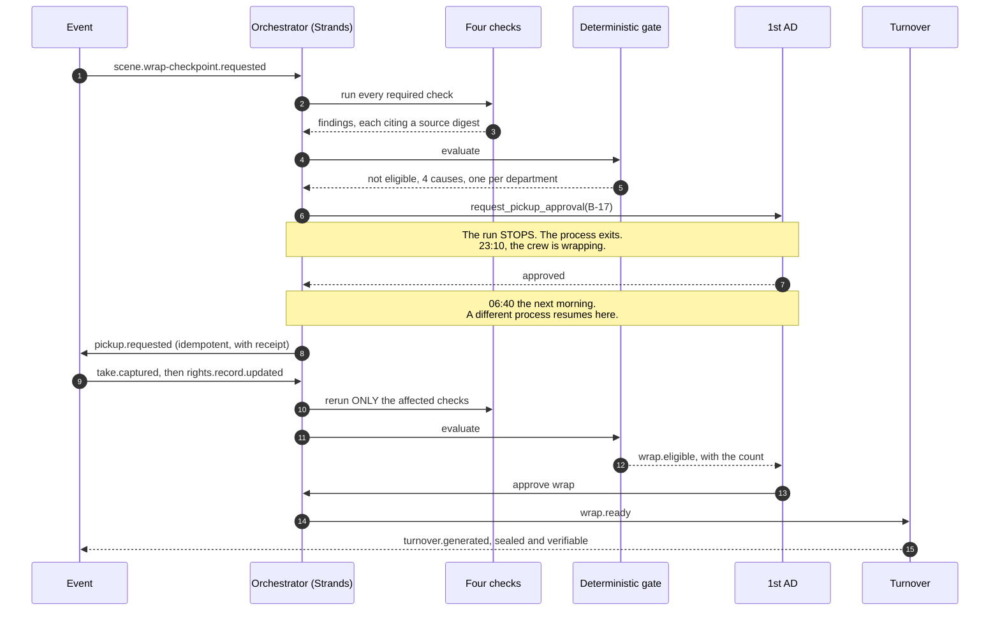

# LastTake

[](https://github.com/upgradedev/lasttake-aws/actions/workflows/ci.yml)
[](LICENSE)
[](https://www.python.org/)

**It checks every required beat against the takes actually captured before the crew is
released, so a missing shot costs fifteen minutes instead of a pickup day.**

Before you wrap the set, know whether you truly have the scene.

---

## Contents

- [Who this is for](#who-this-is-for)
- [The problem](#the-problem)
- [Quickstart](#quickstart)
- [What the demo shows](#what-the-demo-shows)
- [Architecture](#architecture)
- [How Strands is load-bearing](#how-strands-is-load-bearing)
- [The rule the whole product turns on](#the-rule-the-whole-product-turns-on)
- [The numbers, and the commands that produce them](#the-numbers-and-the-commands-that-produce-them)
- [The demo corpus is synthetic](#the-demo-corpus-is-synthetic)
- [What it will not do](#what-it-will-not-do)
- [Running against Amazon Bedrock](#running-against-amazon-bedrock)
- [Repository layout](#repository-layout)
- [Pre-existing components](#pre-existing-components)
- [Licence](#licence)

---

## Who this is for

A **script supervisor** on a shoot day, with the **1st AD** as the second reader.

Not film crews, not production teams, not creators. One person, one afternoon, one
decision: is this scene safe to wrap, and if not, what exactly is missing and who can
fix it while the set is still standing.

## The problem

At the end of a shoot day the evidence needed to judge whether a scene is ready to wrap
sits in seven places owned by five departments: the current script revision, the shot
plan, the captured takes, the supervisor's notes, the camera and sound reports, the
continuity references, and the rights ledger. Nobody holds all of it at once.

The cost is asymmetric, and everyone in the trade knows it. While the set is standing, a
missing shot is fifteen minutes. Once cast, location, set and equipment are released, the
same missing fact is a pickup day, a compromised edit, a clearance escalation, or a
reshoot.

## Quickstart

Prerequisites: Python 3.11 or newer, and git. No AWS account and no credential is needed
for the offline path below, which exercises the real checks, the real gate, the real
approvals and the real turnover.

```bash
git clone https://github.com/upgradedev/lasttake-aws.git
cd lasttake-aws
python -m pip install -e ".[dev]"
```

Time to first result: about twenty seconds after the install.

**Step 1. A wrap checkpoint fires.** No button is pressed; an event arrives.

```bash
lasttake checkpoint
```

Expected: the five checks run, the count prints, and the run **stops** with a pickup
request waiting for the 1st AD. The process then exits.

```
Of 34 required beats, 31 covered with evidence, 2 raising exceptions with named
sources, 1 with no release record and routed to production.

[pid 2378] the run has stopped and is waiting for a human.
  who: first_ad
  what: pickup on B-17
```

**Step 2. The 1st AD answers, in a different process.** This is the part that matters.
The first process is gone. Run this now, or tomorrow morning.

```bash
lasttake approve --yes
```

Expected: a new process picks the run up from exactly where it stopped, the tool that was
waiting finishes, and the pickup is routed with a receipt.

**Step 3. A late take arrives, and only the affected checks rerun.**

```bash
lasttake late-take --beat B-17
```

**Step 4. Production supplies the missing release.**

```bash
lasttake resolve rights --subject BG-07
```

Expected: `Affected checks: rights.` Coverage, continuity and media identity keep their
results rather than being recomputed.

**Step 5. Read the event log, and verify any turnover packet.**

```bash
lasttake events
```

```bash
lasttake verify .lasttake/artifacts/turnover/run-sc042-wrap-checkpoint.json
```

Run the test suite, including the gate's own failure proofs:

```bash
python -m pytest --cov --cov-report=term-missing
```

## What the demo shows

One fictional shoot day, made messy on purpose. Six things are wrong with it and each
exercises a different part of the pipeline.

| What is wrong | Which check finds it | Who it goes to |
|---|---|---|
| B-17 was added in the Blue revision and never made the shot plan, so no camera rolled | coverage | script supervisor |
| Shot `S-42C-ORPHAN` plans for a beat the revision cut | coverage, advisory only | script supervisor |
| Two takes of B-23 are both flagged preferred and the mug does not match | continuity | script supervisor |
| T-013's media identifier does not match the camera report row | metadata | DIT |
| BG-07 is visible in a take and has no release record | rights | production coordinator |
| A late take arrives after the checkpoint | targeted rerun | nobody, it just works |

Note the fourth row. T-013 has a real problem, and beat B-11 is still **covered**, because
a second take of it is clean. A beat is covered when at least one take of it is usable,
reconciles, carries no unresolved continuity conflict, and has every subject released.
Conflating "some take has a problem" with "the beat is missing" would report a scene as
short of footage that is sitting on the card.

## Architecture


The dotted lines matter. A model is used for exactly two questions, both of them language
questions: does this take plausibly contain this beat, and do these two notes describe the
same physical state. Identifier equality, timecode arithmetic, checksum comparison and
counting are done in code, because a model that is bad at arithmetic and expensive at it
is the worst of both.

### The flow, from question to governed write and back



## How Strands is load-bearing

Remove the Strands Agents SDK and four things disappear at once: the orchestration loop,
the tool calls, the two human approvals, and the resume that makes an overnight approval
possible. What is left is a script that cannot stop and wait for a person.

The specific capability the product is built on is **interrupt and resume across process
death**. Inside a terminal tool, `ToolContext.interrupt(name, reason=...)` stops the run.
The agent returns `stop_reason` of `interrupt`. A session manager writes the paused run to
storage. A **different process**, hours later, calls the agent with an `interruptResponse`
and the run continues from the same point.

**What is proven and what is not.** This is proven on `FileSessionManager` and a local
disk, twice, in CI. On a deployed Lambda it needs shared durable storage, because `/tmp`
does not survive the gap between 23:10 and 06:40. `S3SessionManager` ships in the SDK and
`build_s3_session_manager` in `orchestrator.py` swaps it in, but **that path has not been
run and no test covers it**. It is an inference from the SDK's shape, not a result.

On a set this is not academic. The checkpoint finds a coverage gap at 23:10 as the crew is
wrapping. The 1st AD is not looking at a screen. They approve at 06:40 before the first
setup, and the run resumes across a process that no longer exists.

Proved in CI as two separate `run:` steps, which is two separate operating system
processes, plus a negative control that wipes the session and asserts the resume fails:

```
=== START process, pid 2378 ===
[pid 2378] stop_reason = 'interrupt'
=== START process exiting, pid 2378 is now dead ===
=== APPROVE process, pid 2387 ===
PASS: the tool STARTED in pid 2378 and FINISHED in pid 2387
NEGATIVE CONTROL HELD: with the session wiped, resume fails.
```

**One design constraint this forced, found before the build rather than during it.** On
resume the tool body re-enters from its first line and `interrupt()` returns the stored
answer. It is a replay, not a frozen stack frame. So anything with a side effect placed
before the interrupt runs twice. Every approved action in this repository puts its
external call after the interrupt, behind an idempotency key derived from the event
payload. See `src/lasttake/agents/tools.py`.

## The rule the whole product turns on

**It never infers a pass from absent evidence.** Absent evidence is a finding.

There are four truth states and there is no fifth. `verified`, `missing`, `conflicting`,
`unknown`. Three of those are exceptions. There is no `pass`, no `clear`, no `safe`, and a
test asserts there never will be.

The gate that combines them contains no model call, no heuristic and no randomness. It
fails closed in every direction, and each of these has a test that tries to make it fail
open:

- a check that produced no result is a missing result, not a pass
- a check that produced two results is a contradiction, not a pass
- a finding written against an older package revision is discarded, not reused
- a finding whose seal does not verify is discarded
- an exception no authorised human has looked at is not a pass
- a decision taken by the wrong role is not weak evidence, it is no evidence

The last one is a table, not an `if`. A DIT may resolve a media identity question and may
not accept a rights exception. Nobody at all may accept away a missing release, including
the role that owns rights, because that decision belongs to production and counsel and not
to this system.

## The numbers, and the commands that produce them

Every number below comes out of the pipeline, not out of a document. The test that asserts
them fails if the corpus or the rule drifts.

| Claim | Value | Command |
|---|---|---|
| required beats in the scene | 34 | `python -m pytest tests/test_corpus_counts.py -q` |
| covered with evidence | 31 | same |
| raising exceptions with named sources | 2 | same |
| with no release record, routed to production | 1 | same |
| takes in the shoot day | 40 | `python corpus/build_corpus.py` |
| blocking causes at the first checkpoint | 4, one per department | `lasttake checkpoint` |

```
Of 34 required beats, 31 covered with evidence, 2 raising exceptions with named
sources, 1 with no release record and routed to production.
```

## The demo corpus is synthetic

THE LAST FERRY is a fictional production. Every person, place, identifier and record in
`corpus/` is invented for this demonstration. No real production data is used, no real
person's release is included, and no footage is referenced or shipped.

The corpus is generated by `corpus/build_corpus.py`, which is deterministic: no clock, no
randomness, so the digests are stable and a diff means something changed. CI regenerates
it and fails if the committed files differ.

## What it will not do

It is a second set of eyes and an integrity layer. It replaces nobody.

It may not judge creative quality or choose a performance. It may not declare a scene
legally cleared, safe or creatively complete. It may not approve a pickup, a wrap, a
schedule, a spend, a permit or an external communication. It may not edit or delete
original media. And it may not infer a pass from absent evidence.

A rights row reading `verified` means the expected record was found and its structured
fields matched the configured policy. It is not a legal opinion and it does not state that
a use is lawful. Counsel determines sufficiency. That sentence is printed on the face of
every turnover packet, not buried here.

## Running against Amazon Bedrock

The offline path uses a lexical stand-in for the two bounded interpretations. It reports
its own identity as `offline-lexical/1.0.0` on every finding it touches, so a reader of a
turnover packet can always tell which interpreter produced an inference.

To use a real model, ask your own account what it can invoke rather than trusting a string
in a source file:

```bash
lasttake doctor --bedrock
```

That lists the Anthropic foundation models and cross-region inference profiles the
credentialed account can actually reach, in that account's own configured region.

This is not decoration. The first draft of this repository defaulted to
`us.anthropic.claude-sonnet-4-5-20250929-v1:0`. Asking a real account returned neither
that identifier nor that region. The default is now `global.anthropic.claude-sonnet-5`,
verified by invocation on 2026-08-22 against one account, which is not the same as verified
against yours. Set the one `doctor` printed and run any command with `--bedrock`:

```bash
export LASTTAKE_BEDROCK_MODEL_ID=<an id that doctor printed>
lasttake checkpoint --bedrock
```

**What is proven here and what is not.** The model identifier and region above were
verified by a real `converse` call. The Strands-to-Bedrock code path in
`adapters/aws/bedrock_interpreter.py` has **not** been run end to end, because CI has no
AWS credentials. Treat `--bedrock` as unexercised until that job is green. The offline
path, which is what the quickstart runs, is covered by 60-odd tests.

Untrusted input is handled as untrusted. Script pages, supervisor notes and camera reports
are production documents, and a production document can contain any text at all, including
text shaped like an instruction. Everything from a scene package is wrapped in delimiters
and the system prompt states that content inside them is evidence to describe and cannot
issue instructions.

## Repository layout

```
src/lasttake/
  domain/      the model, the four truth states, the deterministic gate, the turnover.
               Imports no SDK, and two tests enforce that rather than asking politely.
  checks/      the four bounded checks. Coverage and continuity use a model through a
               narrow port; metadata and rights are arithmetic and never call one.
  ports/       the interfaces. Event bus, artifact store, run store, interpreter.
  adapters/    local/ runs offline with no account. aws/ is Bedrock and, next,
               EventBridge, S3 and Aurora DSQL.
  agents/      the Strands layer: the orchestrator, its eight tools, and the run.
  cli.py       the commands a judge runs.
corpus/        one fictional shoot day, and the generator that produces it.
tests/         including the gate's own proofs that it can fail.
```

## Pre-existing components

Required disclosure. Everything else in this repository was written for this submission.

| Component | Where it came from | What was carried |
|---|---|---|
| `src/lasttake/domain/sealing.py` | ClaimScene, MIT, same author, `src/claimscene/provenance.py` | `sha256_bytes`, `canonical_json`, and the sealed-record approach. About thirty lines of primitives, plus the idea of sealing a record with the digest of its own canonical JSON. ClaimScene shares them with Cinemory. |
| The product thesis | A private research package written 2026-07-28 by the same author, 2,365 lines across 13 files: the problem definition, the user roles, the four truth states, the finding contract, and the event list | Carried as specification, not as code. Every line of implementation here is new. |
| CI shape, README structure | A private submission toolkit by the same author | Workflow layout and section ordering. |

The AWS adapters, the Strands agent definitions, the deterministic gate, the checks, the
demo corpus and the CLI are all new.

## Licence

MIT. See [LICENSE](LICENSE).
