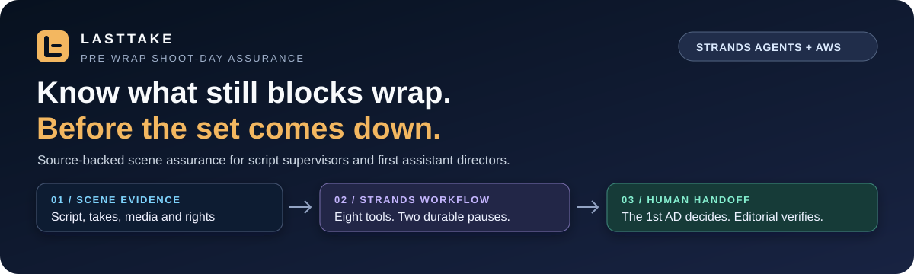
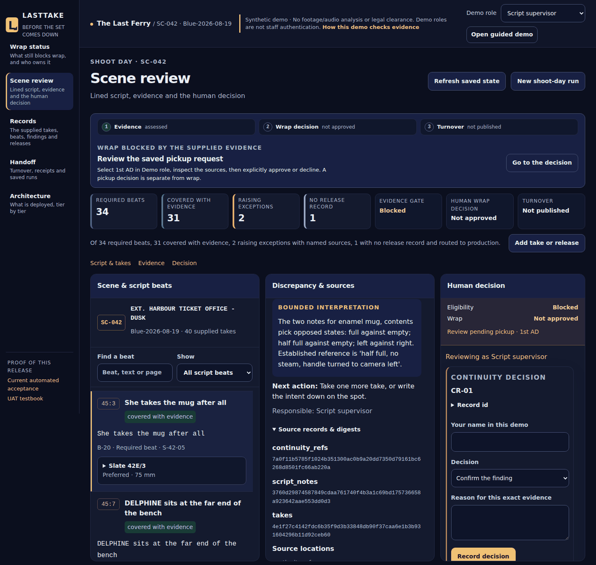
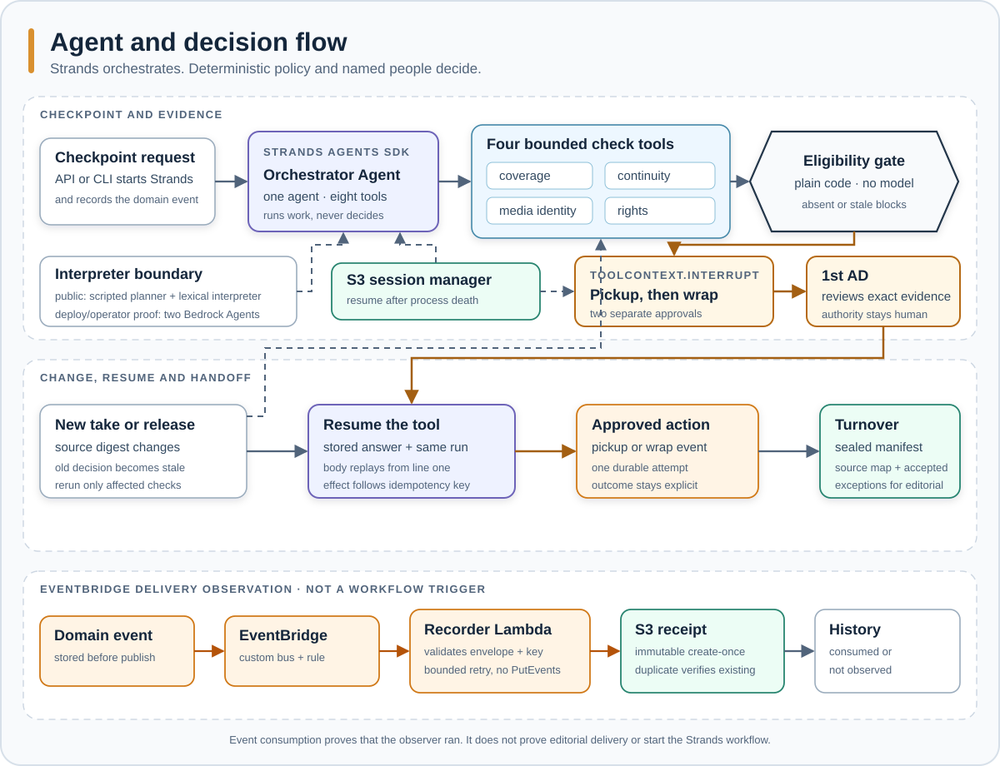

# LastTake



**LastTake reconciles script, take, continuity, media and rights records so a script supervisor catches missing evidence before the set is struck.**

[](https://github.com/upgradedev/lasttake-aws/actions/workflows/ci.yml)
[](https://github.com/upgradedev/lasttake-aws/actions/workflows/frontend-ci.yml)
[](https://github.com/upgradedev/lasttake-aws/actions/workflows/frontend-deploy.yml)
[](LICENSE)


[](docs/strands-interrupt-resume.md)
[](docs/infrastructure.md)

**[Open the live AWS workspace](https://d3kf6hquzlli8g.cloudfront.net/)** · [Judge walkthrough](#try-it-in-five-steps) · [Current automated acceptance](https://d3kf6hquzlli8g.cloudfront.net/acceptance.html) · [Architecture](#architecture) · [Submission status](#submission-status)

Built for the AWS Agents for Humans hackathon, Professional Agents track.

> **Evidence boundary.** The public scene and every person in it are fictional. The browser runs real HTTP requests, Strands tools, human interrupts, AWS storage and EventBridge delivery receipts. It uses a scripted planner and an offline lexical interpreter, not Bedrock. It analyses no footage or audio and gives no legal clearance.



## Contents

[What this release proves](#what-this-release-proves) · [Try it](#try-it-in-five-steps) · [How it works](#how-it-works) · [Architecture](#architecture) · [Why Strands matters](#why-strands-is-load-bearing) · [What is live](#what-is-live) · [Evidence](#evidence-and-numbers) · [Quickstart](#quickstart) · [Limits](#limits) · [Documentation](#documentation) · [Disclosures](#pre-existing-components)

## What this release proves

| Public capability | Proof path |
|---|---|
| A real EventBridge target consumed a domain event | Run a checkpoint, open **History**, and read **EventBridge subscriber consumed** beside the event. The separate Lambda writes an immutable S3 receipt. It does not start Strands or prove editorial delivery. |
| Strands pauses for people and resumes after process death | The orchestrator uses eight `@tool` functions, two `ToolContext.interrupt` transitions and `S3SessionManager`. The [cross-process proof](docs/strands-interrupt-resume.md) fails if the same process resumes or the saved session is removed. |
| The gate cannot turn missing evidence into a pass | Every finding cites source digests and a sealed serialized record. Plain Python checks the required result set, seals, revisions, policy version and role-bound decisions. |
| A disconnect cannot replay a decision or delivery | The service worker caches only the app shell. One last-confirmed run snapshot is read-only, one evidence draft stays in the current tab, and reconnect performs authoritative reads before any new write. |
| Editorial receives the reviewed revision | A separate 1st AD wrap interrupt precedes a versioned turnover. Handoff reads the saved manifest back with its source map, accepted exceptions and SHA-256 byte digest. |

<a id="try-it-without-installing-anything"></a>

## Try it in five steps

No account or install is required. One browser session owns its synthetic runs.

1. Open the [live workspace](https://d3kf6hquzlli8g.cloudfront.net/) and choose **Start this fictional shoot day**. Open a take in **Scene review** to compare the slate, note and camera report.
2. Choose **Run wrap checkpoint**. Review the four cited causes, then open **History** and find the independent EventBridge subscriber receipt.
3. Select **1st AD**, reload, and answer the saved pickup request. The Strands tool resumes from S3 after the original Lambda process has ended. A pickup does not approve wrap.
4. Open **Guided demo**. Add the take and release, record the continuity and media reviews, then disconnect the browser. The last confirmed view remains read-only and one unsent draft survives a same-tab reload. Reconnect to fetch server truth; a changed package fingerprint requires explicit review and nothing is replayed.
5. As **1st AD**, request and answer the separate wrap approval. In **Handoff**, publish, reload and download the versioned turnover and its readable receipt.

The [workspace guide](docs/workspace-guide.md) gives the full path and refusal cases.

<a id="the-rule-the-whole-product-turns-on"></a>

## How it works

Seven source groups describe one scene: script revision, shot plan, captured takes, script notes, camera report, continuity references and rights ledger. Four bounded check tools answer narrow questions.

| Check tool | Question | Human owner |
|---|---|---|
| Coverage | Does each required beat have at least one viable take? | Script supervisor |
| Continuity | Do preferred takes conflict with the recorded physical state? | Script supervisor |
| Media identity | Does each take reconcile with the camera report? | DIT / data manager |
| Rights | Does every visible person and asset trace to a supplied record? | Production coordinator |

Every finding names the source digests it read. The deterministic gate rejects missing results, broken seals, moved sources, contradictory results, old policy versions and decisions from the wrong role. Hashes identify bytes, not truth.



The checkpoint API records `scene.wrap-checkpoint.requested` and starts the orchestrator synchronously. EventBridge is a second path: a rule invokes a terminal delivery-recorder Lambda, which can only write immutable consumption receipts. It never starts the workflow and cannot publish another event.

<a id="what-is-deployed-and-what-it-costs"></a>

## Architecture


The public path is React on private S3 through CloudFront, then API Gateway and Lambda. Aurora DSQL stores run state, findings and decisions. S3 stores supplied artifacts, Strands sessions, events, subscriber receipts and turnovers. The EventBridge consumer has no `events:PutEvents` permission. [Infrastructure](docs/infrastructure.md) maps each resource and permission to the CloudFormation template.

The browser can keep the application shell and a bounded tab-scoped review snapshot through a disconnect. Agent execution, approvals, publishing and authoritative state remain online-only. API, health, acceptance and mutation responses are never cached.

<a id="how-strands-is-load-bearing"></a>

## Why Strands is load-bearing

Remove the Strands Agents SDK and LastTake loses the orchestration loop, eight tool calls, two human interrupts and the durable resume that continues the same run later.

- One Strands `Agent` orchestrates eight `@tool` functions. The four checks are tools, not four agents.
- `request_pickup_approval` and `request_wrap_approval` call `ToolContext.interrupt` for the named 1st AD decision.
- `S3SessionManager` persists the hosted conversation after a Lambda process is gone. `FileSessionManager` provides the local equivalent.
- On resume the tool body re-enters from its first line. Every external action is therefore after the interrupt and behind an idempotency key.
- Bedrock mode adds two scoped interpreter `Agent` instances for coverage and continuity questions. The public browser uses the lexical interpreter and says so.

CI starts the checkpoint and approval in separate operating-system processes and includes a missing-session negative control. A backend deployment proof retires the warm Lambda container and requires a different container to approve. See [Interrupt and resume](docs/strands-interrupt-resume.md).

<a id="running-against-amazon-bedrock"></a>

## What is live

| Capability | Public release status |
|---|---|
| React workspace through CloudFront and API Gateway | Live, login-free, synthetic sessions |
| Strands orchestrator, eight tools and two human interrupts | Live on Lambda |
| Aurora DSQL run state and S3 session resume | Live |
| EventBridge publication and terminal subscriber | Live; History distinguishes bus acceptance, consumed receipt and not observed |
| Bounded offline review and one evidence draft | Live; read-only snapshot, no queued writes, authoritative reconnect |
| Pickup, role reviews and wrap approval | Live with demo role selection; this is not staff authentication |
| Language interpretation in the public browser | Offline lexical matcher; no Bedrock request |
| Amazon Bedrock interpretation | Backend deploy proof and credentialed operator CLI only |
| Amazon Bedrock AgentCore | Not deployed |
| Footage/audio analysis, messaging, scheduling or legal clearance | Not implemented or connected |
| Practising script-supervisor UAT | NOT_RUN; automated browser acceptance is separate |

[Frontend release](https://d3kf6hquzlli8g.cloudfront.net/release.json), [backend health](https://d3kf6hquzlli8g.cloudfront.net/healthz) and [current acceptance](https://d3kf6hquzlli8g.cloudfront.net/acceptance.html) expose the served revisions and test receipt. A green branch run is not deployment evidence.

<a id="the-numbers-and-the-commands-that-produce-them"></a>

## Evidence and numbers

These are deterministic outputs from the synthetic corpus, not productivity or accuracy claims.

| Measured output | Result | Reproduce |
|---|---:|---|
| Required beats | 34 | `python -m pytest tests/test_corpus_counts.py -q` |
| Covered with evidence | 31 | same command |
| Exceptions with named sources | 2 | same command |
| Missing release record routed to production | 1 | same command |
| Takes in the fictional shoot day | 40 | `python corpus/build_corpus.py` |
| Blocking causes at the first checkpoint | 4, one per check | `lasttake checkpoint` |
| Covered when the interpreter is unreachable | 0 of 34, all `unknown` | `PYTHONPATH=src python tools/ablation.py` |

The public acceptance receipt covers the full browser-to-API-to-state-to-response path on desktop and mobile. It does not substitute for a practising user, model-quality evidence or a production restore drill. [Evaluation evidence](docs/model-evidence.md) keeps those gaps separate.

<a id="bring-your-own-record"></a>

## Quickstart

Prerequisites: Python 3.11 or newer and git. This local path needs no AWS account.

```bash
git clone https://github.com/upgradedev/lasttake-aws.git
cd lasttake-aws
python -m pip install -e ".[dev]"
lasttake checkpoint
```

Expected: the four checks run, the `34 / 31 / 2 / 1` result prints, and the process exits with a pickup request waiting for the 1st AD.

Resume it in a new process:

```bash
lasttake approve --yes
```

Expected: Strands restores the run and publishes one idempotent pickup event. The CLI proves checkpoint, pause and resume. Use the browser for the complete wrap and handoff.

<a id="what-it-will-not-do"></a>
<a id="assurance-and-residual-gaps"></a>

## Limits

LastTake is a second set of eyes and an integrity layer. It does not judge a performance, choose a take, approve a schedule or spend, decide legal sufficiency, or edit original media. A `verified` rights row means the expected structured record was supplied under the configured policy.

Known gaps remain visible:

- demo roles are not authenticated staff identities
- agent execution and authority actions require a connection
- public interpretation is lexical; the prepared real-model evaluation is NOT_RUN
- practising-user UAT, current AWS cost, latency p95 and a restore drill are unmeasured
- the backend deploy uses long-lived GitHub secrets; frontend publication uses OIDC

[Assurance](docs/assurance.md) records the AWS Well-Architected and Agentic AI Lens controls, relevant EU AI Act articles, data handling and residual gaps. No regulatory status is claimed.

## Documentation

| Page | What it answers |
|---|---|
| [How LastTake works](docs/how-it-works.md) | Orchestrator, eight tools, deterministic gate and interpreter boundary |
| [Interrupt and resume](docs/strands-interrupt-resume.md) | Cross-process and Lambda proofs, plus replay-safe action ordering |
| [Workspace guide](docs/workspace-guide.md) | Live journey, disconnect behavior, roles, refusals and saved sessions |
| [Bring your own record](docs/bring-your-own-record.md) | Input shapes, reruns and stale decisions |
| [Infrastructure](docs/infrastructure.md) | AWS resources, permissions, deployment and teardown |
| [Release and acceptance](docs/release-and-acceptance.md) | Served revisions and public acceptance receipt |
| [Assurance](docs/assurance.md) | Controls, data handling and residual gaps |
| [AgentCore design note](docs/BEDROCK_AGENTCORE_ARCHITECTURE.md) | Optional future design; AgentCore is not deployed |

## Submission status

The repository, MIT licence, live application, architecture and written Devpost copy are prepared. The new exact-release video must be rendered after this release is merged and deployed. Public YouTube publication and pressing **Submit** in the existing Devpost project require the owner.

## Pre-existing components

| Component | Source | What was carried |
|---|---|---|
| Sealing primitives | ClaimScene, MIT, same author | `sha256_bytes`, `canonical_json` and the sealed-record pattern |
| Product thesis | Private research package by the same author, written 2026-07-28 | Problem, roles, four truth states, finding contract and event list; specification only |
| Submission tooling | Private toolkit by the same author | CI, README and per-beat video patterns adapted for LastTake |
| Visual direction | Kerdon interface and the owner's approved reference | Navy, amber and connected context/evidence/decision panes; no customer data, assets or code |

The AWS adapters, EventBridge subscriber, Strands definitions, deterministic gate, offline safety boundary, checks and synthetic corpus are new for LastTake.

## Licence

MIT. See [LICENSE](LICENSE).
