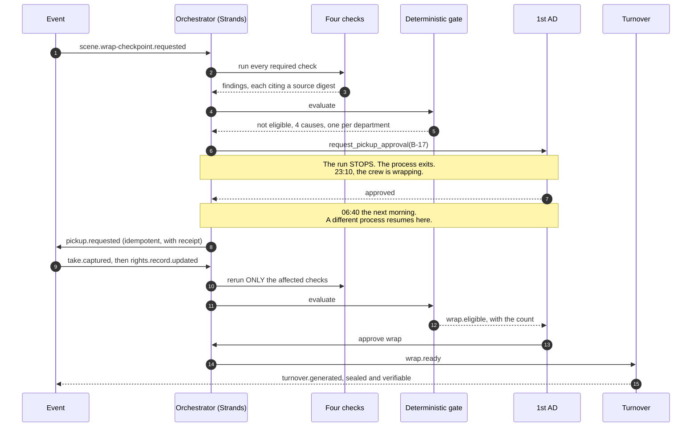
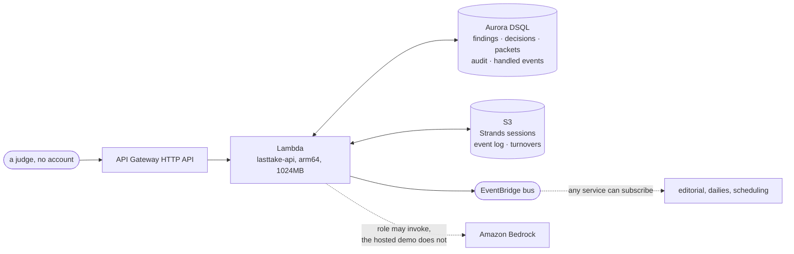

# LastTake

[](https://github.com/upgradedev/lasttake-aws/actions/workflows/ci.yml)
[](LICENSE)
[](https://www.python.org/)

**It checks every required beat against the takes actually captured before the crew is
released, so a missing shot costs minutes, not a pickup day.**

Before you wrap the set, know whether you truly have the scene.

---

## Contents

- [Who this is for](#who-this-is-for)
- [What a script supervisor already uses](#what-a-script-supervisor-already-uses-and-what-this-does-instead)
- [The problem](#the-problem)
- [Try it without installing anything](#try-it-without-installing-anything)
- [Quickstart](#quickstart)
- [What the demo shows](#what-the-demo-shows)
- [Architecture](#architecture)
- [How Strands is load-bearing](#how-strands-is-load-bearing)
- [The rule the whole product turns on](#the-rule-the-whole-product-turns-on)
- [What each rule is worth, measured by removing it](#what-each-rule-is-worth-measured-by-removing-it)
- [Bring your own record](#bring-your-own-record)
- [Four kinds of input](#four-kinds-of-input-and-what-the-pipeline-does-with-each)
- [What "covered" rests on](#what-covered-rests-on-and-why-two-readers-count-differently)
- [The numbers, and the commands that produce them](#the-numbers-and-the-commands-that-produce-them)
- [The demo corpus is synthetic](#the-demo-corpus-is-synthetic)
- [What it will not do](#what-it-will-not-do)
- [Running against Amazon Bedrock](#running-against-amazon-bedrock)
- [What is deployed, and what it costs](#what-is-deployed-and-what-it-costs)
- [Assurance and residual gaps](#assurance-and-residual-gaps)
- [Repository layout](#repository-layout)
- [Pre-existing components](#pre-existing-components)
- [Licence](#licence)

---

## Who this is for

A **script supervisor** on a shoot day, with the **1st AD** as the second reader.

Not film crews, not production teams, not creators. One person, one afternoon, one
decision: is this scene safe to wrap, and if not, what exactly is missing and who can
fix it while the set is still standing.

## What a script supervisor already uses, and what this does instead

Script supervision has good software and this does not replace it. The tools below are where a
supervisor writes things down; the gap is that nobody reconciles what was written down across the
departments that wrote it.

| Already on the cart | What it does | What it does not do |
|---|---|---|
| [ScriptE](https://www.scriptesystems.com/) | continuity and scheduling for script supervisors, with an image capture attachment that fires stills during a take for matching | holds the supervisor's own record. It does not read the camera report, the sound report and the rights ledger and tell you where the three disagree |
| [Scriptation](https://scriptation.com/) | script annotation on iPad with a lining toolkit built with script supervisors, for tracking coverage | lines the script as the supervisor draws it. Coverage is what the person marked, not what the departments' records can evidence |
| [Script Evolution](https://scriptevolution.app/en/) | a script supervisor application built for the iPad | the same shape: a faster place to record an observation |

The difference is one sentence. Those are **recording** tools and this is a **reconciling** one, and
it is the only one of the four that will refuse to conclude. A beat here is covered when a take that
names it is usable, reconciles with the camera report, carries no unresolved continuity conflict and
has every subject released. Absent evidence is a finding, never a pass, and
[the ablation](#what-each-rule-is-worth-measured-by-removing-it) measures what that costs: take the
model away and coverage falls from 31 of 34 to 0, every beat `unknown` rather than a pass.

### Why this is possible now and was not five years ago

The reconciliation needs the shoot day's records to be machine readable while the set is still
standing. Camera to cloud made that true. Frame.io's C2C sends "timecode-accurate H.264 proxy files
with matching filename metadata as well as appropriate production data" from the camera during the
take ([Frame.io support](https://support.frame.io/en/articles/4887091-c2c-frame-io-camera-to-cloud-faqs)),
and at Adobe MAX 2024 Canon, Nikon and Leica joined Fujifilm, Panasonic LUMIX and RED in supporting
it ([Adobe](https://blog.adobe.com/en/publish/2024/11/12/frameios-camera-to-cloud-adds-real-time-photo-video-collaboration)).
Before that, the camera report reached anyone who could compare it against the script the next
morning, which is after the set is struck and after the answer stops being useful.

## The problem

At the end of a shoot day the evidence needed to judge whether a scene is ready to wrap
sits in seven places owned by five departments: the current script revision, the shot
plan, the captured takes, the supervisor's notes, the camera and sound reports, the
continuity references, and the rights ledger. Nobody holds all of it at once.

The cost is asymmetric, and everyone in the trade knows it. While the set is standing, a
missing shot is fifteen minutes. Once cast, location, set and equipment are released, the
same missing fact is a pickup day, a compromised edit, a clearance escalation, or a
reshoot.

## Try it without installing anything

**https://1p6s28nyf0.execute-api.eu-west-1.amazonaws.com/**

No account, no install, no credential. The page opens on the scene as a script supervisor
holds it: the lined script, thirty-four required beats down the left, and beside each one
the takes that were actually shot against it. The checkpoint fires on arrival, so within a
few seconds the verdict lands in the right pane and the exceptions appear with the page and
line they sit on, what each costs to fix now against what it costs after wrap, and which
role can act.

The two panes scroll independently and are linked in both directions. Click an exception and
the script scrolls to the lines it is about and flashes them; click a beat and its exceptions
light up. Click any slate and an inspector puts the two records of that take side by side, the
sidecar and the camera report, with the field the departments disagree on marked.

**If you have two minutes, use the bar across the top.** It runs one shoot day in six moves:
the checkpoint, the 1st AD's overnight pause, a late take, the signed release, the two
judgements that are nobody else's to make, and the turnover. It changes role for you where the
next move belongs to somebody else, and it stops at every point a human has to decide rather
than deciding for them.

The fifth move is the one worth watching. Supplying the missing take and the missing release
leaves the scene at 33 of 34, because two conflicts remain and neither of them is evidence.
What counts as intentional continuity is the supervisor's call and the authoritative technical
record is the DIT's, so the gate refuses, names both findings, and names who owes each
judgement. The walk reads that list rather than keeping its own, and hands you whichever chair
is needed next.

Then the run **stops**, because a pickup needs the 1st AD and you are signed in as the
supervisor. Change the role in the slate to stand in for them. Close the tab first if you
like, and come back tomorrow: the run continues from the same point, in a process that no
longer exists.

**The role in the slate is worth two minutes on its own.** It changes what you can do, not
what you read. As the supervisor you can confirm or reject the coverage and continuity
findings; the metadata one offers you nothing, because it is the DIT's. Switch to production
and the missing release becomes yours, with confirm and reject and **no** accept, because
`MAY_ACCEPT_EXCEPTION[RIGHTS]` is empty and the page reads that table rather than deciding
for itself. Try it as any role: the server refuses a decision taken by the wrong one and says
why.

Every response tells you which Lambda invocation and which container served it, so the
process boundary is something you watch happen rather than something this page asserts.
Every visitor gets their own run id, so two judges never collide.

## Quickstart

Prerequisites: Python 3.11 or newer, and git. No AWS account and no credential is needed
for the offline path below, which exercises the real checks, the real gate, the real
approvals and the real turnover.

```bash
git clone https://github.com/upgradedev/lasttake-aws.git
cd lasttake-aws
python -m pip install -e ".[dev]"
```

Time to first result: about twenty seconds after the install.

**Step 1. A wrap checkpoint fires.** No button is pressed; an event arrives.

```bash
lasttake checkpoint
```

Expected: the five checks run, the count prints, and the run **stops** with a pickup
request waiting for the 1st AD. The process then exits.

```
Of 34 required beats, 31 covered with evidence, 2 raising exceptions with named
sources, 1 with no release record and routed to production.

[pid 2378] the run has stopped and is waiting for a human.
  who: first_ad
  what: pickup on B-17
```

**Step 2. The 1st AD answers, in a different process.** This is the part that matters.
The first process is gone. Run this now, or tomorrow morning.

```bash
lasttake approve --yes
```

Expected: a new process picks the run up from exactly where it stopped, the tool that was
waiting finishes, and the pickup is routed with a receipt.

**Step 3. A late take arrives, and only the affected checks rerun.**

```bash
lasttake late-take --beat B-17
```

**Step 4. Production supplies the missing release.**

```bash
lasttake resolve rights --subject BG-07
```

Expected: `Affected checks: rights.` Coverage, continuity and media identity keep their
results rather than being recomputed.

**Step 5. Read the event log, and verify any turnover packet.**

```bash
lasttake events
```

```bash
lasttake verify .lasttake/artifacts/turnover/run-sc042-wrap-checkpoint.json
```

Run the test suite, including the gate's own failure proofs:

```bash
python -m pytest --cov --cov-report=term-missing
```

## What the demo shows

One fictional shoot day, made messy on purpose. Six things are wrong with it and each
exercises a different part of the pipeline.

| What is wrong | Which check finds it | Who it goes to |
|---|---|---|
| B-17 was added in the Blue revision and never made the shot plan, so no camera rolled | coverage | script supervisor |
| Shot `S-42C-ORPHAN` plans for a beat the revision cut | coverage, advisory only | script supervisor |
| Two takes of B-23 are both flagged preferred and the mug does not match | continuity | script supervisor |
| T-013's media identifier does not match the camera report row | metadata | DIT |
| BG-07 is visible in a take and has no release record | rights | production coordinator |
| A late take arrives after the checkpoint | targeted rerun | nobody, it just works |

Note the fourth row. T-013 has a real problem, and beat B-11 is still **covered**, because
a second take of it is clean. A beat is covered when at least one take of it is usable,
reconciles, carries no unresolved continuity conflict, and has every subject released.
Conflating "some take has a problem" with "the beat is missing" would report a scene as
short of footage that is sitting on the card.

## Architecture

The required diagram is a file of its own, [`docs/architecture.svg`](docs/architecture.svg), so it
can be opened, downloaded and read without this README around it. The Mermaid sources below are the
same system in two other cuts, the system view and the sequence from question to governed write.


The dotted lines matter. A model is used for exactly two questions, both of them language
questions: does this take plausibly contain this beat, and do these two notes describe the
same physical state. Identifier equality, timecode arithmetic, checksum comparison and
counting are done in code, because a model that is bad at arithmetic and expensive at it
is the worst of both.

### The flow, from question to governed write and back



## How Strands is load-bearing

Remove the Strands Agents SDK and four things disappear at once: the orchestration loop,
the tool calls, the two human approvals, and the resume that makes an overnight approval
possible. What is left is a script that cannot stop and wait for a person.

The specific capability the product is built on is **interrupt and resume across process
death**. Inside a terminal tool, `ToolContext.interrupt(name, reason=...)` stops the run.
The agent returns `stop_reason` of `interrupt`. A session manager writes the paused run to
storage. A **different process**, hours later, calls the agent with an `interruptResponse`
and the run continues from the same point.

**Proven on the deployed architecture, not only offline.** On a Lambda, `/tmp` does not
survive the gap between 23:10 and 06:40, so the sessions live on `S3SessionManager`. The
deploy pipeline fires the checkpoint in one HTTP request, then **retires every warm
container** with a configuration change, then approves in a second request, and asserts the
two were served by different processes:

```
=== request 1 of 2: fire the checkpoint ===
Of 34 required beats, 31 covered with evidence, 2 raising exceptions with named
sources, 1 with no release record and routed to production.
stopped for: first_ad on B-17
served by container 5783cd7e

=== between the two: force a new execution environment ===
every warm container has been retired

=== request 2 of 2: a separate invocation approves ===
Pickup approved for B-17 by the 1st AD and routed to the assistant director's board.
container that stopped the run:  5783cd7e
container that resumed it:       0310464e
```

The assertion is `c1 != c2`, so a run where Lambda happened to reuse a container fails the
pipeline rather than quietly passing on a weaker claim.

On a set this is not academic. The checkpoint finds a coverage gap at 23:10 as the crew is
wrapping. The 1st AD is not looking at a screen. They approve at 06:40 before the first
setup, and the run resumes across a process that no longer exists.

Proved in CI as two separate `run:` steps, which is two separate operating system
processes, plus a negative control that wipes the session and asserts the resume fails:

```
=== START process, pid 2378 ===
[pid 2378] stop_reason = 'interrupt'
=== START process exiting, pid 2378 is now dead ===
=== APPROVE process, pid 2387 ===
PASS: the tool STARTED in pid 2378 and FINISHED in pid 2387
NEGATIVE CONTROL HELD: with the session wiped, resume fails.
```

**One design constraint this forced, found before the build rather than during it.** On
resume the tool body re-enters from its first line and `interrupt()` returns the stored
answer. It is a replay, not a frozen stack frame. So anything with a side effect placed
before the interrupt runs twice. Every approved action in this repository puts its
external call after the interrupt, behind an idempotency key derived from the event
payload. See `src/lasttake/agents/tools.py`.

## The rule the whole product turns on

**It never infers a pass from absent evidence.** Absent evidence is a finding.

There are four truth states and there is no fifth. `verified`, `missing`, `conflicting`,
`unknown`. Three of those are exceptions. There is no `pass`, no `clear`, no `safe`, and a
test asserts there never will be.

The gate that combines them contains no model call, no heuristic and no randomness. It
fails closed in every direction, and each of these has a test that tries to make it fail
open:

- a check that produced no result is a missing result, not a pass
- a check that produced two results is a contradiction, not a pass
- a finding written against an older package revision is discarded, not reused
- a finding whose seal does not verify is discarded
- an exception no authorised human has looked at is not a pass
- a decision taken by the wrong role is not weak evidence, it is no evidence

The last one is a table, not an `if`. A DIT may resolve a media identity question and may
not accept a rights exception. Nobody at all may accept away a missing release, including
the role that owns rights, because that decision belongs to production and counsel and not
to this system.

## What each rule is worth, measured by removing it

Every other number here is a count of our own fixture. A count is not an argument until
something can be compared against it, so the same corpus runs through the same pipeline
three times, each time with one load-bearing rule removed. The removed rule is the only
thing that differs, so the delta is attributable to it.

```bash
PYTHONPATH=src python tools/ablation.py
```

| Rule removed | With it | Without it |
|---|---|---|
| the finding seal is verified before anything reads the record | the edited record is discarded and the reason named | all 85 records are admitted, the edited one among them, and the beat it names reads as covered |
| staleness is derived from the digests a finding cites, not asserted from a table | every finding that read the takes document before the pickup is discarded | **50 stale findings** are carried forward and re-stamped, and the gate cannot tell |
| the model is reachable | **31 of 34** beats are covered with evidence | **0 of 34**, and every one of them is `unknown` rather than a pass |

The third row is the one to read twice. A model outage takes this product to refusing,
never to agreeing, and that is a measurement rather than a description of an intention.

Both of the first two ablations found a real defect the first time they ran. With the model
removed the covered count went **up**, from 31 to 32, because a continuity question nobody
could answer stopped blocking anything, and because a beat counted as covered whenever a
viable take named it, whatever the coverage check had concluded. Two places where absent
evidence was being read as a pass, in the one number a 1st AD acts on at 23:10. Both are
fixed and both are pinned by a test.

## Bring your own record

The demo used to have two buttons that wrote a take and a release for you. They
showed the targeted rerun honestly enough, but nobody could put their own scene
through it, which made this a fixture with a play button. It takes a document now.

```bash
curl -s -X POST "$URL/api/ingest" -H 'content-type: application/json' -d '{
  "run_id": "demo-yourrun0001",
  "kind": "take",
  "document": {
    "take_id": "T-900", "shot_id": "S-42-PICKUP", "beat_ids": ["B-17"],
    "slate": "42L/1", "camera_roll": "A007", "sound_roll": "SR07",
    "timecode_in": "23:04:00:00", "timecode_out": "23:04:41:00",
    "lens_mm": 50, "media_id": "A007R2G01",
    "preferred": true, "usable": true,
    "note": "Pickup on the reaction. Clean single.",
    "visible_people": ["DELPHINE"]
  }
}'
```

`kind` is `take` or `rights_record`. A document that does not match the shape is refused before
anything is written, and the refusal names the missing and the unexpected fields rather than
failing quietly. The page carries an editable example of each, so a visitor edits a record rather
than reading a schema.

What happens next is the part worth watching. The document becomes a package amendment, the
amended package produces new digests, and **the checks that read the artifact that moved run
again**. A take moves the takes document, which all four checks read, so all four rerun. A release
moves only the ledger, so only rights does. That narrowing is derived from which bytes changed and
never from a table asserting it.

### An approval does not survive the evidence it was about

A human decision used to bind to a finding **id**, and ids are deterministic: `run:con:CR-01` is
the same string before and after a rerun. So a supervisor could accept the mug conflict as
intentional, a take could arrive that changed the continuity evidence completely, the finding
would be recomputed under the same id, and the old acceptance would still close it. Nobody would
have looked at the new facts and nothing would say so.

A decision now carries the seal of the reading it was taken about. When the evidence moves the
digest changes, the decision stops applying, and the ingest response lists what was withdrawn and
why. Decisions recorded before this existed still apply; silently voiding every historical
approval would be its own kind of dishonesty, and the absent field is what says they are weaker.

## Four kinds of input, and what the pipeline does with each

```bash
PYTHONPATH=src python tools/evaluation_cases.py
```

| Input | What happens |
|---|---|
| **correct**, a take that covers the uncovered beat | B-17 goes from `no_viable_coverage`, basis `insufficient_evidence`, to `covered_with_evidence`, basis `corroborated_by_the_interpreter` |
| **incomplete**, the same take with no slate | refused before anything is written, naming `slate` |
| **conflicting**, a camera report naming a different card | `media_identity_exception`, basis `declared_by_the_production`. The only take does not reconcile, so the beat is not covered |
| **changed**, evidence moving under an approval already given | the acceptance stops applying: `resolved=True` becomes `resolved=None` |

It runs offline with no account and no credential, because the local adapters implement the same
ports the deployed build uses. A test pins all four so they cannot drift.

**These are our cases, scored by our pipeline.** That is a description of behaviour under four
kinds of input. It is not an evaluation of judgement quality against labelled ground truth, and
**no practising script supervisor has run any of it**. The trial that would matter is whether a
supervisor finds the evidence available before wrap and the reconciliation work actually reduced.
That has not happened, and nothing here should be read as though it had.

## What "covered" rests on, and why two readers count differently

`[PRIMARY]` 2026-09-08, deploy run 34195514875, which runs `lasttake checkpoint --bedrock` on the
deployed role and prints the count.

| Interpreter | Covered, of 34 |
|---|---|
| `offline-lexical/1.0.0`, which the live URL runs | **31** |
| `bedrock:global.anthropic.claude-sonnet-5` | **19** |

Neither is wrong, and the difference is not a threshold to tune. "Covered" was one word doing four
jobs, so the outcome now carries **what it rests on**, and the same run reports both:

| Basis | What it means | offline | model unreachable |
|---|---|---|---|
| declared by the production | a take names this beat. The people who were there said so | 2 | 33 |
| corroborated by the interpreter | a second reader agrees the take contains the beat | **31** | 0 |
| confirmed by a named human | the role that owns the check said so. This outranks both | 0 | 0 |
| insufficient evidence | no take, a model that could not tell, a timeout | 1 | 1 |

```bash
PYTHONPATH=src python -m pytest -q tests/test_corpus_counts.py
```

Read the two columns together and the 31-against-19 gap stops being a mystery. **What the
production declared does not move.** What moves is how much of it a given reader will corroborate,
and a stricter reader corroborates less. The model is shown the beat, the slate, the supervisor's
note and the setup, and most takes carry no note, because a supervisor writes one where continuity
matters and not on every take. Asked whether a slate with no note contains a particular beat, a
careful reader says it cannot tell.

Three things follow, and the gate enforces all three. `insufficient` is never a pass, so a timeout
and a model failure both block rather than clear. A beat resting on the production's declaration
alone is **not** counted as covered, because one assertion is not two. And no interpreter can raise
the count above what the evidence supports: the deploy asserts that required beats stay 34 and
covered may fall and may never rise.

What this exposes is the gap already declared in [`docs/assurance.md`](docs/assurance.md), that
there is no evaluation set for the model's judgement on its two bounded questions. It has a size
now instead of only a sentence. Closing it means labelled ground truth for "does this take contain
this beat", which this corpus does not have and one shoot day would not settle.

## The numbers, and the commands that produce them

Every number below comes out of the pipeline, not out of a document. The test that asserts
them fails if the corpus or the rule drifts.

| Claim | Value | Command |
|---|---|---|
| required beats in the scene | 34 | `python -m pytest tests/test_corpus_counts.py -q` |
| covered with evidence | 31 | same |
| raising exceptions with named sources | 2 | same |
| with no release record, routed to production | 1 | same |
| takes in the shoot day | 40 | `python corpus/build_corpus.py` |
| blocking causes at the first checkpoint | 4, one per department | `lasttake checkpoint` |

```
Of 34 required beats, 31 covered with evidence, 2 raising exceptions with named
sources, 1 with no release record and routed to production.
```

## The demo corpus is synthetic

THE LAST FERRY is a fictional production. Every person, place, identifier and record in
`corpus/` is invented for this demonstration. No real production data is used, no real
person's release is included, and no footage is referenced or shipped.

The corpus is generated by `corpus/build_corpus.py`, which is deterministic: no clock, no
randomness, so the digests are stable and a diff means something changed. CI regenerates
it and fails if the committed files differ.

## What it will not do

It is a second set of eyes and an integrity layer. It replaces nobody.

It may not judge creative quality or choose a performance. It may not declare a scene
legally cleared, safe or creatively complete. It may not approve a pickup, a wrap, a
schedule, a spend, a permit or an external communication. It may not edit or delete
original media. And it may not infer a pass from absent evidence.

A rights row reading `verified` means the expected record was found and its structured
fields matched the configured policy. It is not a legal opinion and it does not state that
a use is lawful. Counsel determines sufficiency. That sentence is printed on the face of
every turnover packet, not buried here.

## Running against Amazon Bedrock

The offline path uses a lexical stand-in for the two bounded interpretations. It reports
its own identity as `offline-lexical/1.0.0` on every finding it touches, so a reader of a
turnover packet can always tell which interpreter produced an inference.

To use a real model, ask your own account what it can invoke rather than trusting a string
in a source file:

```bash
lasttake doctor --bedrock
```

That lists the Anthropic foundation models and cross-region inference profiles the
credentialed account can actually reach, in that account's own configured region.

This is not decoration. The first draft of this repository defaulted to
`us.anthropic.claude-sonnet-4-5-20250929-v1:0`. Asking a real account returned neither
that identifier nor that region. The default is now `global.anthropic.claude-sonnet-5`,
verified by invocation on 2026-08-22 against one account, which is not the same as verified
against yours. Set the one `doctor` printed and run any command with `--bedrock`:

```bash
export LASTTAKE_BEDROCK_MODEL_ID=<an id that doctor printed>
lasttake checkpoint --bedrock
```

**What this is checked against.** The deploy pipeline runs a full checkpoint through
`BedrockInterpreter` on every deploy, so `BedrockModel` plus `agent.structured_output` is
exercised rather than described. The last run produced **34 findings carrying a real model
inference**, for example on the mug conflict:

> Established state calls for a half-full mug with handle to camera left. First take matches
> this exactly. Second take describes the mug as empty with handle turned to camera right.

Two assertions run alongside it, and both are the architecture rather than housekeeping.
Every model-touched finding must report confidence below 1.0, because an interpretation is
not a fact. And **the count must not move** when the interpreter changes: the same
`34 / 31 / 2 / 1` comes out with Bedrock as with the offline stand-in. If swapping the model
moved the number, the model would be deciding something it is not allowed to decide.

The hosted demo runs the offline interpreter and reports `offline-lexical/1.0.0` on every
finding it touches, so nothing on that page claims to be a model that it is not.

Untrusted input is handled as untrusted. Script pages, supervisor notes and camera reports
are production documents, and a production document can contain any text at all, including
text shaped like an instruction. Everything from a scene package is wrapped in delimiters
and the system prompt states that content inside them is evidence to describe and cannot
issue instructions.

## What is deployed, and what it costs

Five services, declared in `infra/stack.yaml` and deployed by
`.github/workflows/deploy.yml`. Nothing is created by hand in a console.



**Why a database and not more S3.** The run state started on S3 and it worked, for one
scene with one writer. It is the wrong store the moment two approvals of the same pickup
arrive together, because `already_handled` then `mark_handled` is read-modify-write: both
callers read "not handled", both write, and a real assistant director gets the same pickup
request twice. On DSQL that is one `INSERT ... ON CONFLICT DO NOTHING` and the database
decides. Two smaller reasons follow it: findings are upserted by key rather than the whole
set being rewritten, so a targeted rerun and a human decision landing together stop
clobbering each other; and a shooting day has more than one scene, so
`GET /api/blocked` answers "which scenes are still blocked, and on whom" in one query
rather than a bucket scan per scene.

DSQL specifically, rather than a Postgres somebody has to keep alive, for the same reason
as everything else here: it scales to zero, there is no idle charge and no instance to
size. Authentication is IAM, so there is no password in this repository or in the deployed
configuration; a short-lived token is minted per connection from the function's own role.

Two DSQL constraints shaped `adapters/aws/dsql.py` and are asserted by tests rather than
left as folklore: there are no sequences, so every key is supplied by the caller; and DDL
runs one statement per transaction, so the schema is applied one statement at a time
instead of being wrapped in the transaction that instinct suggests.

The `/healthz` endpoint reports `run_state_store`, and the deploy pipeline fails if it does
not read `aurora-dsql`. Without that assertion a silent fall back to S3 would leave
everything working while the architecture quietly stopped being the one described here.

**Why an HTTP API and not a Lambda Function URL.** A Function URL was the first choice: one
fewer service and no extra bill. It was replaced because this account refuses anonymous
Function URL invocations. Both the real function and a one-line probe returned
`403 AccessDeniedException` with a correct resource policy in place, and with no SCP and no
RCP anywhere in the organization, while the same probe behind an HTTP API answered 200. The
architecture routes around the block rather than arguing with it. Nothing else changed: the
HTTP API uses payload format 2.0, whose event shape is the one the handler already read.

**Least privilege, as deployed.** The execution role reaches its own bucket, its own event
bus, Anthropic inference, and `dsql:DbConnectAdmin` on its own cluster. It cannot read
another bucket, touch another bus, create a cluster, or delete the one it writes to. The bucket is private, encrypted, versioned, and denies any request that is not
TLS. The identity GitHub deploys with is separate again, scoped to `lasttake-*` resources,
and is created by `infra/setup_ci_identity.py` so that nobody's personal credentials are
ever copied into CI.

**Cost when nobody is looking.** Lambda bills per request, so no requests means no charge.
An HTTP API has no hourly charge and the first million requests per month are free. S3 holds
a few hundred kilobytes per run. EventBridge is one dollar per million custom events. Aurora
DSQL bills for compute only while a query is running and scales to zero when idle. Nothing
in this stack has an hourly rate, so an idle month rounds to under a cent, dominated by
stored bytes.

Those are the published pricing shapes, not a measured bill. The first real invoice is the
number worth quoting, and it does not exist yet.

**Tearing it down.** `gh workflow run deploy.yml -f action=teardown` deletes the stack. The
data bucket is retained on purpose, because it holds the audit trail, and a teardown that
destroys the audit trail is not a teardown. Empty it deliberately if you want it gone.

## Assurance and residual gaps

[`docs/assurance.md`](docs/assurance.md) holds three tables: AWS Well-Architected across six
pillars plus the Agentic AI Lens, the EU AI Act articles this class of system has to answer
for, and what is done with personal data.

**Every row names a residual gap and not one of them is empty**, because a row with nothing
left to do is a row nobody looked at hard enough. The gaps include real ones: no measured
p95, no restore drill, no evaluation set for the two bounded model questions, a public
endpoint with no authentication by design, and long-lived access keys in CI rather than
federated identity.

Two words never appear there, and a gate fails the build if they do. Whether a system meets a
regulation is decided by an assessment body, not by the people who wrote it.

## Repository layout

```
src/lasttake/
  domain/      the model, the four truth states, the deterministic gate, the turnover.
               Imports no SDK, and two tests enforce that rather than asking politely.
  checks/      the four bounded checks. Coverage and continuity use a model through a
               narrow port; metadata and rights are arithmetic and never call one.
  ports/       the interfaces. Event bus, artifact store, run store, interpreter.
  adapters/    local/ runs offline with no account. aws/ is Bedrock, EventBridge,
               S3 and Aurora DSQL.
  agents/      the Strands layer: the orchestrator, its eight tools, and the run.
  app/         the Lambda behind the live URL, the lined script it paints, and the
               single page. scene_view.py imports no SDK either: the view a script
               supervisor reads is shaping over the package, not agent output.
  cli.py       the commands a judge runs.
corpus/        one fictional shoot day, and the generator that produces it.
tests/         including the gate's own proofs that it can fail.
```

## Pre-existing components

Required disclosure. Everything else in this repository was written for this submission.

| Component | Where it came from | What was carried |
|---|---|---|
| `src/lasttake/domain/sealing.py` | ClaimScene, MIT, same author, `src/claimscene/provenance.py` | `sha256_bytes`, `canonical_json`, and the sealed-record approach. About thirty lines of primitives, plus the idea of sealing a record with the digest of its own canonical JSON. ClaimScene shares them with Cinemory. |
| The product thesis | A private research package written 2026-07-28 by the same author, 2,365 lines across 13 files: the problem definition, the user roles, the four truth states, the finding contract, and the event list | Carried as specification, not as code. Every line of implementation here is new. |
| CI shape, README structure | A private submission toolkit by the same author | Workflow layout and section ordering. |

The AWS adapters, the Strands agent definitions, the deterministic gate, the checks, the
demo corpus and the CLI are all new.

## Licence

MIT. See [LICENSE](LICENSE).
