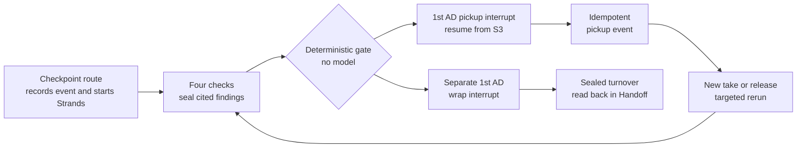
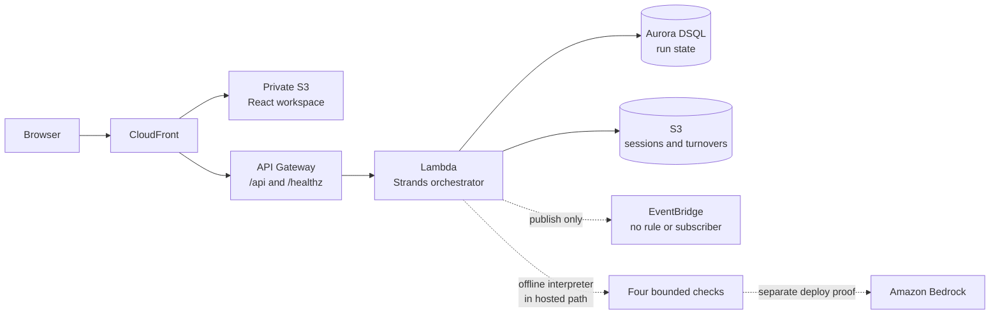

# LastTake

**LastTake reconciles script, take, continuity, media and rights records so a script supervisor catches missing evidence before the set is struck.**

[](https://github.com/upgradedev/lasttake-aws/actions/workflows/ci.yml)
[](LICENSE)


[](docs/strands-interrupt-resume.md)
[](docs/infrastructure.md)

The deterministic gate will not turn absent evidence into a pass. A 1st AD keeps the authority to approve a pickup and, separately, the wrap.

**[Open the AWS workspace](https://d3kf6hquzlli8g.cloudfront.net/)** · [Current automated acceptance](https://d3kf6hquzlli8g.cloudfront.net/acceptance.html) · [Architecture](#architecture) · [Judge path](#try-the-live-demo)

Built for the AWS Agents for Humans hackathon, Professional Agents track.

> **Fictional demo data only.** The public browser runs real HTTP requests, Strands tool calls, S3-backed session resume and role-gated decisions. Its two language judgements use an offline lexical interpreter, not Amazon Bedrock. It analyses no footage or audio and gives no legal clearance.


*Scene review from the `ui-screenshots` artifact of [frontend CI run 34788421972](https://github.com/upgradedev/lasttake-aws/actions/runs/34788421972), captured at commit `8475164`. The data is synthetic.*

## Contents

[Try the live demo](#try-the-live-demo) · [How it works](#how-it-works) · [Architecture](#architecture) · [What is real](#what-is-real) · [Why Strands is load-bearing](#why-strands-is-load-bearing) · [Evidence](#evidence-and-numbers) · [Quickstart](#quickstart) · [Bring your own record](#bring-your-own-record) · [Bedrock](#amazon-bedrock) · [Limits](#limits-and-assurance) · [Documentation](#documentation) · [Disclosures](#pre-existing-components)

<a id="try-it-without-installing-anything"></a>

## Try the live demo

No account or install is required. One browser session owns its saved runs.

1. Choose **Start this fictional shoot day**, then **Run wrap checkpoint**. Scene review shows the lined script, takes and evidence-backed exceptions.
2. Set **Demo role** to **1st AD**, reload, and answer the saved pickup request. The Strands run resumes from its S3 session after the original process has ended. A pickup does not approve wrap.
3. Open **Guided demo**. Add the valid take and the missing release, then record the continuity decision as **Script supervisor** and the media decision as **DIT / data manager**. Changed evidence makes any older decision visibly stale.
4. Return as **1st AD**, review wrap readiness and answer the separate wrap request. In **Handoff**, publish the sealed turnover and prepare its event receipt.

The receipt says only whether the event bus accepted the event. `pending` or `unknown` requires reconciliation, never a blind resend. The [workspace guide](docs/workspace-guide.md) lists every click and refusal case.

<a id="the-rule-the-whole-product-turns-on"></a>

## How it works

Seven source groups describe one scene: script revision, shot plan, captured takes, script notes, camera report, continuity references and rights ledger. Four bounded checks read them:

| Check | Question | Human owner |
|---|---|---|
| Coverage | Does each required beat have at least one viable take? | Script supervisor |
| Continuity | Do preferred takes conflict with the recorded physical state? | Script supervisor |
| Media identity | Does each take reconcile with the camera report? | DIT / data manager |
| Rights | Does every visible person and asset trace to a record? | Production coordinator |

Every finding names the source digests it read and seals its own record. The deterministic gate rejects stale sources, broken seals, missing check results, contradictory results, old policy versions and decisions from the wrong role.

**Absent evidence is a finding, never a pass.** The four truth states are `verified`, `missing`, `conflicting` and `unknown`. Hashes identify bytes, not truth.

### Agent and decision flow



Role-specific continuity and media decisions are bound to the exact finding digest and feed the gate without rewriting the finding. The checkpoint API and CLI record `scene.wrap-checkpoint.requested`, then invoke the orchestrator directly. EventBridge receives run events, but no rule or subscriber starts work today.

## Architecture



The diagram separates the hosted public path from the credentialed Bedrock proof. The [detailed architecture map](docs/architecture.svg), [system guide](docs/how-it-works.md) and [infrastructure guide](docs/infrastructure.md) map the agents, eight tools and AWS resources to code.

## What is real

| Capability | Current status |
|---|---|
| Public React workspace through CloudFront and API Gateway | Live, login-free, synthetic sessions |
| Strands orchestration and tool calls on Lambda | Live |
| Findings and decisions in Aurora DSQL | Live |
| Paused Strands sessions, amendments and turnovers in S3 | Live |
| Pickup and wrap decisions | Live; demo role selection is not staff authentication |
| EventBridge publication | Live; acceptance is recorded, with no rule or subscriber |
| Language interpretation in the public browser | Offline lexical matcher; no Bedrock request |
| Amazon Bedrock interpretation | Backend deploy proof and operator CLI only |
| Footage or audio analysis | Not implemented |
| Email, payment or scheduling action | Not connected |
| Human UAT | NOT_RUN; automated browser acceptance is separate |

[Frontend release metadata](https://d3kf6hquzlli8g.cloudfront.net/release.json), [backend health and runtime modes](https://d3kf6hquzlli8g.cloudfront.net/healthz) and [automated acceptance](https://d3kf6hquzlli8g.cloudfront.net/acceptance.html) expose the served revisions. A green branch run is not proof that those revisions are deployed.

<a id="how-strands-is-load-bearing"></a>

## Why Strands is load-bearing

Remove the Strands Agents SDK and the orchestration loop, tool calls, two human interrupts and process-death resume disappear. What remains cannot stop for a decision and continue later from the same run.

- `ToolContext.interrupt(name, reason=...)` stops a terminal tool and returns an interrupt result.
- `S3SessionManager` persists the hosted run after the Lambda process is gone; `FileSessionManager` does the same offline.
- A later process supplies the `interruptResponse`. The tool body re-enters from its first line, so every external action sits after the interrupt and behind an idempotency key.

CI starts the checkpoint and approval in separate operating-system processes and includes a missing-session negative control. A dispatched backend deployment additionally retires the warm Lambda container and requires the approving request to resume in a different container. The exact proofs and their limits are in [Interrupt and resume across process death](docs/strands-interrupt-resume.md).

<a id="the-numbers-and-the-commands-that-produce-them"></a>

## Evidence and numbers

These are deterministic outputs from the synthetic corpus, not a productivity benchmark or a claim about a real production.

| Measured claim | Result | Reproduce |
|---|---:|---|
| Required beats | 34 | `python -m pytest tests/test_corpus_counts.py -q` |
| Covered with evidence | 31 | same command |
| Raising exceptions with named sources | 2 | same command |
| Missing a release record and routed to production | 1 | same command |
| Takes in the fictional shoot day | 40 | `python corpus/build_corpus.py` |
| Blocking causes at the first checkpoint | 4, one per check | `lasttake checkpoint`, then inspect `.lasttake/runs/run-sc042-wrap-checkpoint/packet.json` |
| Covered when the interpreter is unreachable | 0 of 34, all `unknown` | `PYTHONPATH=src python tools/ablation.py` |

The exact generated sentence is:

> Of 34 required beats, 31 covered with evidence, 2 raising exceptions with named sources, 1 with no release record and routed to production.

A historical deploy observation produced 31 covered beats with `offline-lexical/1.0.0` and 19 with `bedrock:global.anthropic.claude-sonnet-5` in [run 34195514875](https://github.com/upgradedev/lasttake-aws/actions/runs/34195514875). Neither count establishes correctness without labelled ground truth. No practising script supervisor has run the testbook, no human benefit has been measured, and the prepared real-model evaluation remains NOT_RUN. See [Evaluation harness](docs/evaluation-harness.md) and [Model evidence](docs/model-evidence.md).

## Quickstart

Prerequisites: Python 3.11 or newer and git. This offline path needs no AWS account or credentials.

```bash
git clone https://github.com/upgradedev/lasttake-aws.git
cd lasttake-aws
python -m pip install -e ".[dev]"
lasttake checkpoint
```

Expected: four checks run, the count above prints, and the process exits with a pickup request waiting for the 1st AD.

In a new process, answer that saved interrupt:

```bash
lasttake approve --yes
```

Expected: the run resumes and publishes one idempotent pickup event. Bus acceptance does not establish a downstream action. This CLI quickstart proves checkpoint, pause and resume only; it does not request wrap or publish a turnover. Use the browser journey for the complete handoff.

Run the source checks:

```bash
python -m pytest --cov --cov-report=term-missing
python tools/prose_gate.py
python tools/docs_gate.py
```

## Bring your own record

The live API accepts a take or release record you write. Set `URL=https://d3kf6hquzlli8g.cloudfront.net`, create a private session with `POST /api/session`, then create its run with `POST /api/reset`. Keep the returned `session_id` private because it grants access to the saved run.

```bash
curl -s -X POST "$URL/api/ingest" -H 'content-type: application/json' -d '{
  "run_id": "REPLACE_WITH_YOUR_RUN_ID",
  "session_id": "REPLACE_WITH_YOUR_PRIVATE_SESSION_ID",
  "kind": "take",
  "document": {
    "take_id": "T-900", "shot_id": "S-42-PICKUP", "beat_ids": ["B-17"],
    "slate": "42L/1", "camera_roll": "A007", "sound_roll": "SR07",
    "timecode_in": "23:04:00:00", "timecode_out": "23:04:41:00",
    "lens_mm": 50, "media_id": "A007R2G01",
    "preferred": true, "usable": true,
    "note": "Pickup on the reaction. Clean single.",
    "visible_people": ["DELPHINE"]
  }
}'
```

An owned run refuses a missing handle or another session's handle with HTTP 403. Shape errors are refused before a write. A take changes the takes digest and reruns all four checks; a release reruns rights only. The gate separately drops any stale finding, and an older human decision stops applying when its evidence digest changes. See [Bring your own record](docs/bring-your-own-record.md).

<a id="running-against-amazon-bedrock"></a>

## Amazon Bedrock

The public HTTP demo always uses the offline interpreter. Bedrock is available only to a credentialed operator and in the dispatched backend deployment proof.

First ask the current AWS account what it can invoke:

```bash
lasttake doctor --bedrock
```

Then use an identifier that command returned:

```bash
export LASTTAKE_BEDROCK_MODEL_ID=<an-id-that-doctor-printed>
lasttake checkpoint --bedrock
```

The default model identifier was invoked successfully in one account on 2026-08-22; that does not prove access in another account. New findings take `model_id` only from their serialized records. The deploy job runs `BedrockModel` with `agent.structured_output`, but the public Lambda path has no Bedrock switch.

Scene text is delimited and instructed as evidence, never as executable instructions. Offline prompt-injection cases are tested. A real model's resistance to those cases is unexercised; [Model evidence](docs/model-evidence.md) keeps that gap visible.

<a id="what-is-deployed-and-what-it-costs"></a>

## AWS deployment

Two stacks run in `eu-west-1`:

- `lasttake-app`, declared in [`infra/stack.yaml`](infra/stack.yaml): API Gateway, Lambda, Aurora DSQL, an S3 data bucket and an EventBridge bus. An owner dispatches `.github/workflows/deploy.yml` to deploy or tear it down.
- `lasttake-frontend`, declared in [`infra/frontend_stack.py`](infra/frontend_stack.py): private S3 hosting behind CloudFront, with uncached API routes. Pushes to `main` publish and run browser acceptance.

The frontend stack and CI identities are provisioned once by the owner outside GitHub Actions. AWS invoice cost, model cost, human time and savings are unmeasured. The data bucket and DSQL cluster are retained on teardown because they hold the audit trail. [Infrastructure](docs/infrastructure.md) gives the resource map, permissions and teardown details.

<a id="what-it-will-not-do"></a>
<a id="assurance-and-residual-gaps"></a>

## Limits and assurance

LastTake is a second set of eyes and an integrity layer. It does not judge performance or creative quality, declare a scene legally cleared, approve a schedule or spend, or edit original media. A `verified` rights row means the expected structured record was found under the configured policy. Counsel determines legal sufficiency.

Current residual gaps include:

- human UAT and practising script-supervisor evaluation are NOT_RUN
- the public demo has no staff authentication
- no EventBridge rule or subscriber starts the orchestrator
- real-model evaluation, AWS latency p95, a restore drill and current cost are unmeasured
- backend deployment uses long-lived access keys; frontend publication uses GitHub OIDC

[Assurance](docs/assurance.md) records the six AWS Well-Architected pillars, the Agentic AI Lens, relevant EU AI Act articles and the data map, each with its residual gap. No regulatory status is claimed.

## Documentation

| Page | What it answers |
|---|---|
| [How LastTake works](docs/how-it-works.md) | System view, eight tools, interpreter boundary and repository layout |
| [Interrupt and resume](docs/strands-interrupt-resume.md) | Cross-process CI proof, Lambda proof and replay-safe action pattern |
| [Workspace guide](docs/workspace-guide.md) | Live journey, roles, refusals and saved sessions |
| [Bring your own record](docs/bring-your-own-record.md) | Input shapes, limits, reruns and stale decisions |
| [Evaluation harness](docs/evaluation-harness.md) | Frozen cases, measurements, rewrites and limits |
| [Model evidence](docs/model-evidence.md) | Offline versus Bedrock results and work not yet run |
| [Infrastructure](docs/infrastructure.md) | AWS resources, least privilege, deployment and teardown |
| [Release and acceptance](docs/release-and-acceptance.md) | Frontend/backend revisions and public acceptance receipt |
| [Assurance](docs/assurance.md) | Control mapping, data handling and residual gaps |
| [AgentCore design note](docs/BEDROCK_AGENTCORE_ARCHITECTURE.md) | Optional future design; AgentCore is not deployed |

## Pre-existing components

Required disclosure:

| Component | Source | What was carried |
|---|---|---|
| `src/lasttake/domain/sealing.py` | ClaimScene, MIT, same author | `sha256_bytes`, `canonical_json` and the sealed-record pattern, about thirty lines of primitives |
| Product thesis | Private research package by the same author, written 2026-07-28 | Problem definition, roles, four truth states, finding contract and event list; used as specification, not shipped code |
| CI, README structure and video scaffold | Private submission toolkit by the same author | Workflow layout, documentation framing and optional per-beat media tooling, adapted for LastTake |
| Workspace visual direction | Kerdon interface and the owner's approved reference | Deep navy, amber accents and connected context, evidence and decision panes; no customer data, tenant configuration, identifiers, assets or dependency code |

The AWS adapters, Strands agent definitions, deterministic gate, checks and synthetic corpus are new for LastTake.

## Licence

MIT. See [LICENSE](LICENSE).
