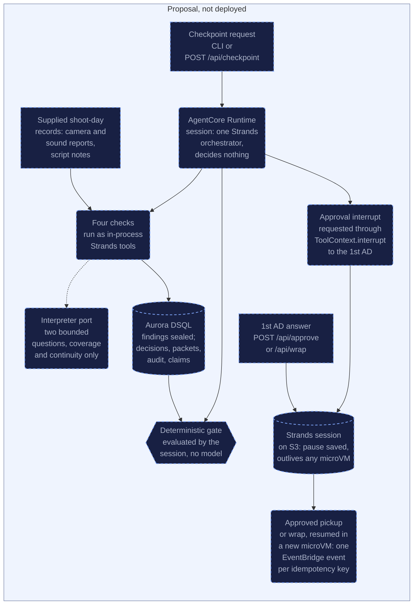

# LastTake: optional AgentCore design notes

This page is for a reviewer asking what moving LastTake onto AgentCore would involve, and it expands [README, What is deployed, and what it costs](../README.md#what-is-deployed-and-what-it-costs). It describes today's code as it is and marks every AgentCore step as a proposal.

For a script supervisor and the 1st AD, the running application is [LastTake on AWS](https://d3kf6hquzlli8g.cloudfront.net/). Create a run, start a checkpoint, review sources and answer the saved approval. Handoff exports the turnover, an evidence summary, receipts and their stated limits. The current browser is an offline synthetic demo using real Strands tool replay and S3 sessions; it does not analyse footage or audio. Pre-existing component disclosures are in the README.

> **Status: a design proposal. None of the AgentCore migration below is deployed, validated or part of the current reliability implementation.**
>
> LastTake does not run on Amazon Bedrock AgentCore today. What is deployed is described in the README under "What is deployed, and what it costs": one Lambda behind an HTTP API, one Aurora DSQL cluster, one data bucket and one EventBridge bus, with the web app served from a private S3 bucket through CloudFront. The backend is one CloudFormation template, `infra/stack.yaml`, applied by the deploy workflow. No workflow deploys the CloudFront frontend stack rendered by `infra/frontend_stack.py` or runs `infra/setup_ci_identity.py`, which creates the CI IAM user; the owner provisions both.
>
> The hosted HTTP demo always runs offline, with no Bedrock switch: interpretations on the live URL come from the offline lexical interpreter and a scripted planner drives the orchestrator, so no language model is called. This document is what a move onto AgentCore could look like. Every sentence about LastTake on AgentCore describes an intention, not a running system, and nothing in it should be read as a capability claim.
>
> LastTake is aimed at **one script supervisor on one shoot day**, with the 1st AD holding pickup and wrap authority, which is the positioning the README leads with.

## 1. Summary

LastTake is pre-wrap assurance for a script supervisor on a shoot day. It reads the kind of records a production already writes down: the script, shot plan, takes, camera and sound reports, continuity references, script notes and rights ledger. It is not a real-time telemetry system, and nothing streams into it. LastTake reports whether a scene's supplied evidence makes it eligible for a human wrap decision before sets are struck and cast released. Eligibility is not a statement that wrapping is safe.

This proposal describes how LastTake, which keeps eligibility with deterministic policy and authority with the 1st AD, could be mapped onto Amazon Bedrock AgentCore. The [mapping](#3-mapping-from-current-modules) comes out small:

- the Strands orchestrator would run in an AgentCore Runtime session
- the session a paused run resumes from would stay on S3
- run state would stay on Aurora DSQL, and the gate would stay in code
- every pickup and wrap approval would stay with the 1st AD

No decision would move to AgentCore.

## 2. Proposal diagram

Every box below belongs to the proposal. Several of the same parts run today inside one Lambda function, but none of them runs on AgentCore, so each is drawn as not deployed. The dotted arrow is the only place a model could be asked a question.

The input is supplied records, not telemetry. No arrow leaves the event bus: no EventBridge rule routes events today, and this proposal adds none.

## 3. Mapping from current modules

AgentCore service names on this page were checked on 2026-09-14 against three AWS documentation pages: [What is Amazon Bedrock AgentCore?](https://docs.aws.amazon.com/bedrock-agentcore/latest/devguide/what-is-bedrock-agentcore.html), [Use isolated sessions for agents](https://docs.aws.amazon.com/bedrock-agentcore/latest/devguide/runtime-sessions.html) and [File system configurations for AgentCore Runtime](https://docs.aws.amazon.com/bedrock-agentcore/latest/devguide/runtime-filesystem-configurations.html). An earlier draft of this page used "action group", "return of control" and "supervisor agent". Those are terms of Amazon Bedrock Agents, a separate service (see its [return of control](https://docs.aws.amazon.com/bedrock/latest/userguide/agents-returncontrol.html) page), so this mapping does not use them.

The middle column is today's code. The right column is the proposal.

| Module or resource | What it does today | In this proposal |
|---|---|---|
| `lasttake.agents.orchestrator` | One Strands agent calling eight tools: four checks, the gate, two approval requests and turnover publication. The hosted demo drives it with a scripted planner. It decides nothing. | Would run in an AgentCore Runtime session instead of the Lambda handler. The AgentCore overview page lists Strands Agents among the frameworks Runtime works with. Still one agent that decides nothing. |
| `lasttake.agents.tools` | The pickup and wrap pauses are `ToolContext.interrupt` calls in `request_pickup_approval` and `request_wrap_approval`, addressed to the 1st AD. `publish_turnover` refuses without a current wrap approval. | Unchanged. The Strands interrupt stays the pause; no AgentCore service replaces it. |
| `S3SessionManager` | Built per request in `lasttake.app.handler` and handed to the orchestrator. A paused run resumes after a container restart from its Strands session on S3. | Unchanged, for the reasons in [section 5](#5-resume-across-container-recycling). |
| `lasttake.checks` | Four Python check modules with no OpenAPI schemas. Coverage checks required beats against usable takes. Continuity checks preferred takes against references such as a mug, a raincoat and a wristwatch. Metadata reconciles the take sidecar with the camera report (media id, lens, camera roll). Rights checks each person and visible asset against release or licence records. | Would stay as in-process Strands tools. AgentCore Gateway turns APIs and Lambda functions into MCP tools; code that already runs inside the agent does not need it. |
| `lasttake.ports.interpreter` | The only door to a model. Coverage and continuity use it for two bounded language questions; metadata and rights never do. The hosted demo always uses the offline lexical interpreter. Only the CLI `--bedrock` flag builds `BedrockInterpreter`, which reads `LASTTAKE_BEDROCK_MODEL_ID`; the stack default is `global.anthropic.claude-sonnet-5`. | Unchanged. A configured model would still be called on Amazon Bedrock through this port. |
| `lasttake.domain.policy` | The deterministic gate, with no model in it. It produces an eligibility result, which is not approval to wrap. | Would stay in code. AgentCore Policy controls which tool calls an agent may make through Gateway; it would not decide eligibility. |
| `lasttake.domain.turnover` | Only builds and seals the turnover manifest, recording the wrap approver it is handed. | Unchanged. |
| `lasttake.app.workspace` | Refuses an approval answer whose claimed role is not `first_ad` on session-owned runs. There is no Unit Production Manager role, and the role is a request claim, not an authenticated identity. | AgentCore Identity, which works with existing identity providers, is the candidate for making the 1st AD an authenticated person rather than a claimed role. This design has not worked out how. |
| `lasttake.adapters.aws.dsql` | Stores findings, decisions, eligibility packets, the audit trail and idempotency claims. | Would stay on Aurora DSQL. AgentCore Memory keeps conversation context, short-term within a session and long-term across sessions, not one-time claims, so it is not proposed for run state. |
| `lasttake.domain.sealing` | Source artifacts and emitted records (findings, eligibility packets, turnover and receipts) carry SHA-256 digests. The gate verifies the seal on each finding. Hashes identify bytes, not truth. | Unchanged. |
| EventBridge bus | Every emitted event is copied to S3 and sent with PutEvents. No rule routes events: the checkpoint request (the CLI command, or POST /api/checkpoint behind the "Run wrap checkpoint" button) publishes `scene.wrap-checkpoint.requested` and then starts the orchestrator itself. | Unchanged. The checkpoint request would start the Runtime session in the same way. |

**What a move would involve.** None of this is written.

1. Package the orchestrator for AgentCore Runtime, and have the checkpoint, approve and wrap requests invoke a Runtime session for the run. The Runtime sessions page asks for a session id of at least 33 characters, while a run id today may be as short as 8 (`RUN_ID_PATTERN` in `lasttake.app.handler`), so the session id would have to be derived from the run id.
2. Give the Runtime execution role the grants the Lambda role has today: its own data bucket, its own event bus, `dsql:DbConnectAdmin` on its own cluster, Bedrock inference and its own logs.
3. Add a release step for the Runtime. No AgentCore resource appears in `infra/stack.yaml` or in any workflow.
4. Keep the S3 session and the DSQL claims, as [section 5](#5-resume-across-container-recycling) explains.

The only AgentCore service this design would use is Runtime, with Identity as an open candidate. Observability, Code Interpreter, Browser, Evaluations and the other services on the overview page are not part of it.

## 4. Out of scope for this design

An earlier draft of this page listed labour turnaround rules, minors' working hours and sun-angle limits as rule engines. None of them is a check anywhere in `src/`, and the product may not approve a schedule, so they stay out of this design.

- **Turnaround rest between wrap and the next call time.** No check computes it, and a schedule is approved by people.
- **Working hours and curfews for minors.** No check computes them.
- **Sun-angle or daylight limits for exterior scenes.** No check computes them.
- **Streaming input.** Nothing streams in. The checks read supplied records.
- **Footage and audio analysis.** No check reads media. The metadata check compares identifiers in the take record with the camera report.
- **Verdicts.** The product may not judge a performance or declare a scene legally cleared, safe or creatively complete. See [README, What it will not do](../README.md#what-it-will-not-do).
- **Model training.** No model is trained or fine-tuned. The data is one synthetic scene package plus 16 synthetic text-interpretation development cases with separate gold labels, documented by `docs/model-evidence-protocol.json`.

Of the constraints that earlier draft listed, only beat coverage exists, and in a narrower form: every required beat must be named by at least one usable take. The interpreter may downgrade that cover to unknown but can never create one. Nothing checks that a take is sound-synced or approved.

## 5. Resume across container recycling

**Today, on Lambda.**

- **The pause.** `request_pickup_approval` and `request_wrap_approval` stop the run with `ToolContext.interrupt`. `S3SessionManager` saves the Strands session under `sessions/` in the data bucket, where a lifecycle rule expires it after 90 days (`expire-demo-sessions` in `infra/stack.yaml`).
- **The resume.** A 1st AD approval request (POST /api/approve or /api/wrap) rebuilds the agent from its S3 session and continues, subject to current evidence and delivery guards. There is no webhook route. The container that resumes need not be the one that paused; see [On Lambda: two requests, two containers, historical](strands-interrupt-resume.md#on-lambda-two-requests-two-containers-historical).
- **Replay.** On resume the tool body re-enters from its first line and `interrupt()` returns the stored answer. It is a replay, not a frozen stack frame, so every approved action puts its external call after the interrupt, behind an idempotency key. See [Replay, not a frozen stack frame](strands-interrupt-resume.md#replay-not-a-frozen-stack-frame).
- **Idempotency.** Idempotency keys and DSQL claims prevent duplicate pickup, wrap-ready and turnover publications during retries. A claim is one `INSERT ... ON CONFLICT DO NOTHING` into the `handled_events` table, so the database decides which of two concurrent attempts wins. Gate evaluation is deterministic and is not deduplicated. A delivery receipt can be pending, accepted, rejected or unknown, and `src/lasttake/agents/runtime.py` handles each outcome. The case for a database here is in [Why a database and not more S3](infrastructure.md#why-a-database-and-not-more-s3).
- **Guards.** Before an approved wrap is published, `publish_approved` refuses unless the answer came from the `first_ad` role, the reviewed evidence and decisions still match, the scene is still eligible, and no later wrap review superseded the approval.
- **Seals.** Source artifacts and emitted records (findings, eligibility packets, turnover and receipts) carry SHA-256 digests, and the gate verifies the seal on each finding. LastTake computes no digest over the Strands session it saves on S3.

**On AgentCore, as the AWS documentation describes it (read 2026-09-14).**

- On a microVM runtime, each session gets its own microVM. By default the microVM stops after 15 minutes of inactivity, or at its maximum compute lifetime of 8 hours. By default, data held in memory or written to its disk lasts only as long as that compute. The next invocation of the same session provisions a new microVM.
- Session storage, a persistent directory for one session on a microVM runtime, is marked Preview. Its data is reset after 14 days without an invocation and whenever the runtime version is updated.
- Instances runtimes, where a session can last up to 14 days, are a separate compute type. This design has not evaluated them.
- AgentCore Memory keeps short-term memory of interactions within a session and long-term memory extracted across sessions.

**What this design would do.**

- The 23:10 to 06:40 pause in the product story is seven and a half hours in which nobody needs to touch the run, far longer than the 15-minute idle default, so the microVM that paused the run would normally be gone by morning. The 1st AD's answer would start a new microVM, which is the same situation a recycled Lambda container is in today.
- The design would keep `S3SessionManager`, so the paused run lives outside any microVM and survives a runtime version update released overnight, which session storage would not.
- Claims, findings, decisions, packets and the audit trail would stay on DSQL. AgentCore Memory is not proposed for them, because a one-time claim needs the database to refuse the second insert.
- Nothing in this section has been built or run on AgentCore.
