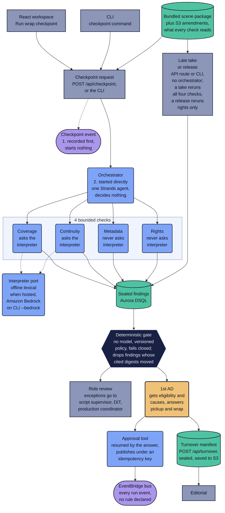

# How LastTake works

This page is for a technical judge or reviewer who wants the system in more detail than the README gives. It expands [README, Architecture](../README.md#architecture), whose required diagram is [architecture.svg](architecture.svg). The absent-evidence rule, the four truth states and the fail-closed cases are stated once, in [README, The rule the whole product turns on](../README.md#the-rule-the-whole-product-turns-on), and this page links there instead of repeating them.

## System view

The picture follows one wrap checkpoint as the hosted demo runs it, from the request to the turnover editorial receives. The CLI takes the same path inside one local process. Solid arrows are calls and data. Dashed arrows are the two language questions a check may ask the interpreter, and the checkpoint event, which is published but starts nothing.



What each part does:

- **Starting a checkpoint.** The "Run wrap checkpoint" button posts to `POST /api/checkpoint`, and the CLI's `lasttake checkpoint` does the same work in its own process. Either one publishes `scene.wrap-checkpoint.requested` and then starts the orchestrator itself (`handler.py:275-286`, `cli.py:144-154`). No EventBridge rule routes that event or any other: `infra/stack.yaml` declares the bus with no rule or target, and nothing in `src/` subscribes to it.
- **What the checks read.** On AWS the base scene package ships inside the Lambda package, because the deploy copies `corpus/*.json` into it. Amendments a person supplies are read from S3 and replayed on top (`handler.py:72-115`, `handler.py:138`). The CLI reads `corpus/` from the checkout. The table below shows which sources each check cites.
- **Findings.** Each finding is sealed with the SHA-256 of its own record and stored in Aurora DSQL on AWS, or in local files for the CLI. The gate verifies a finding's seal before it reads any field. Eligibility packets are sealed but not verified again when read, and decisions, audit entries and handled events are stored without a seal.
- **The gate.** It derives the required checks from the package itself, so a check the orchestrator never ran shows up as a missing result. It drops a finding whose seal fails, whose cited source digests have moved, or that was judged under a policy version different from the current one, older or newer (`policy.py:197-248`). A finding from an older package revision whose cited sources did not move is kept. Its answer is an eligibility result with its causes. It is not approval to wrap.
- **Role review.** Exceptions go to the role that owns them (see the table below). A decision counts only when the deciding role holds authority for that check and the decision is bound to the finding's current seal (`policy.py:388-418`).
- **The 1st AD.** A pickup or wrap approval is a Strands interrupt inside an approval tool. The run stops and its session is saved, on S3 when hosted. The answer, sent through `POST /api/approve` or `POST /api/wrap`, resumes the tool, which replays from its first line. Only after an approval does the tool publish `pickup.requested` or `wrap.ready`, under an idempotency key, and nothing subscribes to `wrap.ready`. On a session-owned run the workspace refuses an answer whose claimed role is not the 1st AD; that role is a claim in the request, not an authenticated identity. See [Interrupt and resume across process death](strands-interrupt-resume.md).
- **The turnover.** It is built only when the `publish_turnover` tool runs, which the "Publish approved turnover" button in Handoff reaches through `POST /api/turnover` (`handler.py:550-568`). The tool refuses without an eligible packet and a current 1st AD wrap approval, runs the gate again, seals the manifest, saves it under `turnover/` in the artifact store and publishes `turnover.generated`. There is no separate turnover service.
- **Reruns.** A late take or a release goes through its own API route or CLI command, which runs the checks directly, without the orchestrator. `POST /api/ingest` looks up which checks to rerun in the `AFFECTED_CHECKS` table in `src/lasttake/domain/events.py`. `POST /api/late-take` reruns all four, and `POST /api/resolve-rights` reruns rights only. A new take moves the takes digest, which every check cites, so all four rerun; a release moves only the rights ledger. The gate separately discards any finding whose cited source digests moved, so a table entry that left out an affected check would show up in the eligibility result as a missing current result, not as a pass. The intake contract is in [Bring your own record](bring-your-own-record.md).
- **The bus.** On AWS every run event reaches EventBridge, including one `finding.recorded` per finding, and a copy of each is written to S3 first. Each publish returns a receipt that reads pending, accepted, rejected or unknown. Bus acceptance is not downstream completion. The CLI writes its events to a local file instead.

| Check | Sources it cites | Question it asks the interpreter | Exceptions go to |
|---|---|---|---|
| Coverage | script revision, shot plan, takes | Does this take plausibly contain this beat? | Script supervisor |
| Continuity | continuity references, script notes, takes | Do these two notes describe the same physical state? | Script supervisor |
| Metadata | takes, camera report | None | DIT |
| Rights | rights ledger, takes | None | Production coordinator |

Sources come from `coverage.py:37-52`, `continuity.py:60-72`, `metadata.py:38-45` and `rights.py:48-56` in `src/lasttake/checks/`, and roles from the `AUTHORITY` table in `src/lasttake/domain/policy.py`. The package also holds a sound report, but no check cites it.

## The orchestrator and its eight tools

The orchestrator is one Strands agent, built in [`src/lasttake/agents/orchestrator.py`](../src/lasttake/agents/orchestrator.py). Its eight tools are bound to one run by `build_tools` in [`src/lasttake/agents/tools.py`](../src/lasttake/agents/tools.py), and `grep -c '^\s*@tool' src/lasttake/agents/tools.py` prints 8. Its system prompt says that deterministic policy decides eligibility and the 1st AD decides authority, so the agent runs checks and routes work to people.

Every surface drives the agent with `OfflineOrchestratorModel`, a scripted planner whose `model_id` is `offline-scripted/1.0.0`. It calls the four checks and then the gate, in that order, and matches a few phrases to the approval and turnover tools (`orchestrator.py:60-112`). The CLI flag `--bedrock` swaps the interpreter, not the planner.

| Tool, with its line in `tools.py` | What it does | Stops the run | What it publishes |
|---|---|---|---|
| `run_coverage_check`, 121 | Checks each required beat against the usable takes that name it, asking the interpreter whether a take is about the beat. A full run also records an advisory finding for any shot planned against a beat the script no longer has. | No | `finding.recorded`, one per finding |
| `run_continuity_check`, 142 | Compares preferred takes of the same beat against each continuity reference, asking the interpreter whether two notes describe the same state. | No | `finding.recorded`, one per finding |
| `run_metadata_check`, 160 | Compares each take with its camera report row: media identifier, lens and camera roll. | No | `finding.recorded`, one per finding |
| `run_rights_check`, 177 | Traces each person and visible asset in a usable take to a release or licence record. | No | `finding.recorded`, one per finding |
| `evaluate_wrap_eligibility`, 194 | Runs the gate over the current findings and decisions, stores the sealed packet, and returns the headline sentence with the causes. | No | `wrap.eligible` with the gate's counts when eligible, otherwise `approval.requested` with the causes |
| `request_pickup_approval`, 232 | Asks the 1st AD to approve a pickup for one beat. | Yes, interrupt `first-ad-pickup-approval` | `pickup.requested` after approval, under an idempotency key |
| `request_wrap_approval`, 297 | Refuses unless the stored packet is eligible and the reviewed evidence still matches, then asks the 1st AD to approve the wrap. | Yes, interrupt `first-ad-wrap-approval` | `wrap.ready` after approval, under an idempotency key |
| `publish_turnover`, 357 | Refuses without an eligible packet and a current wrap approval, runs the gate again, then builds and seals the turnover manifest. | No | `turnover.generated`, under an idempotency key |

A few things the table does not show:

- The two approval tools are declared `@tool(context=True)` and take a Strands `ToolContext` as their first argument. Both reach one helper, `_await_approval` (`tools.py:87-100`), which calls `tool_context.interrupt`. On resume the tool body replays from its first line, so each tool publishes only after the interrupt has returned an answer.
- Not every route goes through the agent. `POST /api/checkpoint` prompts it, and `POST /api/approve` and `POST /api/wrap` prompt or resume it. `POST /api/evaluate` calls `evaluate_wrap_eligibility` directly, and `POST /api/turnover` calls `publish_turnover` directly (`handler.py:488-568`).
- The narrowing arguments (`only_beats`, `only_refs`, `only_takes`, `only_subjects`) exist, but no shipped path passes them. Reruns call the check functions directly.
- Hosted, the session lives in `S3SessionManager` under the `sessions/` prefix of the data bucket (`handler.py:155-169`). The CLI uses `FileSessionManager` under `.lasttake/sessions`.

## Where an interpreter is used, and where code decides

An interpreter is used for exactly two questions, both of them language questions: does this take plausibly contain this beat, and do these two notes describe the same physical state. They are the only two methods of the `Interpreter` port in [`src/lasttake/ports/interpreter.py`](../src/lasttake/ports/interpreter.py), `match_beat_to_take` and `compare_continuity`, and only the coverage and continuity checks call them. In the system view they are the two dashed arrows into the interpreter port.

Identifier equality (media identifier, lens and camera roll against the camera report), SHA-256 digest comparison of cited artifacts and sealed records, and counting are done in code, not by a model. No timecode arithmetic is performed: timecodes are copied into observation text and locators, never parsed. A take has no checksum field, so no media checksum is compared. Each of these has one exact answer, and code gives the same one every time.

The interpreter can weaken a coverage result but cannot create one. Code decides whether a usable take names the beat. The interpreter may turn that claimed cover into `unknown`, and a match below 0.55 confidence becomes `unknown`, but it can never turn an absent take into a cover (`coverage.py:3-10`, `coverage.py:123`). In continuity, a disagreement the interpreter reports with less than 0.6 confidence becomes `unknown` instead of `conflicting` (`continuity.py:171`).

| Where it runs | Interpreter | `model_id` on a finding that carries an inference |
|---|---|---|
| Hosted demo, every HTTP request | `OfflineInterpreter`, always. The handler has no Bedrock switch (`handler.py:146`). | `offline-lexical/1.0.0` |
| CLI, default | `OfflineInterpreter` | `offline-lexical/1.0.0` |
| CLI with `--bedrock` | `BedrockInterpreter` on Amazon Bedrock, model from `LASTTAKE_BEDROCK_MODEL_ID`, default `global.anthropic.claude-sonnet-5` | `bedrock:` followed by the model id |

What has actually run against Bedrock, and what that evidence does and does not show, is in [Model evidence](model-evidence.md).

## Workflow requirements the gate and receipt enforce

These five requirements come from the product's own workflow. Each row gives the requirement as written, the code that enforces it and a test that exercises it. The truth states and fail-closed cases they rest on are in [README, The rule the whole product turns on](../README.md#the-rule-the-whole-product-turns-on).

| Requirement | Enforced in | Test |
|---|---|---|
| A supplied take must not manufacture its own camera report. | `ingest.py:292` keeps `camera_report_row` out of the take, and `package.py:250-282` adds a camera report row only when one is supplied. | `tests/test_reliable_workflows.py:210` |
| Every current required check must have admissible evidence. | `policy.py:197-248` admits findings, and `policy.py:278-354` turns a missing or duplicate result into a cause. | `tests/test_gate.py:51`, `tests/test_gate.py:213` |
| Current authorized decisions are selected consistently by the UI, deterministic gate and receipt. | `latest_decision` and `decision_applies` in `policy.py:388-401`, used by the gate, `receipt.py:217`, `rollup.py:181` and `turnover.py:172`. The workspace applies the same order and digest rule in `frontend/src/model.ts:36-38`. | `tests/test_reliable_workflows.py:245` |
| A wrap approval binds the exact package and review digest shown to the 1st AD. | `review_binding` and `wrap_guard` in `runtime.py:158-175` | `tests/test_reliable_workflows.py:190`, `tests/test_reliable_workflows.py:397` |
| The latest pending or declined wrap review supersedes earlier authority while preserving its historical receipt. | `publish_approved`, `current_wrap_approval` and `latest_wrap_review` in `runtime.py:177-242` | `tests/test_reliable_workflows.py:293` |

## Repository layout

The tree below was refreshed against the files on this branch. Every count in it is listed underneath with the command that prints it, run from the repository root.

```text
src/lasttake/
  domain/      findings and their truth states, the scene package, the gate
               (policy.py), the headline count (rollup.py), events, sealing,
               the turnover, the receipt and saved-history paging
  checks/      the four bounded checks; coverage and continuity ask the
               interpreter port, metadata and rights compare in code
  ports/       interfaces: event bus, artifact store, run store, interpreter
  adapters/    local/ runs offline with no account; aws/ holds the Bedrock
               interpreter, the EventBridge and S3 stores, and Aurora DSQL
  agents/      the Strands layer: orchestrator.py, tools.py with the eight
               tools, runtime.py with publishing, delivery receipts and
               approval guards
  app/         handler.py, the Lambda behind the HTTP API; ingest.py for a
               supplied record; workspace.py for sessions, role guards and
               receipts; local_server.py, the same API offline; scene_view.py,
               the lined script; static/index.html, the legacy single page
  cli.py       seven subcommands: checkpoint, approve, late-take, resolve,
               verify, doctor, events
corpus/        one fictional shoot day: eight JSON documents and build_corpus.py
tests/         the Python suite, including the gate's proofs that it fails closed
frontend/      the React workspace judges open, served through CloudFront
  src/         the pages, the API client and the Architecture view
  tests/       unit and component tests; tests/e2e/ holds the Playwright
               journeys, run by frontend-ci.yml against a local server and by
               aws-uat.yml against the CloudFront URL
  acceptance-tests/  the published acceptance proof, read after a release
  proof-tests/       how the acceptance page shows each receipt state
  benchmark-tests/   the source hero benchmark
  scripts/           build and measurement helpers
web/
  tests/       21 Playwright tests against the legacy page: the walk to a
               sealed turnover, document intake, and the two-role handover.
               live-surface.yml runs them against the page the Lambda serves
               at the HTTP API endpoint, and legacy-source-ci.yml against the
               offline local server
  source-tests/, support/, video/
               source contracts for the legacy page, and the journey the
               video capture shares
infra/         stack.yaml (backend), frontend_stack.py (CloudFront frontend),
               frontend.json, setup_ci_identity.py (CI user, run once by the
               owner), dsql_runtime_authority.py (prepares, never applies), the
               frontend publish, smoke and acceptance scripts, and their tests
tools/         ablation, bounded_model_evidence, dast_probe, docs_gate,
               evaluation_cases, evaluation_runner, hero_benchmark_server,
               judge_url_check, measure, model_evidence, package_lambda,
               prose_gate, secret_scan, uptime_check (all .py)
video/         the optional video build: narration, composition, release proof
scripts/       verify_video_sync.py, the video sync gate
requirements/  pinned dependencies for the video sync gate selftest
.github/workflows/
               aws-hosting-ci, aws-uat, ci, codeql, deploy, frontend-ci,
               frontend-deploy, legacy-source-ci, live-surface,
               submission-video, uptime, video-sync-gate-selftest (all .yml)
docs/
  how-it-works.md                    this page
  strands-interrupt-resume.md        interrupt and resume across process death
  workspace-guide.md                 using the LastTake workspace
  bring-your-own-record.md           the intake contract and what reruns
  evaluation-harness.md              baseline, ablation and evaluation cases
  model-evidence.md                  what has run against a model, what has not
  infrastructure.md                  AWS resources, release paths, least privilege
  release-and-acceptance.md          releases and acceptance evidence
  assurance.md                       Well-Architected, EU AI Act, data protection
  BEDROCK_AGENTCORE_ARCHITECTURE.md  a design proposal, not deployed
  architecture.svg                   the required architecture diagram
  measurement.json                   written by tools/measure.py
  evaluation_cases.json              written by tools/evaluation_cases.py
  ablation.json                      historical; tools/ablation.py prints to
                                     stdout and does not overwrite it
  hero-measurement-protocol.json     a preregistered protocol, measured once
                                     in run 34481212393 (2026-09-10); its
                                     status field still reads
                                     PREREGISTERED_NOT_MEASURED
  model-evidence-cases.json, model-evidence-gold.json,
  model-evidence-protocol.json       16 synthetic cases with assistant-authored
                                     labels, frozen by tools/model_evidence.py
  model-evidence-inventory.json      an inventory of model evidence, 2026-09-10
  build_stories.json                 three unpublished drafts
  submission_description.json        an unpublished draft, not submitted
```

`domain/`, `checks/` and `ports/` import no SDK: no Strands and no boto3. Two tests enforce it. `tests/test_contracts.py:127` fails if any Python file in those three folders imports either one, and `tests/test_contracts.py:139` imports the gate, the headline count and the coverage check in a separate Python process with both SDKs blocked.

The counts, and the commands that print them:

- 4 check modules, 8 orchestrator tools and 7 CLI subcommands: `ls src/lasttake/checks`, `grep -c '^\s*@tool' src/lasttake/agents/tools.py` and `grep -c 'add_parser(' src/lasttake/cli.py`.
- 8 corpus documents: `ls corpus/*.json`.
- 21 legacy-page browser tests: `grep -cE '^\s*test\(' web/tests/*.spec.mjs` prints 6, 8 and 7.
- 4 journey files holding 13 tests for the React workspace: `grep -cE '^\s*test\(' frontend/tests/e2e/*.spec.ts` prints 2, 5, 2 and 4.
- 14 tool scripts and 12 workflows: `ls tools/*.py` and `ls .github/workflows/*.yml`.
- 16 model-evidence cases: `case_count` on line 9 of `docs/model-evidence-protocol.json`.
- 3 unpublished drafts: `python -c "import json; print(len(json.load(open('docs/build_stories.json', encoding='utf-8'))['stories']))"`.
