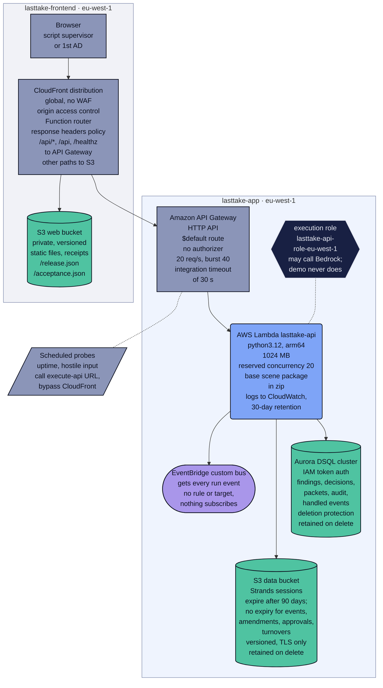
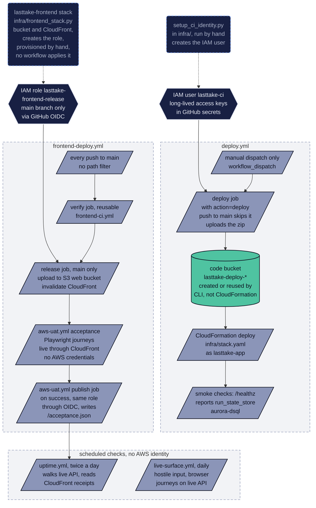

# Infrastructure

This page is for an AWS-literate reviewer and for the operator. It covers every AWS resource behind [the live workspace](https://d3kf6hquzlli8g.cloudfront.net/): where each one is declared, how each stack is released, and how to take it all down again. It expands [README, What is deployed, and what it costs](../README.md#what-is-deployed-and-what-it-costs).

## Runtime resources

There are two CloudFormation stacks, both in eu-west-1.

- `lasttake-app` is declared in `infra/stack.yaml` and deployed by `.github/workflows/deploy.yml`. It holds five backend services: API Gateway, Lambda, Aurora DSQL, S3 and EventBridge.
- `lasttake-frontend` is rendered by `infra/frontend_stack.py` and holds CloudFront and the site bucket.

The frontend stack and the CI identities are set up outside any workflow. The AWS resources in the diagram are declared in `infra/stack.yaml`, `infra/frontend_stack.py` and `infra/frontend.json`. Some labels come from other files: the scheduled probes from `.github/workflows/uptime.yml` and `.github/workflows/live-surface.yml`, the `/release.json` and `/acceptance.json` receipts from `infra/frontend_publish.py:68` and `infra/frontend_acceptance.py:257`, the scene package in the zip from `.github/workflows/deploy.yml:98-99`, and the note that the hosted demo never calls Bedrock from `src/lasttake/app/handler.py:146`.

What the diagram means in practice:

- **There are two public doors.** A person opens the CloudFront URL. CloudFront serves the React workspace from the private site bucket, and forwards `/api/*`, `/api` and `/healthz` to the HTTP API without caching (`infra/frontend_stack.py:48-54,110-143`). The HTTP API endpoint is public as well, and the scheduled checks call it directly, bypassing CloudFront.
- **Events are published, not routed.** A checkpoint request comes from the CLI command `lasttake checkpoint`, or from `POST /api/checkpoint` behind the **Run wrap checkpoint** button. It publishes `scene.wrap-checkpoint.requested` and then starts the orchestrator itself (`src/lasttake/cli.py:143-153`, `src/lasttake/app/handler.py:275-286`). Every run event goes to the bus, after a copy is written under `events/` in the data bucket (`src/lasttake/adapters/aws/infrastructure.py:258-307`). A rule could route those events to another service, but none is declared, so nothing in this repository consumes them (`infra/stack.yaml:127-142`).
- **Run state and resume live in different places.** Findings, decisions, eligibility packets, audit entries and handled-event claims are rows in Aurora DSQL (`src/lasttake/adapters/aws/dsql.py:44-95`). A run paused for the 1st AD resumes in a new container from its Strands session files on S3 (`src/lasttake/app/handler.py:155-169`).
- **The scene package is not in S3.** It ships inside the function package (`.github/workflows/deploy.yml:99`, `src/lasttake/app/handler.py:72-115`). S3 holds amendments, approvals, delivery receipts, turnovers, event copies and sessions.
- **The hosted demo never calls Bedrock.** The function's role may invoke Bedrock, but the hosted HTTP demo always runs offline and has no Bedrock switch (`src/lasttake/app/handler.py:146`). Bedrock runs only from the CLI with `--bedrock`, and the backend deploy runs it that way (see [Release paths](#release-paths)).

## Resources, and where each is declared

There are three S3 buckets in all: the data bucket and the site bucket, each in a stack, and the code bucket, which no template declares. Account ids and the HTTP API hostname are shown as placeholders.

**Backend stack `lasttake-app`.** It is declared in `infra/stack.yaml` and deployed by `.github/workflows/deploy.yml` only on manual dispatch (`deploy.yml:32-38,185-193`). It has exactly these 12 resources. It has no EventBridge rule, target or archive, no Lambda Function URL, no API authorizer, no VPC and no WAF.

| Resource | Settings that matter | Declared at |
|---|---|---|
| `DataBucket`, S3 `lasttake-data-${AWS::AccountId}-${AWS::Region}` | All public access blocked, AES256 encryption, versioning on. Three lifecycle rules: `runs/` expires at 90 days, `sessions/` at 90 days, overwritten versions at 30 days. The live stack keeps run state in DSQL, so nothing is written under `runs/`. `events/` and `artifacts/` never expire. Retained when the stack is deleted. | `infra/stack.yaml:41-81` |
| `DataBucketPolicy` | Denies every S3 action on the bucket over plain HTTP. | `infra/stack.yaml:83-101` |
| `Database`, Aurora DSQL cluster | IAM token authentication. Deletion protection is on for the live stack and off for a throwaway copy. Retained when the stack is deleted. Rows have no expiry. | `infra/stack.yaml:103-125` |
| `EventBus`, `lasttake-${AWS::AccountId}` | Receives every run event. No rule, target or archive; the archive was removed because every event is already copied to S3. | `infra/stack.yaml:127-142` |
| `LogGroup`, `/aws/lambda/lasttake-api-${AWS::AccountId}` | 30-day retention. The only log destination: the API stage has no access logs and CloudFront has no logging. | `infra/stack.yaml:144-148,299-312`, `infra/frontend_stack.py:110-143` |
| `FunctionRole`, `lasttake-api-role-${AWS::Region}` | One inline policy. See [Least privilege, as deployed](#least-privilege-as-deployed). | `infra/stack.yaml:150-219` |
| `ApiFunction`, `lasttake-api-${AWS::AccountId}` | python3.12 on arm64, 1024 MB, 120 s timeout, reserved concurrency 20, handler `lasttake.app.handler.handler`, code from the code bucket. The environment names the bucket, the bus, the DSQL endpoint, the commit, and a Bedrock model id (default `global.anthropic.claude-sonnet-5`) that the HTTP path never reads. | `infra/stack.yaml:29-32,221-253` |
| `HttpApi` | HTTP protocol. CORS allows any origin, GET and POST, and the `content-type` header. | `infra/stack.yaml:255-278` |
| `HttpIntegration` | Lambda proxy, payload format 2.0, 30 s timeout. | `infra/stack.yaml:280-287` |
| `DefaultRoute` | One `$default` route with no authorizer; the handler owns its own routing table. | `infra/stack.yaml:289-297` |
| `DefaultStage` | `$default`, auto-deploy, throttling at 20 requests per second with a burst of 40. | `infra/stack.yaml:299-312` |
| `InvokePermission` | Lets API Gateway invoke the function. | `infra/stack.yaml:314-320` |

The stack outputs include `LiveUrl`, the HTTP API endpoint, which is why that endpoint is a second public door beside CloudFront (`infra/stack.yaml:322-343`).

**Frontend stack `lasttake-frontend`.** It is rendered by `infra/frontend_stack.py`, with the stack name and region taken from `infra/frontend.json:4-5`. No workflow deploys it. `aws-hosting-ci.yml` only renders and tests the template, and `frontend-deploy.yml` stops unless the stack is already provisioned (`.github/workflows/aws-hosting-ci.yml:30-36`, `.github/workflows/frontend-deploy.yml:35-40`). It has 7 resources and two parameters: `GitHubSubjectPrefix`, and `ApiDomain`, the HTTP API hostname (`infra/frontend_stack.py:192-200`).

| Resource | Settings that matter | Declared at |
|---|---|---|
| `Site`, S3 `lasttake-web-${AWS::AccountId}-${AWS::Region}` | Bucket owner enforced, all public access blocked, versioning on, AES256, no lifecycle rules, retained. Each release writes every file at its key and again under `releases/<commit>/`, and never deletes an object. | `infra/frontend_stack.py:58-74`, `infra/frontend_publish.py:72-98` |
| `Access`, origin access control | S3 origin; always signs requests with SigV4. | `infra/frontend_stack.py:75-82` |
| `Router`, CloudFront Function | Runs on viewer request for the default behaviour. For GET and HEAD it rewrites `/` and application page paths to `/index.html`. API paths and missing assets stay errors. | `infra/frontend_stack.py:15-23,83-90` |
| `Headers`, response headers policy | Content-Security-Policy, HSTS for one year, X-Frame-Options DENY, no-referrer, nosniff, and a Permissions-Policy that turns off camera, microphone and geolocation. Applied to every behaviour. | `infra/frontend_stack.py:91-109` |
| `Distribution`, CloudFront | HTTP/2 and HTTP/3, IPv6, `PriceClass_100`, the default CloudFront certificate, no WAF, no logging. Default behaviour: site bucket, cache policy `DISABLED`. `/assets/*`: site bucket, cache policy `OPTIMIZED`. `/api/*`, `/api` and `/healthz`: the HTTP API over HTTPS only, cache policy `DISABLED`, 30 s origin read timeout. | `infra/frontend_stack.py:11-13,110-143` |
| `SitePolicy` | Only this distribution may read objects; plain HTTP is denied. | `infra/frontend_stack.py:144-158` |
| `ReleaseRole`, `lasttake-frontend-release` | Assumed through GitHub OIDC from `main` only. See [Least privilege, as deployed](#least-privilege-as-deployed). | `infra/frontend_stack.py:159-187` |

**Outside any template.**

| Resource | Settings that matter | Declared at |
|---|---|---|
| Code bucket `lasttake-deploy-<account>-<region>` | Created by the deploy job with the AWS CLI when it is missing, then all public access is blocked. Holds content-addressed packages named `builds/lasttake-<first 16 hex of the sha256>.zip`. The workflow sets no versioning, encryption or lifecycle on it. The lifecycle job reuses it and never creates it. | `.github/workflows/deploy.yml:107-124,490-498` |
| IAM user `lasttake-ci`, managed policy `lasttake-ci-deploy` | Created by the owner running `python infra/setup_ci_identity.py` once from their own machine. Its access key goes straight into GitHub secrets. Used only by the backend deploy workflow. | `infra/setup_ci_identity.py:1-16,28-30,222-300` |
| GitHub OIDC provider for `token.actions.githubusercontent.com` | `ReleaseRole` trusts it. No file in this repository creates it. | `infra/frontend_stack.py:167` |
| Repository variable `FRONTEND_RELEASE_ROLE_ARN` | Set by the owner to the release role. Without it the frontend release stops before building. | `.github/workflows/frontend-deploy.yml:35-40` |
| Repository variable `LASTTAKE_EVAL_ROLE_ARN` | Names an OIDC role for a gated evaluation job. The workflow says the role is a prerequisite that nothing here creates. | `.github/workflows/ci.yml:188-236` |

## Release paths

The two stacks are released by different workflows, with different credentials, on different triggers. The frontend lane runs by itself on every push to `main`. The backend lane runs only when the owner asks for it.

| Trigger | Credential | Target stack | What proves success |
|---|---|---|---|
| **Frontend.** Every push to `main`, including docs-only merges, or a manual run. Releases queue one at a time (`.github/workflows/frontend-deploy.yml:2-12`). | The OIDC role `lasttake-frontend-release`, named by the repository variable `FRONTEND_RELEASE_ROLE_ARN`, usable from `main` only, for at most one hour (`frontend-deploy.yml:24-27,49-52`, `infra/frontend_stack.py:159-187`). The browser journeys themselves run with no AWS credentials (`.github/workflows/aws-uat.yml:22-28`). | `lasttake-frontend`. The release writes objects to the site bucket and invalidates `/`, `/index.html` and `/release.json`. It does not change the stack (`infra/frontend_publish.py:72-98`). | A smoke check, then live browser acceptance with a published receipt. Listed below the table. |
| **Backend.** The owner runs `gh workflow run deploy.yml -f action=deploy` (`.github/workflows/deploy.yml:12-18,37-38`). A push to `main` that touches `src/**`, `corpus/**` or `infra/stack.yaml` starts the workflow, but every job is skipped (`deploy.yml:19-26,38,447,655`). | Long-lived access keys of the IAM user `lasttake-ci`, read from the GitHub secrets `AWS_ACCESS_KEY_ID` and `AWS_SECRET_ACCESS_KEY` (`deploy.yml:45-71`). | `lasttake-app`, by `aws cloudformation deploy` of `infra/stack.yaml`, with the arm64 package (boto3 removed) uploaded to the code bucket first (`deploy.yml:87-124,185-193`). | HTTP checks on the live backend, then Bedrock checks on the runner. Listed below the table. |

**What proves a frontend release** (`.github/workflows/frontend-deploy.yml:53-58`, `.github/workflows/aws-uat.yml:42-180`):

1. `infra/frontend_smoke.py` finds the release commit in the served HTML and in `/release.json`, and checks the security headers, the assets, and that API errors stay errors.
2. `aws-uat.yml` checks the release, runs the live Playwright journeys through CloudFront, and checks the release again.
3. Its publish job writes `/acceptance.json` and `/acceptance/runs/<run>-<attempt>.json`.
4. An anonymous browser reads the published page.

**What proves a backend release.** The HTTP checks go to the HTTP API endpoint, not CloudFront.

1. `GET /` answers 200, and `/healthz` reports ok and `run_state_store` `aurora-dsql`. The step prints the reported commit but does not compare it with the build (`deploy.yml:206-228`).
2. A checkpoint stops for the 1st AD with 31 covered beats. The step then changes the function's description to force a cold start, and the approval must be served by a different container, with the pickup accepted on the bus (`deploy.yml:230-322`).
3. Late take, rights resolution and `GET /api/blocked` answer (`deploy.yml:324-347`).
4. On the runner, with the same keys and not the function's role, `lasttake checkpoint --bedrock` must give 34 model-touched findings with confidence below 1.0 and at most 31 covered beats (`deploy.yml:349-419`).
5. One direct Converse call to Bedrock must reply (`deploy.yml:421-429`).

There is no public receipt for the backend. Read `/healthz` for the backend commit and `/release.json` for the frontend commit.

The step-by-step detail and the receipt rules are in [Frontend release and live acceptance on every push to main](release-and-acceptance.md#frontend-release-and-live-acceptance-on-every-push-to-main) and [Backend release by manual dispatch](release-and-acceptance.md#backend-release-by-manual-dispatch). The scheduled checks at the bottom of the diagram are listed in [Scheduled checks on the live surface](release-and-acceptance.md#scheduled-checks-on-the-live-surface).

## Why a database and not more S3

The run state started on S3, and it worked for one scene with one writer. It is the wrong store the moment two approvals of the same pickup arrive together. Checking "already handled" and then marking the event handled is a read followed by a write. Both callers read "not handled", both write, and a real assistant director gets the same pickup request twice. On DSQL the claim is one `INSERT ... ON CONFLICT DO NOTHING`, and the database decides which caller won (`src/lasttake/adapters/aws/dsql.py:193-208`, `tests/test_dsql_store.py:51`).

Two smaller reasons follow:

- **Findings are upserted by key.** The S3 store rewrote the whole set, so a targeted rerun and a human decision landing together could overwrite each other. An upsert replaces only its own rows (`dsql.py:224-251`, `tests/test_dsql_store.py:67`).
- **A shooting day has more than one scene.** `GET /api/blocked` answers from one SQL query instead of a bucket scan per scene. The query returns each run that has a finding that is not verified and has no recorded decision, with how many check types are involved (`dsql.py:385-399`). The route then checks S3 once for each returned run and leaves out any run with an owner record, which every run the workspace registers to a session through `/api/reset` has (`src/lasttake/app/handler.py:643-644,716-717`, `src/lasttake/app/workspace.py:58-64`). On an S3 run store the route returns 501 (`handler.py:710-715`).

**Why DSQL rather than a Postgres somebody has to keep alive.** The reason is recorded in the template: DSQL is serverless, with no instance to size or keep running, which is the same reason everything else here is serverless (`infra/stack.yaml:112-115`). It speaks ordinary Postgres, so the queries are plain SQL (`dsql.py:18-20`). This page quotes no price.

**Authentication is IAM.** There is no database password in this repository or in the deployed configuration. For each connection the function mints a short-lived token (900 seconds) from its own role and uses it as the password (`dsql.py:40-42,138-158`, `tests/test_dsql_store.py:131,159`). Today that is the admin token; see [DSQL runtime authority preparation, not activated](#dsql-runtime-authority-preparation-not-activated).

**Two DSQL constraints shaped `src/lasttake/adapters/aws/dsql.py`, and tests assert both.**

- There are no sequences, so every key is supplied by the caller (`tests/test_dsql_store.py:81`).
- DDL runs one statement per transaction, so the schema is applied one statement at a time instead of inside a single transaction (`dsql.py:160-173`, `tests/test_dsql_store.py:112`).

The schema is created once per container, on first use (`handler.py:121-136`).

**The deploy checks which store is really in use.** `/healthz` reports `run_state_store`, and the backend deploy fails unless it reads `aurora-dsql` (`.github/workflows/deploy.yml:220-228`). Without that check, a function missing its DSQL endpoint would quietly use the S3 run store and keep working (`src/lasttake/adapters/aws/dsql_config.py:46-48`). The architecture would then no longer be the one described here. An earlier version of the cold-start step did exactly that, by replacing the function's whole environment (`deploy.yml:277-284`).

## Why an HTTP API and not a Lambda Function URL

A Lambda Function URL was the first choice: one fewer service to run and pay for. It was replaced because this AWS account refuses anonymous Function URL invocations. The template comment records the evidence (`infra/stack.yaml:255-264`). Both the real function and a one-line probe returned `403 AccessDeniedException` with a correct resource policy in place, and with no SCP and no RCP anywhere in the organization. The same probe behind an HTTP API answered 200. That observation has not been rerun for this page.

The architecture routes around the block rather than arguing with it. Nothing else changed: the HTTP API uses payload format 2.0, whose event shape is the one the handler already read (`infra/stack.yaml:266-268,286`).

**How the HTTP API is reached today.**

- **Through CloudFront.** CloudFront sends `/api/*`, `/api` and `/healthz` to it without caching (`infra/frontend_stack.py:48-54,123-126,134-135`).
- **Directly.** The endpoint is also public. The stack publishes it as the `LiveUrl` output (`infra/stack.yaml:323-325`), and the backend deploy checks and the scheduled checks call it directly.
- **Rate limits and timeouts.** There is one `$default` route with no authorizer, and no WAF in front of either door. The only rate controls are stage throttling at 20 requests per second with a burst of 40, and a reserved Lambda concurrency of 20 (`infra/stack.yaml:241,299-312`). A request gets at most 30 seconds, from both the API integration and CloudFront's origin read timeout, even though the function's own timeout is 120 seconds (`infra/stack.yaml:234-237,287`, `infra/frontend_stack.py:126`).

## Least privilege, as deployed

Four identities are declared or named in this repository. The owner's own AWS credentials, used to run the setup script and to provision the frontend stack, are not among them.

| Identity | Used by | Allowed | Limits and caveats | Declared at |
|---|---|---|---|---|
| Lambda execution role `lasttake-api-role-${AWS::Region}` | The API function | Get, put, delete and list objects in its own data bucket. Put events on, and describe, its own bus. `dsql:DbConnectAdmin` on its own cluster. Bedrock inference on `anthropic.*` foundation models in any region and on any inference profile in the account. Write its own logs. | It cannot read another bucket, touch another bus, or create or delete a cluster, but it can still delete the records it writes. `DbConnectAdmin` gives broad SQL authority over the database and schema, which does not protect records from a compromised function, and the bucket grant includes `s3:DeleteObject`. The hosted demo never uses the Bedrock grant. | `infra/stack.yaml:150-219` (caveat at 188-191) |
| Frontend release role `lasttake-frontend-release` | The release job in `frontend-deploy.yml` and the publish job in `aws-uat.yml` | Get, put and list objects in its own site bucket. Create and read invalidations on its own distribution. Describe its own stack. | Assumed only through GitHub OIDC from the `main` branch, for at most one hour. It has no `s3:DeleteObject`, so a release cannot delete what is already published. | `infra/frontend_stack.py:159-187`, `.github/workflows/frontend-deploy.yml:24-27,49-52`, `.github/workflows/aws-uat.yml:118-137` |
| IAM user `lasttake-ci`, policy `lasttake-ci-deploy` | The deploy, lifecycle and teardown jobs in `deploy.yml` | CloudFormation, Lambda, S3, IAM roles, EventBridge and logs, all on `lasttake-*` names. Bedrock inference on Anthropic models and any inference profile, plus Bedrock model listing. `dsql:CreateCluster`, and `dsql:*` on every cluster in the account. Create, update and delete on every API Gateway HTTP API in the account. Creating the DSQL service-linked role. A few account-wide list and read calls. | Long-lived access keys in GitHub secrets, not OIDC. The DSQL and API Gateway grants are account-wide, not limited to `lasttake-*` names. It has no CloudFront permissions. | `infra/setup_ci_identity.py:33-219` |
| Evaluation role named by `LASTTAKE_EVAL_ROLE_ARN` | The gated, manually dispatched evaluation job in `ci.yml` | A 900-second session whose inline session policy allows only `bedrock:InvokeModel` on one Anthropic model. | The job runs only in a private repository with an approved plan. No code in this repository provisions the role. | `.github/workflows/ci.yml:188-236` |

So the backend deploy uses long-lived access keys, although the frontend release already uses GitHub OIDC.

The script that creates the keys deletes the user's previous keys first and pipes the new secret straight into the GitHub secrets. Nobody's personal credentials are copied into CI, and the secret is never written to a file (`infra/setup_ci_identity.py:254-298`).

The data bucket and the site bucket are private, encrypted and versioned, and both refuse any request that is not TLS (`infra/stack.yaml:52-65,83-101`, `infra/frontend_stack.py:58-74,144-158`). Only the one CloudFront distribution may read the site bucket. The code bucket blocks public access, but the deploy workflow sets no versioning, encryption or TLS-only policy on it (`.github/workflows/deploy.yml:107-124`).

## DSQL runtime authority preparation, not activated

The live stack still connects to DSQL as the admin user and creates its schema on first use (`infra/stack.yaml:244-250`, `src/lasttake/adapters/aws/dsql_config.py:14-19`, `src/lasttake/app/handler.py:121-136`). The source now also contains a prepared second path that connects as a custom database role. Preparing it did not change deployed IAM, database grants or the defaults in the templates (`tests/test_dsql_authority.py:324`). Probes of the limited role on a real cluster are **NOT_RUN**: nobody has run them yet. Running them requires a second cutover that the owner approves separately (`infra/stack.yaml:188-191`).

With none of the new settings present, the existing admin behaviour, including schema bootstrap, is unchanged. To select the prepared runtime path, all four values must be supplied together:

| Setting | Prepared runtime value |
|---|---|
| `LASTTAKE_DSQL_ENDPOINT` | The exact cluster hostname, without a URL scheme |
| `LASTTAKE_DSQL_USER` | `lasttake_runtime` |
| `LASTTAKE_DSQL_AUTH_MODE` | `runtime` |
| `LASTTAKE_DSQL_BOOTSTRAP` | `disabled` |

**What the prepared path refuses.**

- **Bad configuration.** Missing, blank or conflicting values stop the function before any storage adapter is built. They can never select the admin user, S3 or local storage instead (`dsql_config.py:21-54`).
- **Admin tokens and schema creation.** The runtime path uses the non-admin token method and refuses to create the schema (`src/lasttake/adapters/aws/dsql.py:138-146,160-169`). The schema must already exist, created separately by an operator with its own authority.

The prepared grants keep DELETE on two tables (`infra/dsql_runtime_authority.py:16-22`). `handled_events` needs it to release an idempotency claim when the publish after it fails (`dsql.py:210-220`, called at `src/lasttake/agents/runtime.py:111-113`). `findings` keeps it for the adapter's targeted-rerun delete (`dsql.py:261-275`); a search of `src/` finds no caller of that delete today.

**The renderer.** [`infra/dsql_runtime_authority.py`](../infra/dsql_runtime_authority.py) is inert. It refuses to run without an explicit `--prepare` flag and only prints JSON (`infra/dsql_runtime_authority.py:73-81`). The JSON holds (`dsql_runtime_authority.py:50-57`):

- the schema SQL
- exact per-table grants
- the custom role and its IAM mapping
- a connection policy scoped to the one cluster
- an environment patch: values to merge into the function's environment, never a replacement for it

It has no apply operation, makes no AWS connection, runs in no workflow, and the active stack does not import it. Keep rendered real identifiers in a private change record.

**Rollback and cleanup.** The rendered rollback order has three steps (`dsql_runtime_authority.py:58-63`):

1. Restore the admin IAM permission.
2. Restore the retained complete environment and the exact old code.
3. Verify health and acceptance, then stop, keeping the custom role, mappings and grants.

Optional cleanup is **NOT_AUTHORIZED**: the owner has not approved it. It needs a second, separate owner approval and is not part of rollback. Nothing is dropped (`dsql_runtime_authority.py:64-67`).

The configuration follows the official [DSQL role mapping instructions](https://docs.aws.amazon.com/aurora-dsql/latest/userguide/using-database-and-iam-roles.html) and the [non-admin token API](https://docs.aws.amazon.com/boto3/latest/reference/services/dsql/client/generate_db_connect_auth_token.html).

**What CI checks** (`tests/test_dsql_authority.py`):

- that bad configuration is refused
- which token method is chosen
- that cold-start schema bootstrap stays compatible
- the adapter's actual queries, against an independent written permission map
- fixtures where permissions or rollback are wrong

These are checks on source code. They do not prove the grants Aurora actually enforces, inherited permissions, or what a real runtime principal is allowed to do. The ordinary user journeys and current AWS evidence stay on `/acceptance.html`; see [Current automated acceptance](release-and-acceptance.md#current-automated-acceptance).

## Lifecycle and teardown

**What expires on its own.** The data bucket has three lifecycle rules: `runs/` expires after 90 days, `sessions/` after 90 days, and overwritten object versions after 30 days (`infra/stack.yaml:66-78`). The live stack keeps run state in DSQL, and the deploy fails unless `/healthz` confirms it (`.github/workflows/deploy.yml:220-228`), so nothing is written under `runs/`. In practice only Strands session files expire. These have no expiry:

- event copies under `events/`
- artifacts under `artifacts/`: amendments, approvals, delivery receipts and turnovers
- DSQL rows
- the site bucket, which has no lifecycle rules and gains a `releases/<commit>/` copy with every release (`infra/frontend_stack.py:58-74`, `infra/frontend_publish.py:91-94`)

Logs are kept for 30 days (`infra/stack.yaml:144-148`).

**One operation at a time.** The deploy, lifecycle and teardown actions all live in `deploy.yml`. They use the `lasttake-ci` keys and share one concurrency group, so they never overlap (`deploy.yml:28-30`).

**Recovery the deploy job does by itself.**

- **A stack that cannot be updated.** If an earlier first create left the stack in `ROLLBACK_COMPLETE` or `REVIEW_IN_PROGRESS`, the deploy deletes it.
- **An orphaned data bucket.** With no stack present, it removes a leftover data bucket only when the bucket has zero object versions and zero delete markers. A bucket holding anything makes the deploy fail instead (`deploy.yml:131-184`).

**Lifecycle: build a throwaway copy, check it, destroy it.** Run `gh workflow run deploy.yml -f action=lifecycle` (`deploy.yml:446-652`). The live stack is never touched, because rebuilding it would generate a new API id and change the URL (`deploy.yml:438-445`). The job does this, in order:

1. Refuses to start if the throwaway names match the live ones.
2. Builds the package, uploads it to the existing code bucket, and deletes any leftover `lasttake-app-ephemeral` stack.
3. Deploys `infra/stack.yaml` as `lasttake-app-ephemeral` with the name prefix `lasttake-eph`. That prefix marks the copy as ephemeral, which turns off deletion protection on its cluster (`infra/stack.yaml:34-37,122`). The job checks that the stack reports itself ephemeral.
4. Runs `tools/uptime_check.py` against the copy's URL.
5. Deletes the stack, empties every object version and delete marker from the copy's data bucket, deletes the bucket, and confirms it is gone.
6. Calls `aws dsql delete-cluster` on the copy's cluster.
7. Confirms that no throwaway stack or bucket is still listed, and that the live stack is still `CREATE_COMPLETE` or `UPDATE_COMPLETE`.

That final check covers stacks and buckets. It does not wait for, or confirm, the cluster deletion (`deploy.yml:615-652`).

**Teardown.** Run `gh workflow run deploy.yml -f action=teardown`. It deletes the `lasttake-app` stack and waits for the deletion to finish (`deploy.yml:654-672`).

The data bucket and the DSQL cluster are retained on purpose (`infra/stack.yaml:48-49,118-122`), because together they hold the audit trail. The bucket holds event copies, approvals, delivery receipts and turnovers; the cluster holds findings, decisions and audit entries. A teardown that destroys the audit trail is not a teardown. The cluster also keeps deletion protection on. If you want them gone, empty and delete the bucket, and turn off deletion protection and delete the cluster, deliberately.

The log group has no `DeletionPolicy`, so it is deleted with the stack (`infra/stack.yaml:144-148`).

Teardown also leaves these in place:

- the code bucket, which no template declares
- the `lasttake-frontend` stack. ESTIMATE: API calls through CloudFront then fail, because its API origin still names the deleted HTTP API (`infra/frontend_stack.py:123-126`)
- the `lasttake-ci` user; remove it with `python infra/setup_ci_identity.py --destroy` (`infra/setup_ci_identity.py:16,303-320`)
